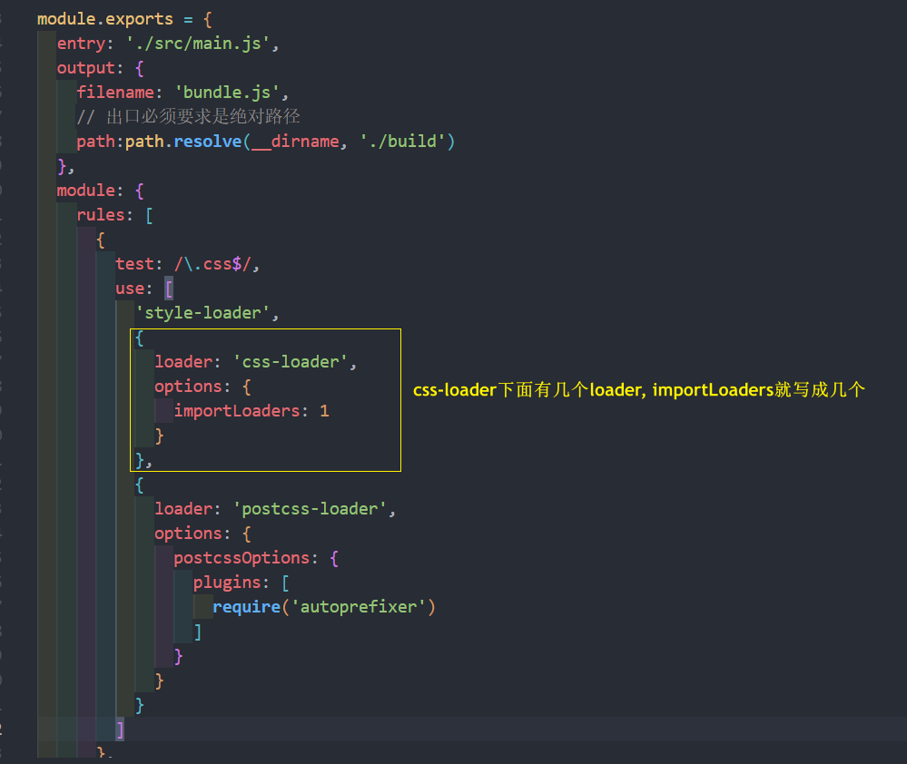

# webpack 
## 认识 PostCSS 工具
什么是PostCSS呢？
* PostCSS是一个通过**JavaScript**来**转换样式的工具**；
* 这个工具可以帮助我们进行一些**CSS的转换和适配**，比如**自动添加浏览器前缀、css样式的重置；**
* 但是实现这些工具，我们需要借助于 PostCSS 对应的插件；

如何使用PostCSS呢？主要就是两个步骤：
* 第一步：查找 PostCSS 在构建工具中的扩展，比如 webpack 中的 postcss-loader；
* 第二步：选择可以添加你需要的 PostCSS 相关的插件；
### 命令行使用 postcss
当然，能不能也直接在终端使用PostCSS呢？
* 也是可以的，但是我们需要单独安装一个工具postcss-cli；

可以安装一下它们：postcss、postcss-cli
```shell
npm install postcss -D

npm install postcss-cli -D
```
编写一个需要添加前缀的css：


### 插件autoprefixer
因为我们需要添加前缀，所以要安装autoprefixer：
```shell
npm install autoprefixer -D
```
直接使用使用postcss工具，并且制定使用autoprefixer
```shell
npx postcss --use autoprefixer -o end.css ./src/css/style.css
```
转化之后的css样式如下


### postcss-loader
真实开发中我们必然不会直接使用命令行工具来对 css 进行处理，而是要`npm run build` , 借助于webpack构建工具打包时处理：
* **在webpack中使用postcss 就是使用postcss-loader来处理的**

来安装postcss-loader：  
```shell
npm install postcss-loader -D
```

修改加载css的loader：
* 注意：**因为 postcss 需要有对应的插件(autoprefixer)才会起效果，所以我们需要配置它的 plugin**


### 单独的 postcss 配置文件
当然，我们也可以将这些配置信息放到**一个单独的文件**中进行管理：
* 在根目录下创建 `postcss.config.js`


### postcss-preset-env
事实上，在配置 postcss-loader 时，我们配置插件并不需要使用 autoprefixer

我们可以使用另外一个插件：**`postcss-preset-env`**
* `postcss-preset-env` 也是一个 postcss 的插件；
* 它可以帮助我们将一些现代的CSS特性，转成大多数浏览器认识的CSS，并且会根据目标浏览器或者运行时环
境添加所需的polyfill；
* 也包括会自动帮助我们添加 autoprefixer（所以相当于已经内置了autoprefixer）；


首先，我们需要安装postcss-preset-env：
```shell
npm install postcss-preset-env -D
```
之后，我们直接修改掉之前的 autoprefixer 即可


注意：我们在使用某些postcss插件时，`postcss.config.js`文件 也可以直接传入字符串


### css-loader的 importLoaders 属性


## file-loader
比较常见的使用图片的方式是两种：
* **img 元素**，设置 src 属性；
* **其他元素**（比如div），设置background-image的css属性


要处理 jpg、png 等格式的图片，也需要有对应的loader：`file-loader`
* file-loader 的作用就是帮助我们处理 **import/require()方式**引入的一个文件资源，并且会将它放到我们**输出的文件夹**中；
* 待会儿总结如何修改它的名字和所在文件夹；

安装 file-loader：
```shell
npm install file-loader -D
```

配置处理图片的Rule：

## 文件的名称规则
有时候我们处理后的 **文件名称** 按照一定的规则进行显示：
* 比如保留原来的 **文件名、扩展名**，同时为了防止重复，包含一个 **hash 值**等；

这个时候我们可以使用PlaceHolders来完成，webpack给我们提供了大量的PlaceHolders来显示不同的内容：
* [https://webpack.js.org/loaders/file-loader/#placeholders](https://webpack.js.org/loaders/file-loader/#placeholders)
* 可以在文档中查阅自己需要的 placeholder；

这里给几个最常用的placeholder

### 设置文件名称
那么我们可以按照如下的格式编写：

* 这个也是vue的写法；


### 设置文件的存放路径
当然，刚才通过 `img/` 已经设置了文件夹，这个也是 vue、react脚手架中常见的设置方式：
* 其实按照这种设置方式就可以了；
* 当然我们也可以通过 **outputPath** 来设置输出的文件夹；


## url-loader 
url-loader和file-loader的工作方式是相似的，但是可以将较小的文件，转成 **base64的URI**

安装 url-loader：
```shell
npm install url-loader -D
```


显示结果是一样的，并且图片可以正常显示；

但是在dist文件夹中，我们会看不到图片文件：
* 这是因为我的两张图片的大小分别是38kb和295kb；
* 默认情况下 url-loader 会将所有的图片文件转成base64编码

### url-loader 的 limit
但是开发中我们往往是**小的图片需要转换**，**但是大的图片直接使用图片即可**
* 这是因为**小的图片转换base64之后**可以**和页面一起被请求，减少不必要的请求过程；**
* 而**大的图片也进行转换**，反而会**影响页面的请求速度**

那么，我们如何可以限制哪些大小的图片转换和不转换呢？
* url-loader有一个options属性 **limit**，可以用于设置转换的限制；
* 下面的代码38kb (**< 100kb**)的图片会进行 base64 编码，而295kb的不会

## asset module type 的介绍
当前使用的webpack版本是webpack5：
* 在 webpack5之前，加载这些资源我们需要使用一些 loader，比如raw-loader 、url-loader、file-loader；
* 在 webpack5之后，我们可以直接使用资源模块类型 **（asset module type）**来替代上面的这些 loader

**资源模块类型(asset module type)**，通过添加 4 种新的模块类型，来替换所有这些 loader：

### asset module type的使用
比如加载图片，之前使用的是 file-loader 或者 url-loader , 但还可以使用下面的方式


但是，如何可以自定义文件的**输出路径**和**文件名**呢？
* 方式一：修改 output 中，添加 `assetModuleFilename` 属性；


通常不用这种方法, 因为在这里设置的话 所有 asset module type 都会遵循这个规则, 所以不合理
* **方式二：** 在 Rule 中，添加一个 `generator` 属性，并且设置 `filename`

### url-loader的 limit 效果
我们需要两个步骤来实现：
* 步骤一：将 type 修改为 asset；
* 步骤二：添加一个 `parser` 属性，并且制定 `dataUrl` 的条件，添加 `maxSize` 属性


## 加载字体文件
如果我们需要使用某些特殊的字体或者字体图标，那么我们会引入很多字体相关的文件，这些文件的处理也是一样
的

首先，从阿里图标库中下载了几个字体图标：


在 component 中引入，并且添加一个i元素用于显示字体图标

### 字体的打包
这个时候打包会报错，因为无法正确的处理**eot、ttf、woff**等文件：
* 可以选择使用 `file-loader` 来处理，也可以选择直接使用webpack5的资源模块类型(asset module type)来处理


