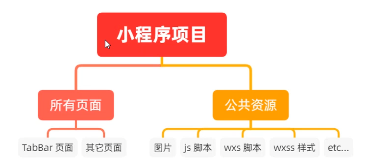
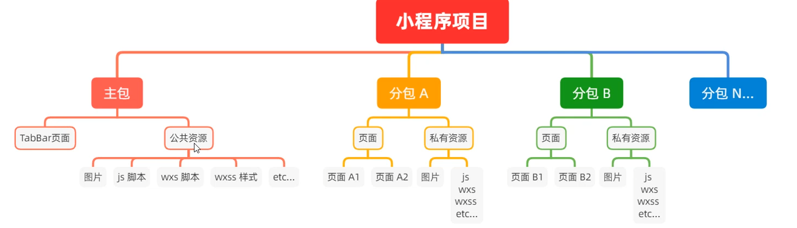
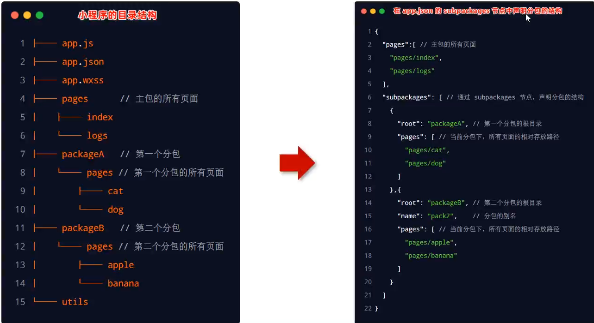
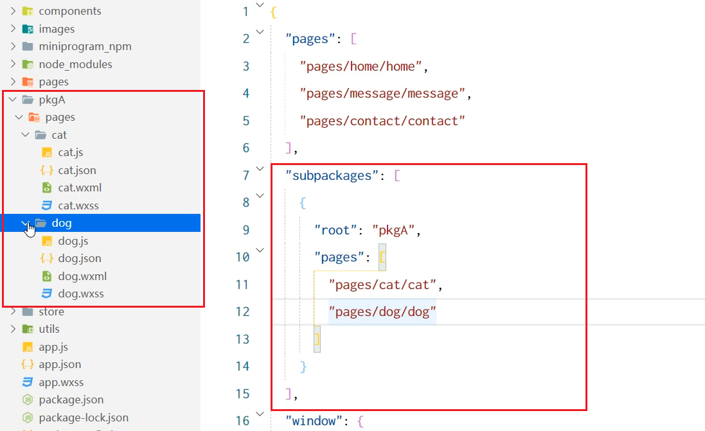
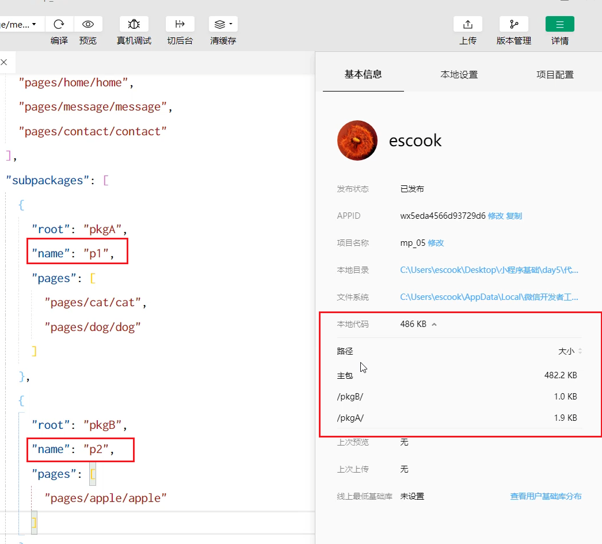
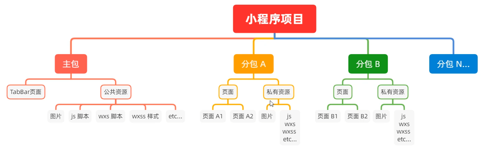
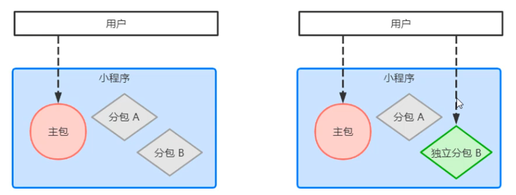
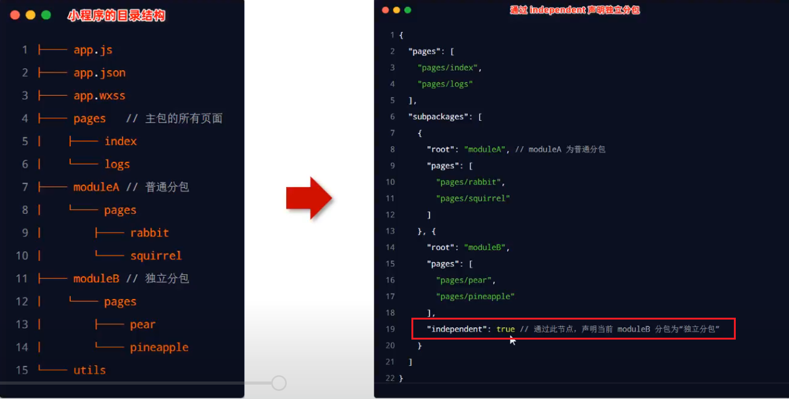
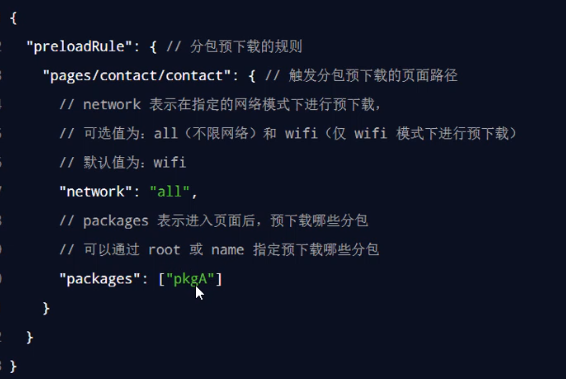
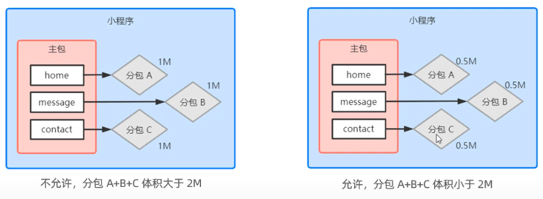

# 分包
分包指的是把一个完整的小程序项目，按照需求**划分为不同的子包**，在构建时打包成不同的分包，用户在使用
时**按需进行加载**

对小程序进行分包的好处主要有以下两点：
* 可以**优化小程序首次启动的下载时间**
* 在多团队共同开发时可以更好的**解耦协作**
## 分包前的项目
分包前，小程序项目中**所有的页面和资源**都被打包到了一起，导致整个**项目体积过大**，影响小程序**首次启动的下载时间**。

## 分包后的项目
分包后，小程序项目由 **1 个主包 + 多个分包组成**：
* 主包：一般只包含项目的**启动页面或 TabBar 页面**、以及所有分包都需要用到的一些**公共资源**
* 分包：只包含和当前分包有关的页面和私有资源

## 分包加载规则

1. 在小程序启动时，默认会**下载主包**并**启动主包内页面**
* tabBar 页面需要放到主包中

2. 当用户进入分包内某个页面时，**客户端会把对应分包下载下来**，下载完成后再进行展示
* 非 tabBar 页面可以按照功能的不同，划分为不同的分包之后，进行按需下载

## 分包的体积限制
目前，小程序分包的大小有以下两个限制：

* 整个小程序所有分包大小不超过 **16M（主包 + 所有分包）**
* 单个分包/主包大小不能超过 **2M**

## 使用分包
### 配置方法

### 添加别名, 查看体积 

### 打包原则
1. 小程序会按 subpackages 的配置进行分包，**subpackages 之外的目录将被打包到主包中**
2. 主包也可以有自己的 pages（即最外层的 pages 字段）
3. **tabBar 页面必须在主包内**
4. 分包之间不能互相嵌套
### 引用原则
* 主包**无法引用**分包内的私有资源
* 分包之间**不能相互引用**私有资源
* 分包**可以引用**主包内的公共资源

## 独立打包
独立分包本质上也是分包，只不过它比较特殊，可以独立于主包和其他分包而单独运行

最主要的区别：是否依赖于主包才能运行
* 普通分包必须依赖于主包才能运行
* 独立分包可以在不下载主包的情况下，**独立运行**

### 独立分包的应用场景
开发者可以按需，将某些具有一定功能独立性的页面配置到独立分包中。原因如下：
* 当小程序从普通的分包页面启动时，需要首先下载主包
* 而独立分包**不依赖主包**即可运行，**可以很大程度上提升分包页面的启动速度**

注意：一个小程序中可以有多个独立分包

### 独立分包配置方法

### 引用规则
独立分包和普通分包以及主包之间，**是相互隔绝的，不能相互引用彼此的资源！**例如：

1. 主包**无法引用**独立分包内的私有资源
2. 独立分包之间，**不能相互引用**私有资源
3. 独立分包和普通分包之间，**不能相互引用**私有资源
4. **特别注意**：独立分包中不能引用主包内的公共资源

## 分包预加载
分包预下载指的是：在进入小程序的某个页面时，由框架自动预下载可能需要的分包，从而提升进入后续分包
页面时的启动速度
### 配置预下载
预下载分包的行为，会在进入指定的页面时触发。在 app.json 中，使用 preloadRule 节点定义分包的预下载
规则

### 分包预下载限制
同一个分包中的页面享有共同的**预下载大小限额 2M**，例如

