#  模板语法 
## 数据绑定
页面解构: 

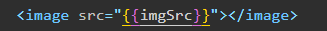

页面数据: 

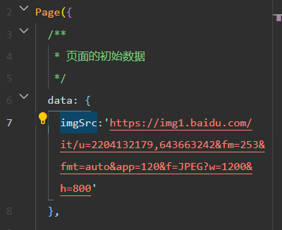
## 事件绑定 

事件是**渲染层到逻辑层的通讯方式**。通过事件可以将用户在渲染层产生的行为，反馈到逻辑层进行业务的处理

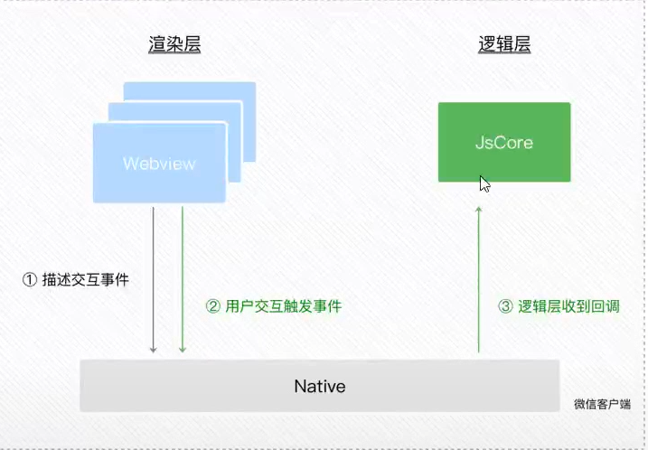

### 常用的事件
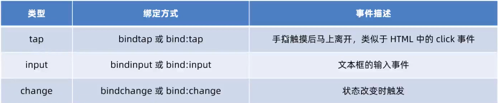
### 事件对象的属性列表 
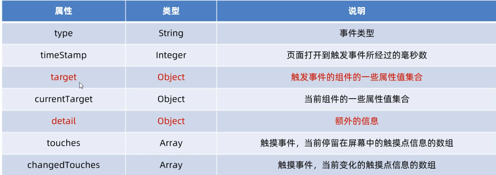

### target 和 currentTarget 区别
**target** 是**触发该事件的源头组件**，而 **currentTarget** 则是**当前事件所绑定的组件**。举例如下：

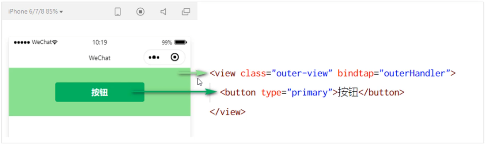

点击内部的按钮时，点击事件以 **冒泡** 的方式向外扩散，也会触发外层 view 的 tap 事件处理函数

此时，对于外层的 view 来说：

* e.target 指向的是触发事件的源头组件，因此，**e.target 是内部的按钮组件**
* e.currentTarget 指向的是当前正在触发事件的那个组件，因此，**e.currentTarget 是当前的 view 组件**
### bindtap 的语法格式 
在小程序中，不存在 HTML 中的 onclick 鼠标点击事件，而是通过 **tap 事件** 来响应用户的触摸行为。
1. 通过 `bindtap` ，可以为组件绑定 tap 触摸事件，语法如下：
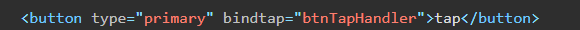
2. 在页面的 .js 文件中定义对应的事件处理函数，事件参数通过形参 **event**（一般简写成 e） 来接收：
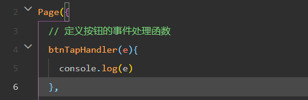
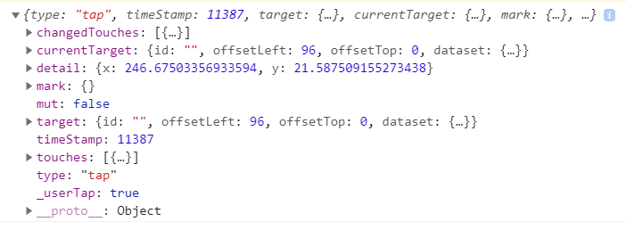

### 在事件处理函数中为 data 中的数据赋值
通过调用 **this.setData(dataObject)** 方法，可以给页面 data 中的数据重新赋值，示例如下
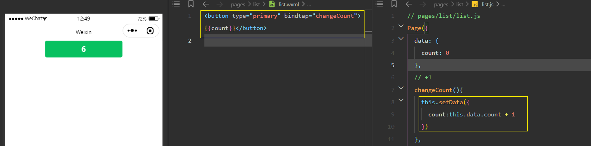

### 事件传参  data-*
小程序中的事件传参比较特殊，**不能在绑定事件的同时为事件处理函数传递参数**

因为小程序会把 bindtap 的属性值，统一当作事件名称来处理，相当于要调用一个名称为 btnHandler(123) 
的事件处理函数

正确做法是 可以为组件提供 **`data-*`** 自定义属性传参，其中 * 代表的是参数的名字，示例代码如下：
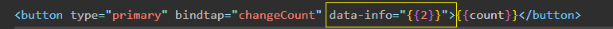
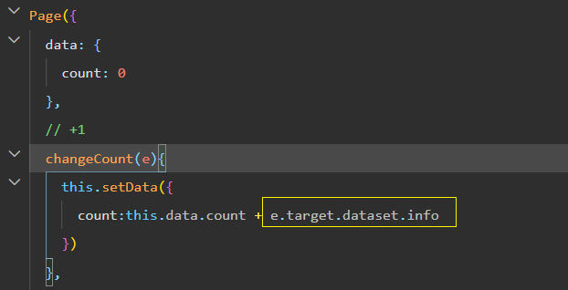
### bindinput 语法格式
在小程序中，通过 **input 事件** 来响应文本框的输入事件，语法格式如下：
1. 通过 bindinput，可以为文本框绑定输入事件：
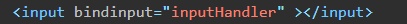
2. 在页面的 .js 文件中定义事件处理函数
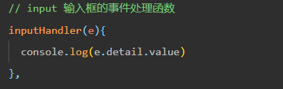

### 实现文本框和 data 之间的数据同步
结构 :

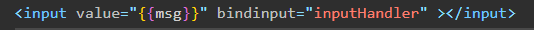

事假处理: 

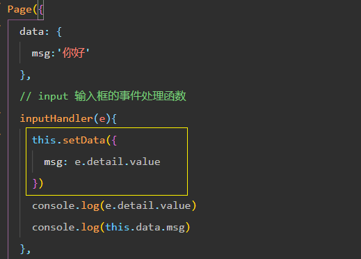
## 条件渲染
### wx:if wx:elif wx:else
**wx:if , ws:elif, wx:else** 来判断

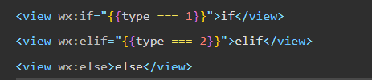
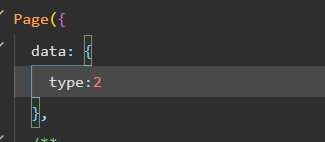
### 结合 `<block>` 使用 wx:if
如果要一次性控制多个组件的展示与隐藏，可以使用一个 `<block></block>`标签将多个组件包装起来，并在
`<block>` 标签上使用 wx:if 控制属性，示例如下：

相当于 Vue 中的 template 标签 

注意： `<block>` 并不是一个组件，它只是一个包裹性质的容器，不会在页面中做任何渲染。
### hidden 
在小程序中，直接使用 hidden="{{ condition }}" 也能控制元素的显示与隐藏 

### wx:if 与 hidden 的对比

1. 运行方式不同
*  wx:if 以 **动态创建和移除元素** 的方式，控制元素的展示与隐藏
*  hidden 以 **切换样式** 的方式（display: none/block;），控制元素的显示与隐藏
2. 使用建议
*  频繁切换 时，建议使用 hidden
*  控制条件复杂 时，建议使用 wx:if 搭配 wx:elif、wx:else 进行展示与隐藏的切换
## 列表渲染
### wx:for , index , item 和 wx:key 的 使用
默认情况下，当前循环项的索引用 index 表示；当前循环项用 item 表示。

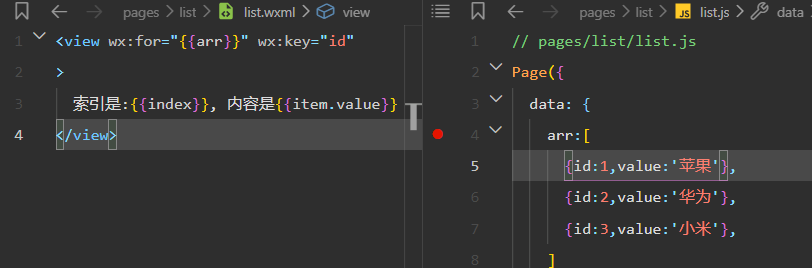

类似于 Vue 列表渲染中的 **:key**，小程序在实现列表渲染时，也建议为渲染出来的列表项指定唯一的 key 值，
从而提高渲染的效率
### 手动指定索引和当前项的变量名 (了解一下)
* 使用 **wx:for-index** 可以指定当前循环项的索引的变量名
* 使用 **wx:for-item** 可以指定当前项的变量名

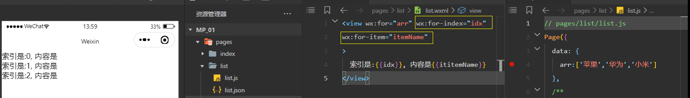

