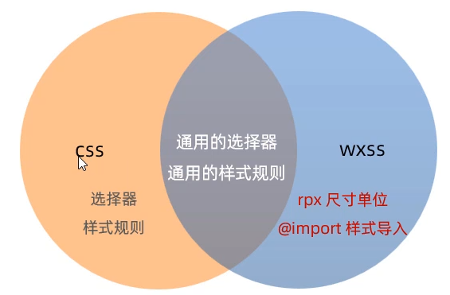
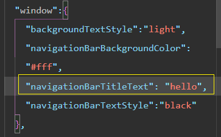
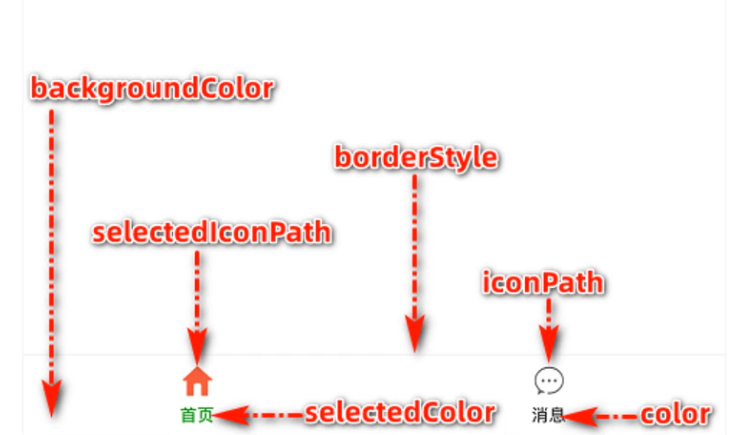

# 进阶
## WXSS 
###  WXSS 和 CSS 的关系
WXSS 具有 CSS 大部分特性，同时，WXSS 还对 CSS 进行了扩充以及修改，以适应微信小程序的开发。
与 CSS 相比，WXSS 扩展的特性有：

* **rpx** 尺寸单位
* **@import** 样式导入

### rpx 
responsible pixel  : 用来解决屏幕适配的尺寸单位 

rpx 的实现原理非常简单：鉴于不同设备屏幕的大小不同，为了实现屏幕的自动适配，rpx 把所有设备的屏幕，

在 **宽度上等分为 750 份** （即：当前屏幕的总宽度为 750rpx）
*  在较小的设备上，**1rpx 所代表的宽度较小**
* 在较大的设备上，**1rpx 所代表的宽度较大**

小程序在不同设备上运行的时候，会自动把 rpx 的样式单位换算成对应的像素单位来渲染，从而实现屏幕适配

###  rpx 与 px 之间的单位换算(了解一下)
在 iPhone6 上，屏幕宽度为375px，共有 750 个物理像素，等分为 750rpx。则：

* 750rpx = 375px = 750 物理像素
* 1rpx = 0.5px = 1物理像素

官方建议：开发微信小程序时，设计师可以用 iPhone6 作为视觉稿的标准

开发举例：在 iPhone6 上如果要绘制宽**100px，高20px**的盒子，换算成rpx单位，宽高分别为 **200rpx 和 40rpx**

### 样式导入  @import
使用 WXSS 提供的 `@import` 语法，可以导入外联的样式表

@import 后跟需要导入的外联样式表的相对路径，用 ; 表示语句结束

### 全局样式和局部样式

1. 全局样式

定义在 **app.wxss** 中的样式为全局样式，作用于每一个页面

2. 局部样式
在页面的 **.wxss 文件**中定义的样式为局部样式，只作用于当前页面。

注意：
* 当局部样式和全局样式冲突时，根据就近原则，局部样式会覆盖全局样式
* 当局部样式的权重大于或等于全局样式的权重时，才会覆盖全局的样

## 全局配置
小程序根目录下的 `app.json` 文件是小程序的全局配置文件。常用的配置项如下：
1. pages
* 记录当前小程序所有页面的存放路径

2. window
* 全局设置小程序窗口的外观

3. tabBar
* 设置小程序底部的 tabBar 效果

4. style
* 是否启用新版的组件样式

### window 
### 1. 小程序窗口的组成部分

### 2. 了解 window 节点常用的配置项

### 3. 设置导航栏的标题
app.json -> window -> navigationBarTitleText

### 4. 设置导航栏的背景色
app.json -> window -> navigationBarBackgroundColor

只支持以 # 开头的 16进制颜色

### 5. 设置导航栏的标题颜色
app.json -> window -> navigationBarTextStyle

从默认的 black 修改为 white 

### 6. 全局开启下拉刷新功能
**下拉刷新** 是移动端的专有名词，指的是通过手指在屏幕上的下拉滑动操作，从而重新加载页面数据的行为。

设置步骤：app.json -> window -> 把 `enablePullDownRefresh` 的值设置为 **`true`**

**注意**：在 **app.json** 中启用下拉刷新功能，会作用于每个小程序页面

### 7. 设置下拉刷新时窗口的背景色
当全局开启下拉刷新功能之后，默认的窗口背景为白色。如果自定义下拉刷新窗口背景色，设置步骤为: 

app.json -> window -> 为 **backgroundColor** 指定16进制的颜色值 `#efefef`

### 8. 设置下拉刷新时 loading 的样式
当全局开启下拉刷新功能之后，默认窗口的 loading 样式为白色，如果要更改 loading 样式的效果，设置步
骤为 app.json -> window -> 为 **backgroundTextStyle** 指定 dark 值

注意： backgroundTextStyle 的可选值只有 **light 和 dark**

### 9. 设置上拉触底的距离
概念：上拉触底是移动端的专有名词，通过手指在屏幕上的上拉滑动操作，从而加载更多数据的行为。

设置步骤： app.json -> window -> 为 **onReachBottomDistance** 设置新的数值

注意：**默认距离为 50px**，如果没有特殊需求，建议使用默认值即可
## tabBar
### 1. 关于 tabBar
小程序中通常将其分为：
* 底部 tabBar
* 顶部 tabBar

注意：
* tabBar 中只能配置最少 2 个、最多 5 个 tab 页签
* 当渲染顶部 tabBar 时，不显示 icon，只显示文本

### 2. tabBar的 6个组成部分 

* backgroundColor：tabBar 的背景色
* selectedIconPath：选中时的图片路径
* borderStyle：tabBar 上边框的颜色
* iconPath：未选中时的图片路径
* selectedColor：tab 上的文字选中时的颜色
* color：tab 上文字的默认（未选中）颜色
### 3. tabbar 节点的配置项

### 4. 每个 tab 项的配置选项

配置如: 

### tabBar 小案例: 

## 页面配置

小程序中，app.json 中的 window 节点，可以全局配置小程序中每个页面的窗口表现

如果某些小程序页面想要拥有特殊的窗口表现，此时，“页面级别的 .json 配置文件”就可以实现这种需求

注意：当页面配置与全局配置冲突时，根据**就近原则**，最终的效果以页面配置为准

### 常见的页面配置

