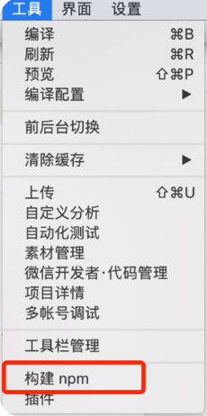
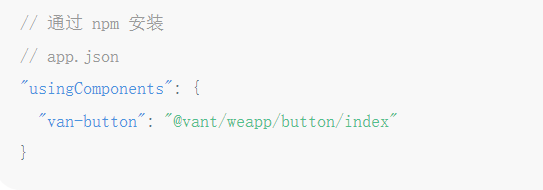
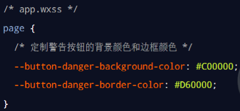

# 使用 npm 包

## 小程序对 npm 的支持与限制
目前，小程序中已经支持使用 npm 安装第三方包，从而来提高小程序的开发效率。但是，在小程序中使用
npm 包有如下 3 个限制：

* 不支持依赖于 Node.js 内置库的包
* 不支持依赖于浏览器内置对象的包
* 不支持依赖于 C++ 插件的包

总结：虽然 npm 上的包有千千万，但是能供小程序使用的包却“为数不多”
## Vant Weapp
[官方文档地址](https://youzan.github.io/vant-weapp)
### 安装 Vant 组件库
[快速上手安装](https://vant-contrib.gitee.io/vant-weapp/#/quickstart)

* npm init -y 
* npm i @vant/weapp@1.3.3 -S --production 
* 将 app.json 中的 `"style": "v2"` 去除
* 
* 

### 使用 Vant 组件 
安装完 Vant 组件库之后，可以在 **app.json 的 usingComponents 节点**中引入需要的组件，即可在 wxml 中
直接使用组件


### 定制全局主题样式
在 app.wxss 中，写入 CSS 变量，即可对全局生效 


所有可用的颜色变量，请参考 Vant 官方提供的配置文件：
[Vant 样式变量](https://github.com/youzan/vant-weapp/blob/dev/packages/common/style/var.less)

## API Promise 化   
***API Promise化**，指的是通过额外的配置，将官方提供的、基于回调函数的异步 API，升级改造为基于Promise 的异步 API，从而提高代码的可读性、维护性，避免回调地狱的问题*

### 实现 API Promise化
在小程序中，实现 API Promise 化主要依赖于 **miniprogram-api-promise** 这个第三方的 npm 包
```
npm install --save miniprogram-api-promise@1.0.4
```
删除 miniprogram_npm 文件夹 , 然后点击重新构建 npm 模块
(删除后, 重新构建)


[图片](../.vuepress/public/images/pma1.png)
### 调用 Promise 化之后的异步 API
[图片](../.vuepress/public/images/pma2.png)


