# 网络请求

## 小程序中网络数据请求的限制
出于安全性方面的考虑，小程序官方对数据接口的请求做出了如下
两个限制：
* 只能请求 `HTTPS` 类型的接口
* 必须将**接口的域名**添加到**信任列表**中

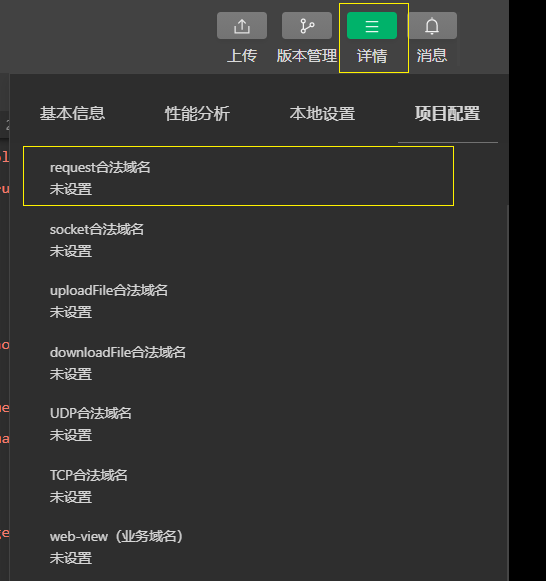

## 配置 request 合法域名
需求描述：假设在自己的微信小程序中，希望请求 https://www.xxxxxxxx.cn/ 域名下的接口

配置步骤：**登录微信小程序管理后台 -> 开发 -> 开发设置 -> 服务器域名 -> 修改 request 合法域名**

注意事项：
* 域名只支持 `https` 协议
* 域名不能使用 IP 地址或 localhost
* 域名必须经过 ICP 备案
* 服务器域名一个月内最多可申请 5 次修改
## 发起 GET 请求
调用微信小程序提供的 **wx.request() 方法**，可以发起 GET 数据请求

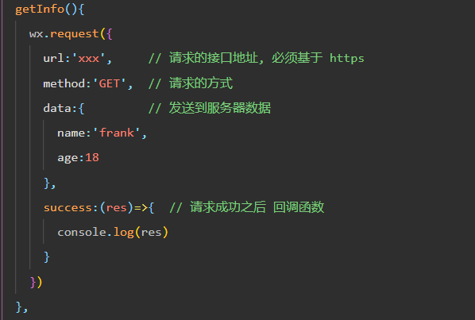

## 发起 POST 请求

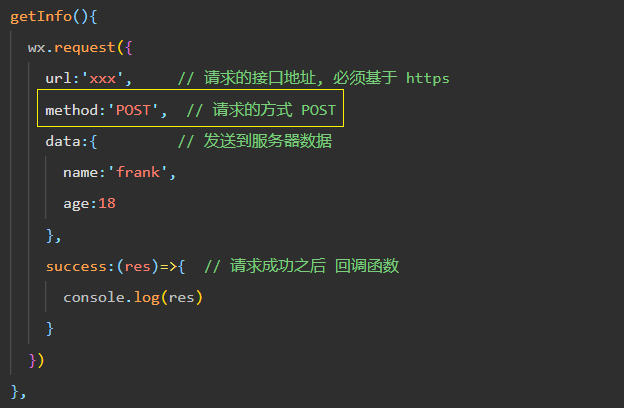
## 在页面刚加载时请求数据
在很多情况下，我们需要**在页面刚加载的时候**，**自动请求一些初始化的数据**。此时需要在页面的 **onLoad** 事件
中调用获取数据的函数

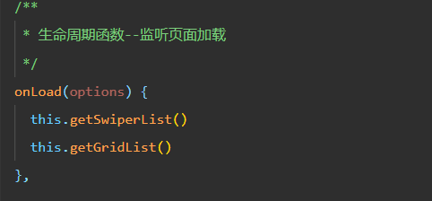

## 跳过 request 合法域名校验
如果后端程序员**仅仅提供了 http 协议的接口、暂时没有提供 https 协议的接口**。

此时为了不耽误开发的进度，我们可以在微信开发者工具中，临时
开启「开发环境不校验请求域名、TLS 版本及 HTTPS 证书」选项，
跳过 request 合法域名的校验。

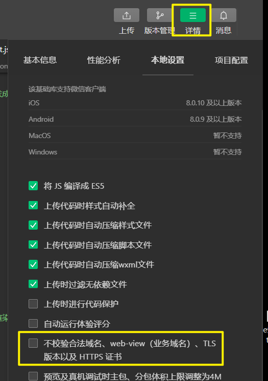

**注意**： *跳过 request 合法域名校验的选项，仅限在开发与调试阶段使用！*

## 关于 跨域 和 Ajax 的说明
  *跨域问题**只存在于**基于浏览器的 Web 开发中。由于小程序的宿主环境不是浏览器，而是**微信客户端**，所以**小程序中不存在跨域的问题***

  *Ajax 技术的核心是依赖于浏览器中的 XMLHttpRequest 这个对象，**由于小程序的宿主环境是微信客户端**，所以小程序中不能叫做“发起 Ajax 请求”，而是叫做“**发起网络数据请求**”*

## 案例
### 1. 首页效果以及实现步骤
* 新建项目并梳理项目结构
* 配置导航栏效果
* 配置 tabBar 效果
* 实现轮播图效果
* 实现九宫格效果
* 实现图片布局

接口地址:
1. 获取轮播图数据列表的接口
* 【GET】https://www.escook.cn/slides

2. 获取九宫格数据列表的接口
* 【GET】https://www.escook.cn/categories

### (1) 创建项目 
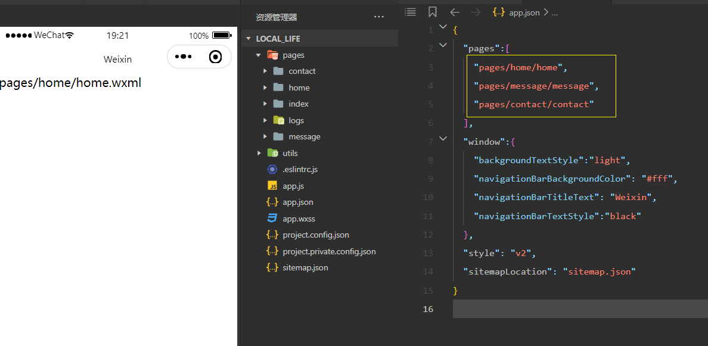
还有进入 project.config.json -> settings -> "checkSiteMap": false 设为 false

### (2) 配置导航栏效果 
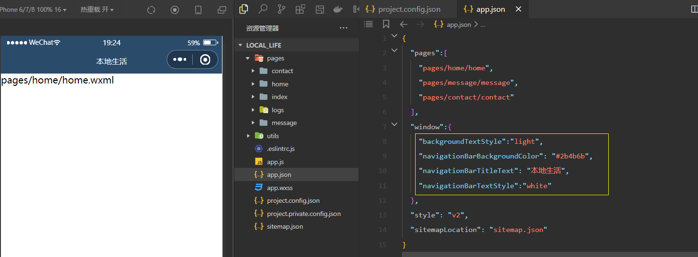
### (3) 配置 tabBar 
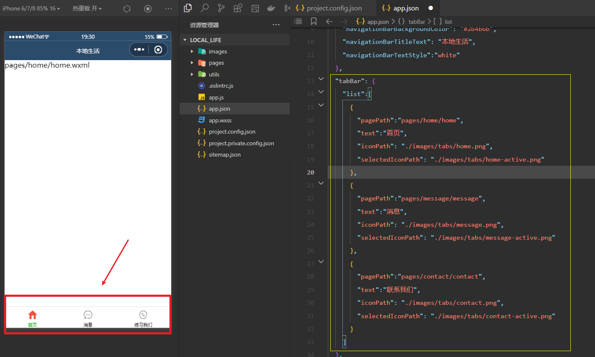
### (4) 获取轮播图数据并渲染到页面
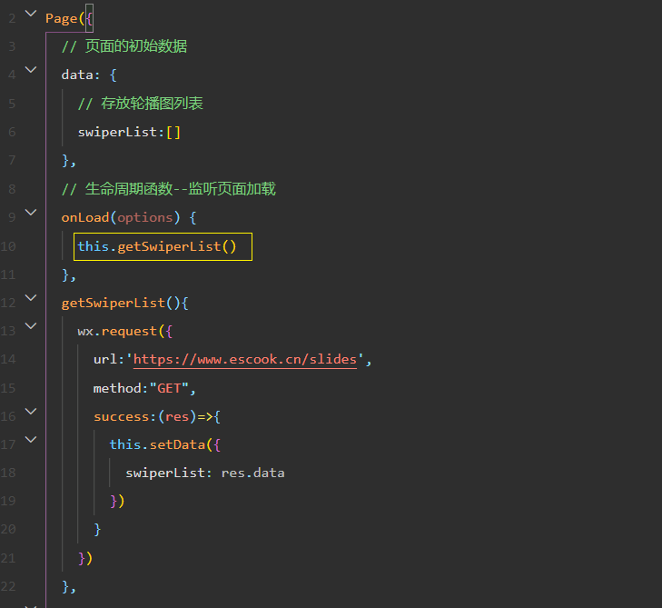

渲染轮播图 
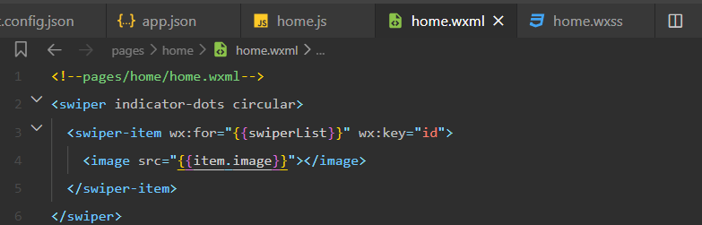
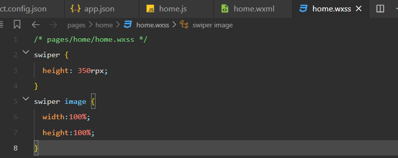
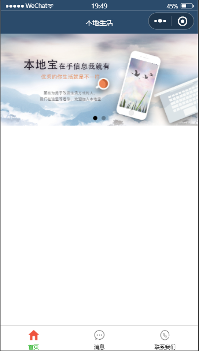
### (5) 获取九宫格数据并渲染到页面 
获取九宫格数据
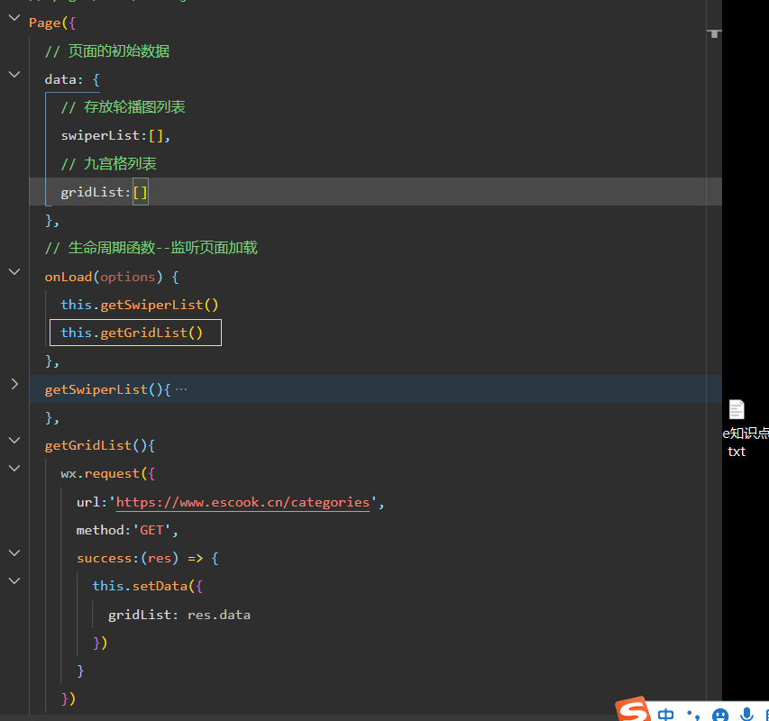

展示在页面 : 

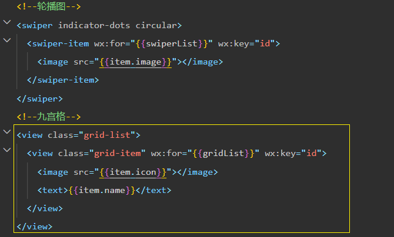
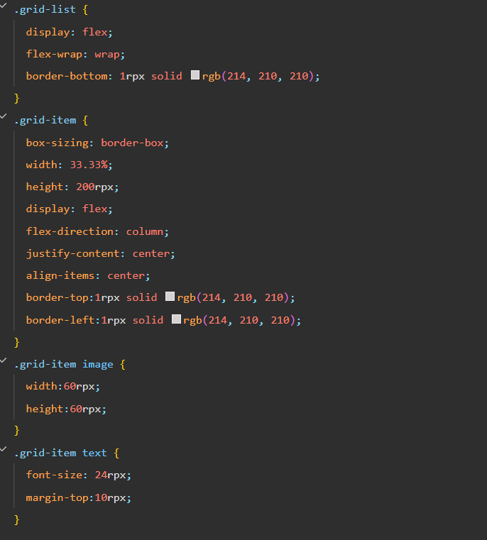

### (6) 底部图片区域
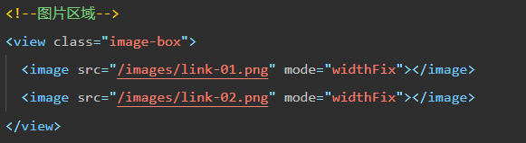
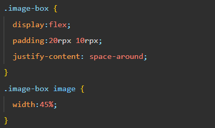

### 最终效果

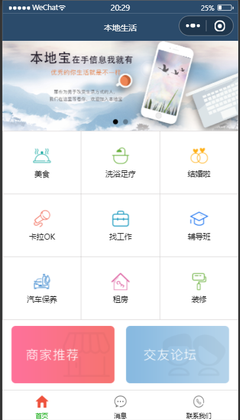

## 总结
1. 能够使用 WXML 模板语法渲染页面结构
* **wx:if**、wx:elif、wx:else、hidden、**wx:for、wx:key**

2. 能够使用 WXSS 样式美化页面结构
* **rpx 尺寸单位**、@import 样式导入、全局样式和局部样式

3. 能够使用 app.json 对小程序进行全局性配置
* pages、**window、tabBar**、style

4. 能够使用 page.json 对小程序页面进行个性化配置
* 对单个页面进行个性化配置、**就近原则**

5. 能够知道如何发起网络数据请求
* **wx.request() 方法、onLoad() 事件**

