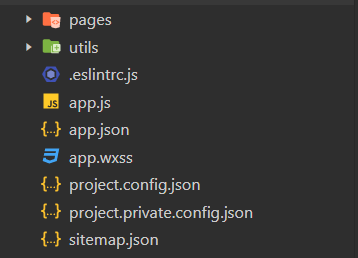
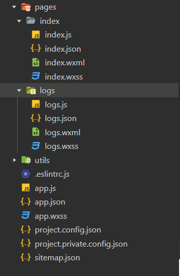
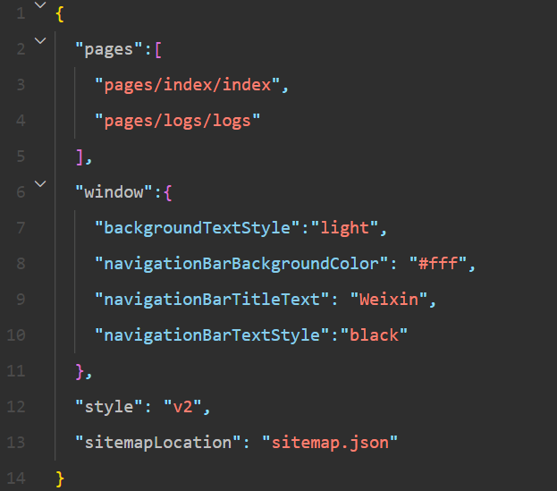
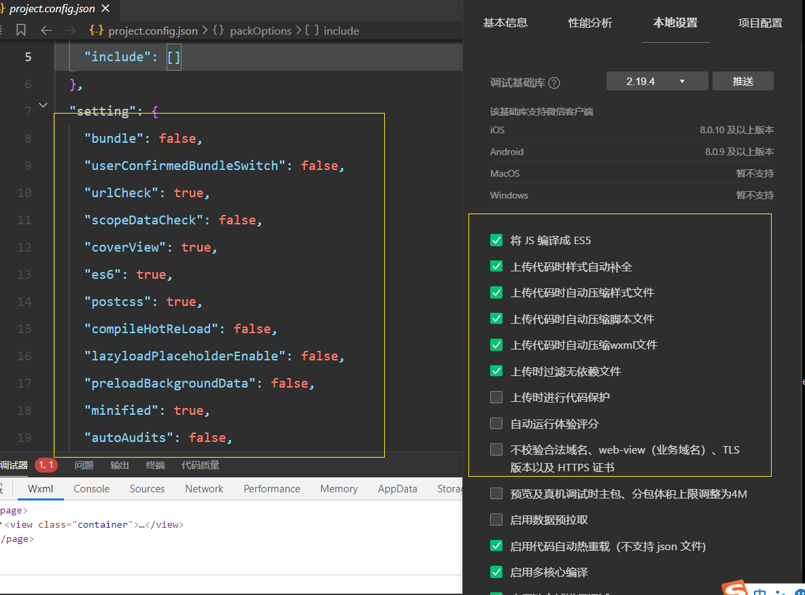
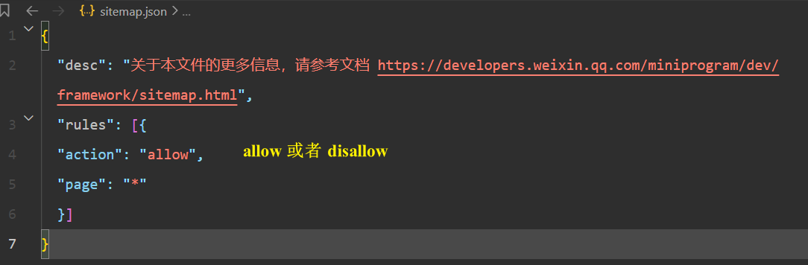
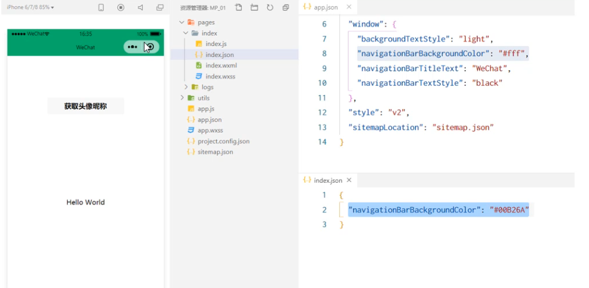
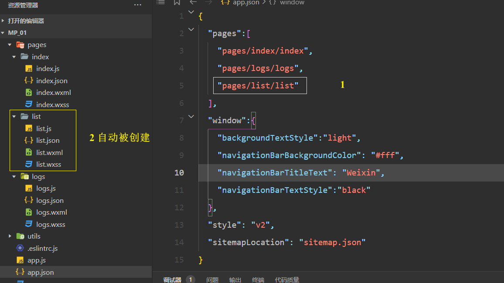
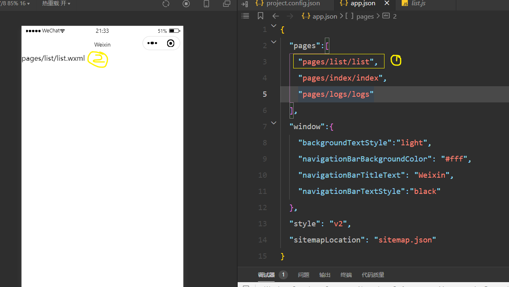

# 起步
## 小程序与普通开发的不同
1. 运行环境的不同

* **网页**运行在**浏览器**
* **小程序**运行在**微信**里

2. API 不同 
由于运行环境的不同, 小程序中 **无法调用 DOM 和 BOM 的API**

但是小程序中可以调用微信环境提供的 API
* 地理定位
* 支付
* 扫码 

3. 开发模式不同 
网页的开发模式: **浏览器 + 编辑器**

小程序有自己的一套开发模式: 
* **申请小程序开发账号**
* **安装小程序开发者工具**
* **创建和配置小程序项目**
## 小程序代码的构成 - 项目结构 
### 项目的基本组成结构 


* pages 用来存放所有小程序的页面
* utils 用来存放工具性质的模块 ( 例如: 格式化时间的自定义模块 )
* app.js 小程序项目的入口文件
* app.json 小程序项目的全局配置文件
* app.wxss 小程序项目的全局样式文件
* project.config.json 项目的配置文件 
* sitemap.json 用来配置小程序及其页面是否允许被微信索引
### 小程序页面的组成部分
小程序官方建议把所有小程序的页面, 都存放在 **pages 目录** 里, 以 **单独的文件夹**存在, 如图所示 

其中, 每个页面由 **四个基本文件** 组成, 分别是: 
* **.js** 文件 ( 页面的脚本文件, 存放页面的数据, 事件处理函数 等 )
* **.json** 文件 ( 当前页面的配置文件, 配置窗口的外观, 表现 等 )
* **.wxml** 文件 ( 页面的模板结构文件 )
* **.wxss** 文件 ( 当前页面的样式表文件 )
## 小程序代码的构成 - json 配置文件
### json 配置文件的作用
可以对小程序项目进行不同级别的配置

小程序项目中有 4种项目配置文件, 分别是 : 
* 项目根目录中的 **app.json** 配置文件
* 项目根目录中的 **project.config.json** 配置文件
* 项目根目录中的 sitemap.json 配置文件
* **每个页面文件夹中的 .json 配置文件** 
### app.json 文件
app.json 是当前小程序的 **全局配置**, 包括小程序的 **所有页面路径, 窗口外观, 界面表现, 底部 tab 等**

简单看下 demo项目里的 app.json : 


了解一下 4个 配置项的作用: 
* pages : 用来记录当前小程序所有页面的路径
* window : 全局定义小程序所有页面的背景色, 文字颜色 等
* style :  全局定义小程序组件所使用的样式版本
* sitemapLocation : 用来指明 sitemap.json 的位置
### project.config.json 
用来记录我们对 小程序开发工具所做的个性化配置, 例如: 
* **setting** 中保存 **编译相关的配置**
* **projectname** 保存的是 **项目名称**
* **appid** 中保存的是 **小程序的账号id**


### sitemap.json 
微信已开放 **小程序内搜索**, 效果类似于 PC 网页的 SEO , sitemap.json 文件用来配置 **小程序页面是否允许微信索引**

当开发者允许微信索引时, 微信会通过爬虫的形式, 为小程序的页面内容简历索引。当用户的搜索关键字和页面的索引匹配成功的时候, 小程序的页面将可能展示在搜索结果中


注意: sitemap的索引提示是默认开启的, 如果要关闭 sitemap 的索引提示, 可在小程序配置文件 **project.config.json的 setting 中 配置字段 checkSiteMap 为 true** 
### 页面的 .json 文件 
小程序的每一个页面可以使用 .json 文件来对 **本页面的窗口外观进行配置**, 页面中的配置项会覆盖 app.json 里的 window 中相同的配置。


### 新建小程序页面 
只需要在 app.json -> pages 中新增页面的存放路径, 开发者工具自动帮我们创建对应的页面组件 

### 修改项目首页

只需要调整 **app.json -> pages** 数组中页面路径地前后顺序, 即可修改相矛盾首页, 小程序会把排在第一位的页面, 当做项目首页进行渲染 

## 小程序代码的构成 - WXML 模板
### WXML 和 HTML 区别 
1. 标签名不同 
* HTML (div, span, img, a)
* WXML (view, text, image, navigator)

2. 属性节点不同
```html
<a href="#">超链接</a>

<navigator url="/pages/home/home"></navigator>
```

3. 提供了类似于 Vue 的模板语法
* 数据绑定
* 列表渲染
* 条件渲染
## 小程序代码的构成 - WXSS 样式
### WXSS 和 CSS 区别 
***1. 新增了 rpx 尺寸单位 ***
* CSS 中需要手动进行像素单位的换算, 比如: rem 
* WXSS 中在底层支持新的尺寸单位 **rpx**, 在不同大小的屏幕上小程序会自动地进行换算

**2. 提供了全局样式和局部样式**
* 项目根目录中的 app.wxss 会作用于所有小程序的页面
* 局部页面的 .wxss 样式仅对当前页面有效

**3. WXSS 仅支持部分 CSS 选择器**
* .class 和 #id
* element
* 并集选择器, 后代选择器
* ::after 和 ::before 等伪类选择器
## 小程序代码的构成 - JS 逻辑交互
###  .js 文件 
在小程序中, 我们通过 .js文件来处理用户的操作, 例如: 响应用户的点击, 获取用户的位置 等等
###  小程序中 .js 文件的分类
小程序中的 JS 文件分为三大类 , 分别是 : 

1. app.js
* 是整个小程序项目的入口文件, 需要通过 **App()函数** 来启动整个小程序

2. 页面的 .js 
* 是页面的入口文件, 需要通过调用 **Page()函数**来创建并运行页面

3. 普通的 js文件
是普通的功能模块文件, 用来 **封装公共的函数或属性** 供页面使用


