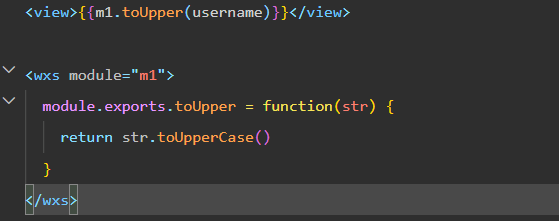

# 生命周期 和 WSX脚本
## 生命周期
### 生命周期函数分类
小程序中的生命周期函数分为两类，分别是：
1. 应用的生命周期函数
* 特指小程序从启动 -> 运行 -> 销毁期间依次调用的那些函数

2. 页面的生命周期函数
* 特指小程序中，每个页面从加载 -> 渲染 -> 销毁期间依次调用的那些函数
### 应用的生命周期函数
小程序的应用生命周期函数需要在 **app.js**中进行声明

### 页面的生命周期函数
小程序的页面生命周期函数需要在页面的 **.js 文件**中进行声明

## WSX
小程序中 wxs 的典型应用场景就是 “**过滤器**”
### wxs 和 JavaScript 的关系(了解)
虽然 wxs 的语法类似于 JavaScript，但是 wxs 和 JavaScript 是完全不同的两种语言

1. wxs 有自己的数据类型
* number 数值类型、string 字符串类型、boolean 布尔类型、object 对象类型、
* function 函数类型、array 数组类型、 date 日期类型、 regexp 正则

2. wxs 不支持类似于 ES6 及以上的语法形式
* 不支持：let、const、解构赋值、展开运算符、箭头函数、对象属性简写 等
* 支持：var 定义变量、普通 function 函数等类似于 ES5 的语法

3. wxs 遵循 CommonJS 规范
* module 对象
* require() 函数
* module.exports 对象
### 定义内嵌 wsx 脚本
wxs 代码可以编写在 wxml 文件中的 `<wxs>`标签内，就像 Javascript 代码可以编写在 html 文件中的 `<script>` 
标签内一样。
wxml 文件中的每个`<wxs></wxs>` 标签，**必须提供 module 属性**，用来指定当前 wxs 的模块名称，方便在

wxml 中访问模块中的成员

### 定义外联的 wsx 脚本 
wxs 代码还可以编写在以 **.wxs 为后缀名的文件** 内，就像 javascript 代码可以编写在以 .js 为后缀名的文件中
一样

### 使用外联的 wsx 脚本 
在 wxml 中引入外联的 wxs 脚本时，**必须**为 `<wxs>` 标签添加 `module` 和 `src` 属性，其中：
* **module** 用来指定模块的名称
* src 用来指定要引入的脚本的路径，且必须是**相对路径**

## WSX 特点
### 与 JavaScript 不同 

为了降低 wxs（WeiXin Script）的学习成本， wxs 语言在设计时借大量鉴了 JavaScript 的语法。但是本质上，wxs 和 JavaScript 是完全不同的两种语言!

### 不能作为组件的事件回调
wxs 典型的应用场景就是 **“过滤器”，经常配合 Mustache 语法进行使用**

但是，在 wxs 中定义的函数**不能作为组件的事件回调函数**
### 隔离性 
隔离性指的是 wxs 的运行环境和其他 JavaScript 代码是隔离的。体现在如下两方面：
* wxs 不能调用 js 中定义的函数
* wxs 不能调用小程序提供的 API

### 性能好
* 在 **iOS 设备**上，小程序内的 WXS 会比 JavaScript 代码**快 2 ~ 20 倍**
* 在 **android 设备**上，二者的运行效率无差异

## 总结 
1. 能够知道如何实现页面之间的导航跳转
* 声明式导航、编程式导航

2. 能够知道如何实现下拉刷新效果
* enablePullDownRefresh、onPullDownRefresh

3. 能够知道如何实现上拉加载更多效果
* onReachBottomDistance、onReachBottom

4. 能够知道小程序中常用的生命周期函数
* 应用生命周期函数：onLaunch, onShow, onHide
* 页面生命周期函数：onLoad, onShow, onReady, onHide, onUnloa