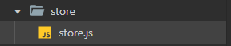
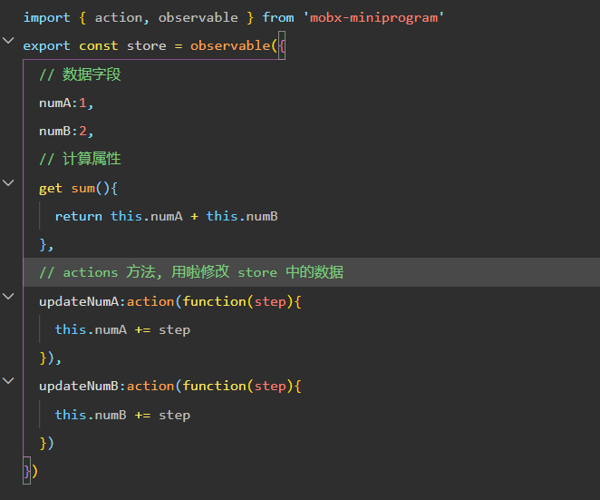
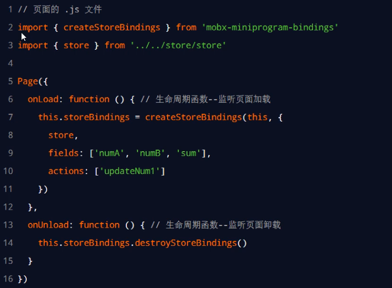
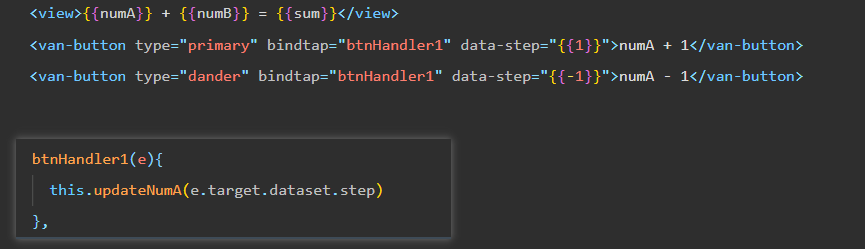
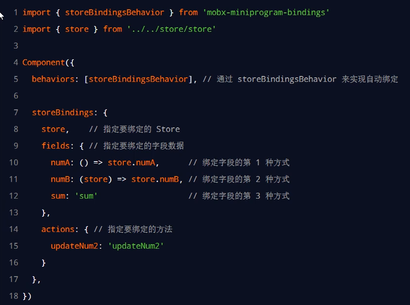
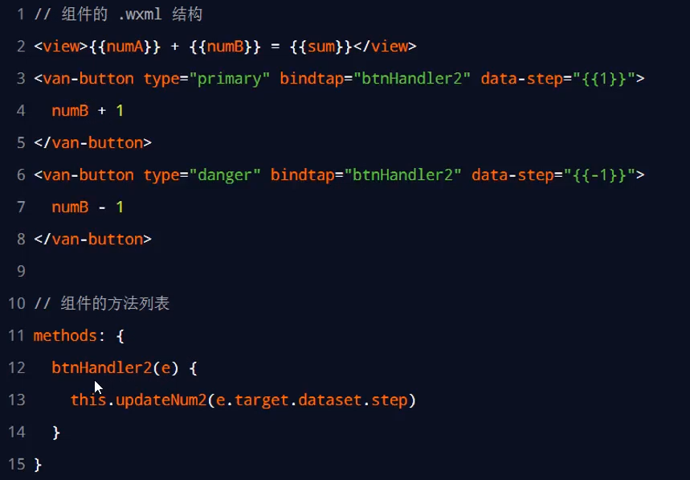

# 全局数据共享
## 全局共享方案
在小程序中，可使用 **mobx-miniprogram** 配合 **mobx-miniprogram-bindings** 实现全局数据共享。其中：
⚫ mobx-miniprogram 用来**创建 Store 实例对象**
⚫ mobx-miniprogram-bindings 用来**把 Store 中的共享数据或方法，绑定到组件或页面中使用**
## Mobx 
### 安装 Mobx 相关的包
在项目中运行如下的命令，安装 MobX 相关的包：

```
npm install --save mobx-miniprogram@4.13.2 mobx-miniprogram-bindings@1.2.1
```

注意：MobX 相关的包安装完毕之后，**记得删除 miniprogram_npm 目录后，重新构建 npm**

### 创建 MobX 的 Store 实例


### 将 store 中的成员绑定到 页面上


### 在页面上使用 Store 中的成员


###  将 store 中的成员绑定到 组件上


###  在组件中使用 Store 中的成员


