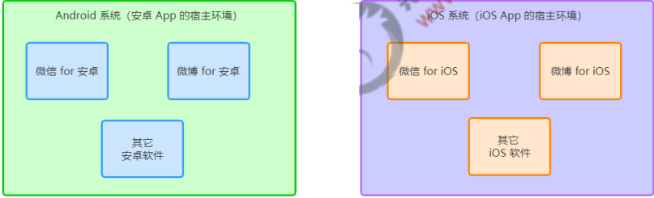
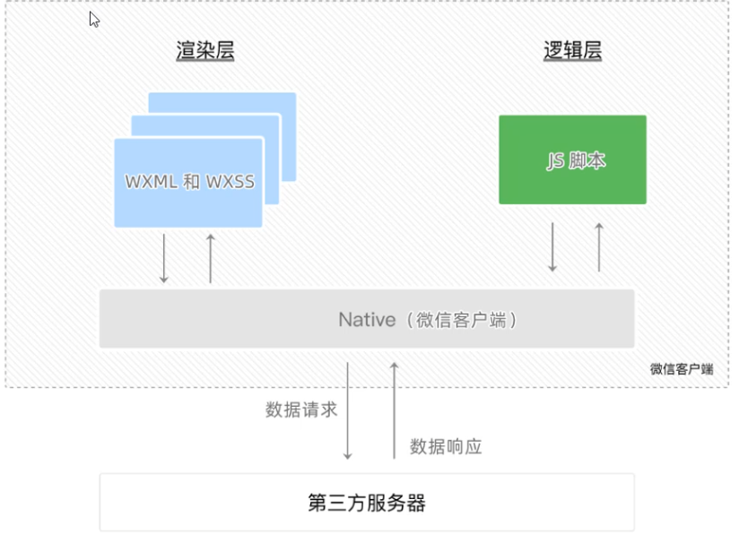
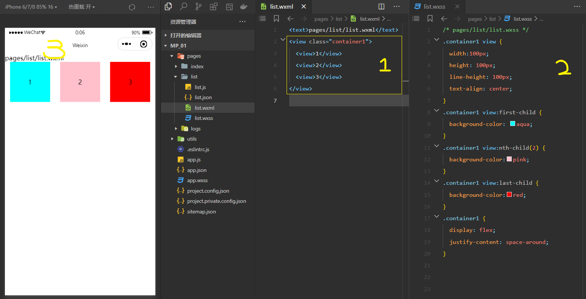
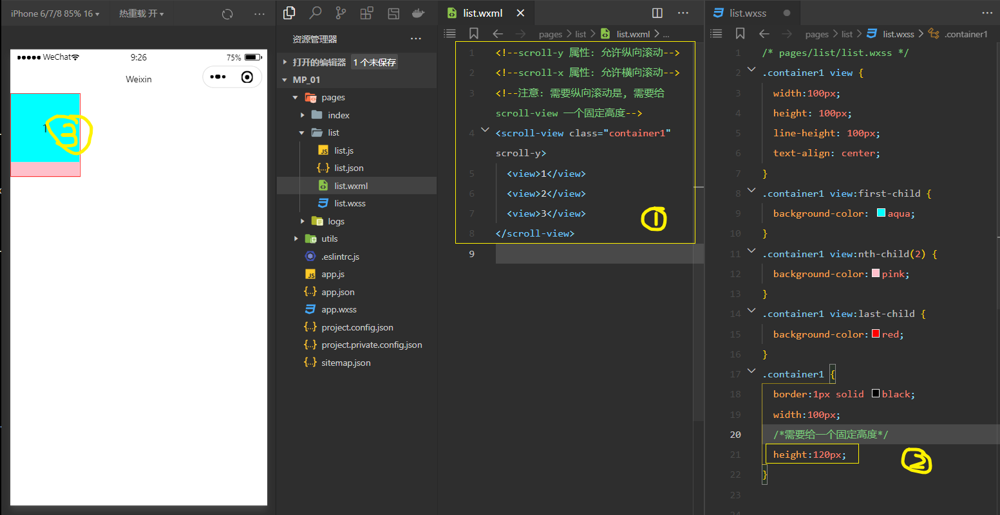
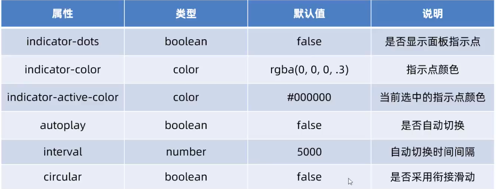
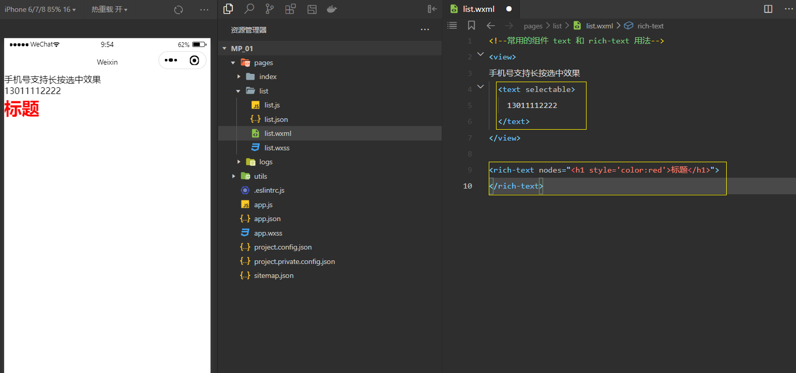
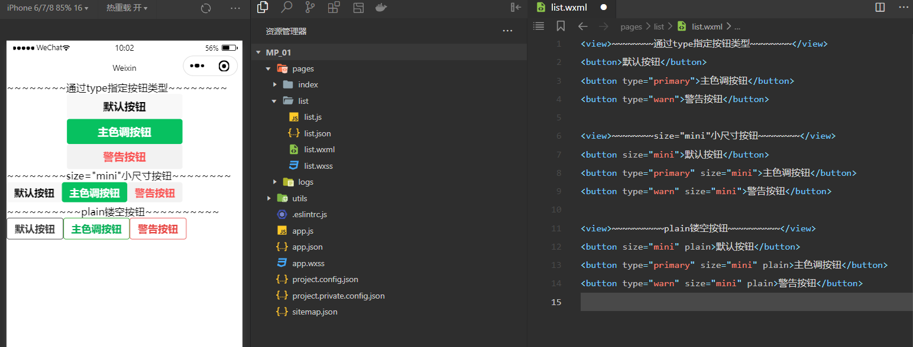
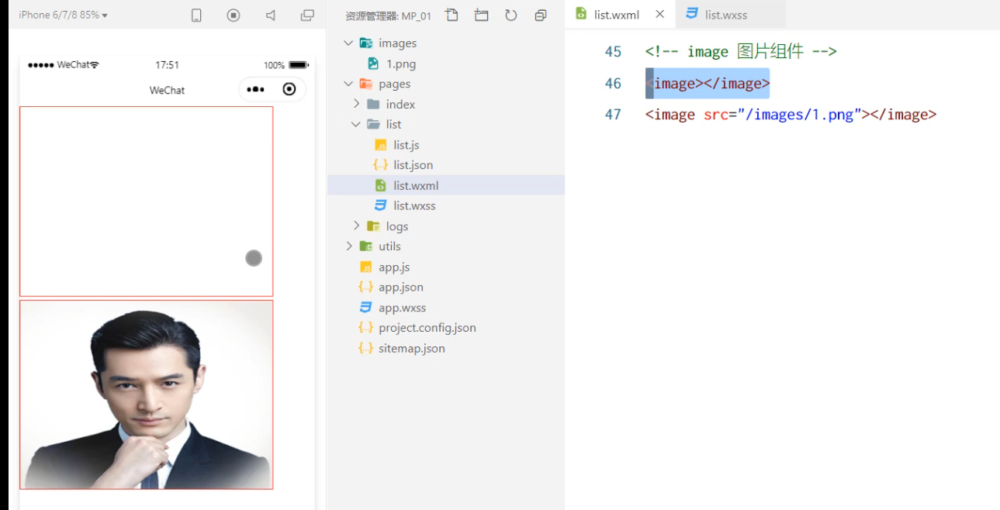
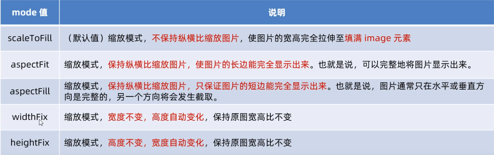

# 宿主环境
## 认识宿主环境
### 什么是宿主环境 
**宿主环境**（host environment） 指的是**程序运行所必须的依赖环境**。例如：
Android 系统和 iOS 系统是两个不同的宿主环境。安卓版的微信 App 是不能在 iOS 环境下运行的，所以，
Android 是安卓软件的宿主环境，**脱离了宿主环境的软件是没有任何意义的**

### 小程序的宿主环境
**手机微信**是小程序的宿主环境

小程序**借助宿主环境提供的能力**，可以完成许多普通网页无法完成的功能，例如：

微信扫码、微信支付、微信登录、地理定位、等等
### 小程序宿主环境包含的内容
① 通信模型
② 运行机制
③ 组件
④ API
## 通信模型
###  通信的主体
小程序中通信的主体是 **渲染层** 和 **逻辑层** ，其中：
1. WXML 模板和 WXSS 样式工作在渲染层
2. JS 脚本工作在逻辑层

### 小程序的通信模型
小程序中的通信模型分为两部分：
1.  **渲染层**和**逻辑层**之间的通信
* 由微信客户端进行转发

2. **逻辑层**和**第三方服务器**之间的通信
* 由微信客户端进行转发

## 运行机制
1. **小程序启动的过程**
* 把小程序的代码包下载到本地
* 解析 app.json 全局配置文件
* 执行 app.js 小程序入口文件，**调用 App() 创建小程序实例**
* 渲染小程序首页
* 小程序启动完成

2. 页面渲染的过程
* 加载解析页面的 .json 配置文件
* 加载页面的 .wxml 模板和 .wxss 样式
* 执行页面的 .js 文件，调用 **Page() 创建页面实例**
* 页面渲染完成
## 组件
### 组件分类
**小程序中的组件也是由宿主环境提供的**
* **视图容器**
* **基础内容**
* **表单组件**
* **导航组件**
* 媒体组件
* map 地图组件
* canvas 画布组件
* 开放能力
* 无障碍访问

### 常用的 视图容器类 组件
**1. view**
* 普通视图区域
* 类似于 HTML 中的 div，是一个块级元素
* 常用来实现页面的布局效果

**2. scroll-view**
* 可滚动的视图区域
* 常用来实现滚动列表效果

**3. swiper 和 swiper-item**
* 轮播图容器组件 和 轮播图 item 组件
### view 组件 基本使用
实现如图的 flex 横向布局效果

### scroll-view 组件 基本使用
实现如图的纵向滚动效果

### swiper 和 swiper-item 组价 基本使用

#### swiper组件 的常用属性
[swiper 属性](https://developers.weixin.qq.com/miniprogram/dev/component/swiper.html)

### 常用的基础内容组件
1. text
* 文本组件
* 类似于 HTML 中的 span 标签，是一个行内元素

2. rich-text
* 富文本组件
* 支持把 HTML 字符串渲染为 WXML 结构
### text 组件 和 rich-text 组件 基本使用
通过 text 组件的 **selectable 属性**，实现长按选中文本内容的效果：

通过 rich-text 组件的 **nodes 属性节点**，**把 HTML 字符串渲染为对应的 UI 结构：**

### 其他常用组件
**1. button**
* 按钮组件
* 功能比 HTML 中的 button 按钮丰富
* 通过 open-type 属性可以调用微信提供的各种功能（客服、转发、获取用户授权、获取用户信息等）

**2. image**
* 图片组件
* image 组件默认宽度约 300px、高度约 240px
**3. navigator（后面再总结）**
* 页面导航组件
* 类似于 HTML 中的 a 链接

### button 按钮的基本使用

### image 组件的使用 
image 组件默认宽度约 300px、高度约 240px

####  image 组件的 mode 属性
image 组件的 **mode 属性** 用来指定图片的**裁剪**和**缩放**模式，常用的 mode 属性值如下：

## API 
**小程序中的 API 是由宿主环境提供的**，通过这些丰富的小程序 API，开发者可以方便的调用微信提供的能力，
例如：获取用户信息、本地存储、支付功能等

### 小程序 API 的 3大类
小程序官方把 API 分为了如下 3 大类：
**1. 事件监听 API**
* 特点：以 on 开头，用来监听某些事件的触发
* 举例：`wx.onWindowResize(function callback)`监听窗口尺寸变化的事件

**2. 同步 API**
* 特点1：以 Sync 结尾的 API 都是同步 API
* 特点2：同步 API 的执行结果，可以通过函数返回值直接获取，如果执行出错会抛出异常
* 举例：`wx.setStorageSync('key', 'value')` 向本地存储中写入内容

**3. 异步 API**
* 特点：类似于 jQuery 中的 $.ajax(options) 函数，需要通过 success、fail、complete 接收调用的结果
* 举例：`wx.request()` 发起网络数据请求，通过 success 回调函数接收数据

