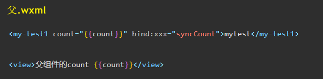
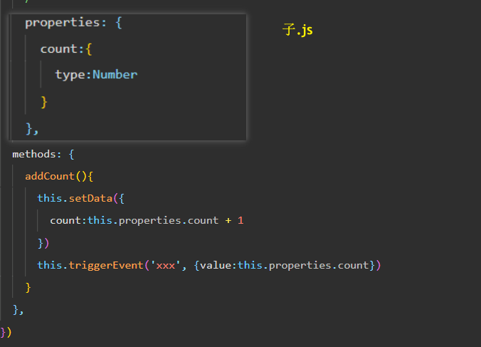
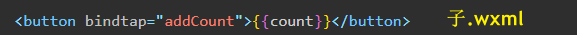
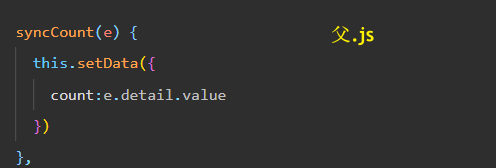
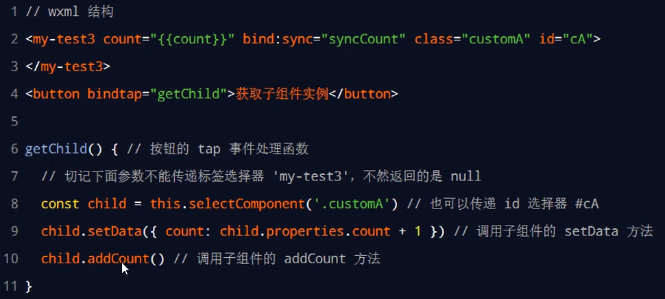
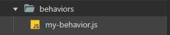
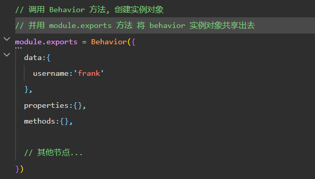
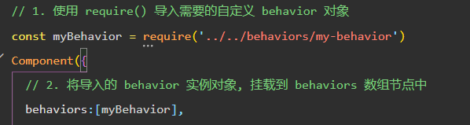
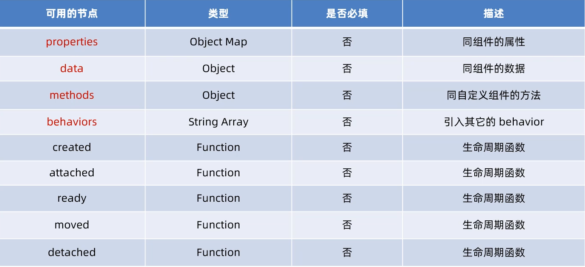

# 父子组件通信 和 behavior
## 父子通信 3种方式
1. 属性绑定
* 用于父组件向子组件的指定属性设置数据，仅能设置 JSON 兼容的数据

2. 事件绑定
* 用于子组件向父组件传递数据，可以传递任意数据

3. 获取组件实例
* 父组件还可以通过 `this.selectComponent()` 获取子组件实例对象
* 这样就可以直接访问子组件的任意数据和方法

### 属性绑定
思路跟 Vue 相同, 子组件 通过 properties 属性接受数据
### 事件绑定
**跟 Vue 思路相同**

事件绑定用于实现子向父传值，可以传递任何类型的数据。使用步骤如下：
1. 在父组件的 js 中，定义一个函数，这个函数即将通过自定义事件的形式，传递给子组件
2. 在父组件的 wxml 中，通过自定义事件的形式，将步骤 1 中定义的函数引用，传递给子组件
3. 在子组件的 js 中，通过调用 **`this.triggerEvent('自定义事件名称', { /* 参数对象 */ })`** ，将数据发送到父组件
4. 在父组件的 js 中，通过 `e.detail` 获取到子组件传递过来的数据

### 获取组件实例 
可在父组件里调用 **`this.selectComponent("id或class选择器")`** ，获取子组件的实例对象，从而直接访问子组
件的任意数据和方法。调用时需要传入一个选择器，例如 this.selectComponent(".my-component")

## behavior
behaviors 是小程序中，用于**实现组件间代码共享的特性**，类似于 Vue.js 中的 “mixins”

每个 behavior 可以包含一组**属性、数据、生命周期函数和方法**。组件引用它时，它的属性、数据和方法会被
合并到组件中

每个组件可以引用多个 behavior，behavior 也可以引用其它 behavior

### 创建 behavior
**调用 Behavior(Object object) 方法**即可创建一个共享的 behavior 实例对象

### 导入并使用 behavior 
在组件中，使用 **require() 方法**导入需要的 behavior，**挂载后即可访问 behavior 中的数据或方法**

### behavior 中所有可用的节点

### 同名字段的覆盖和组合规则 (了解)

组件和它引用的 behavior 中可以包含同名的字段，此时可以参考如下 3 种同名时的处理规则：

* 同名的数据字段 (data)
* 同名的属性 (properties) 或方法 (methods)
* 同名的生命周期函数

关于详细的覆盖和组合规则[官方解释](https://developers.weixin.qq.com/miniprogram/dev/framework/custom-component/behaviors.html)
