# 案例 - 本地生活(列表页面)

* 页面导航并传参
* 上拉触底时加载下一页数据
* 下拉刷新列表数据
## 实现导航跳转并传参
###  创建 shopList 页面 
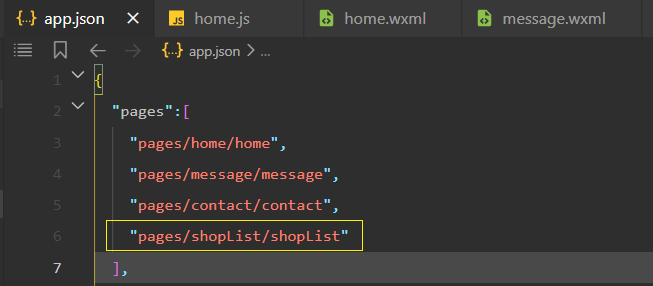
### 跳转并传参
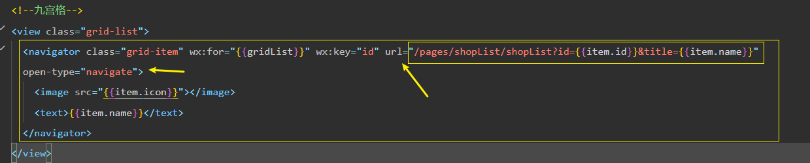
### 动态设置商铺列表的标题内容
动态设置页面的标题

[wx.setNavigationBarTitle(Object object)](https://developers.weixin.qq.com/miniprogram/dev/api/ui/navigation-bar/wx.setNavigationBarTitle.html)

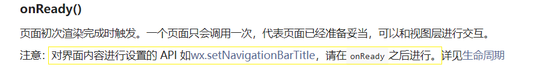

需要把 onLoad 函数中获取的 参数信息(options) 保存到 data 中, 供其他函数使用

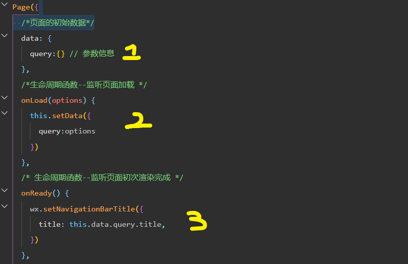
## 商铺列表页面的编译模式
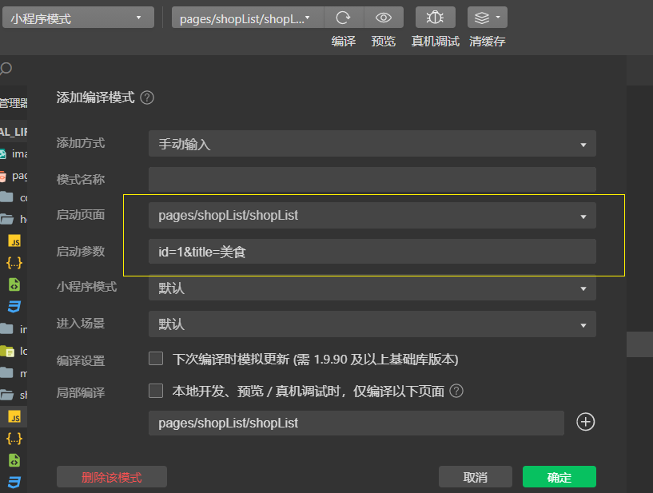
## 调接口 
以**分页**的形式，加载指定分类下商铺列表的数据：

1. 接口地址
* https://www.escook.cn/categories/:cate_id/shops
* URL 地址中的 :cate_id 是动态参数，表示分类的 Id
2. 请求方式
* GET 请求
3. 请求参数
* _page 表示请求第几页的数据
* _limit 表示每页请求几条数据
### 定义 getShopList() 获取商铺列表数据

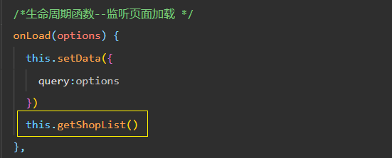
### 渲染 UI 结构美化样式

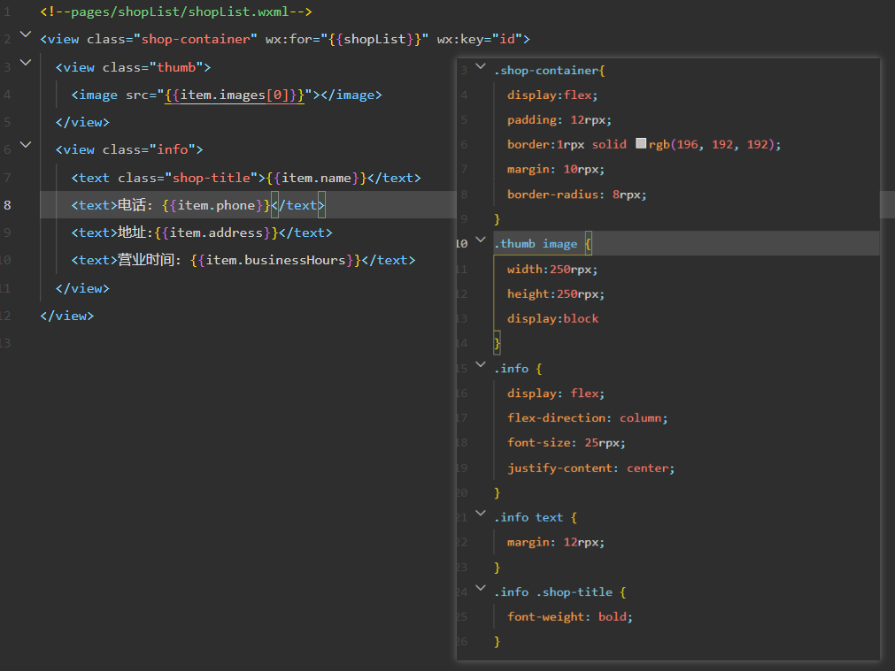
## 展示 loading 效果
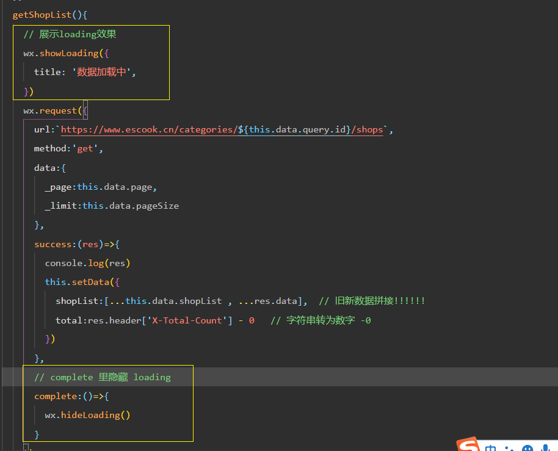
## 上拉触底请求下一页数据
1. 配置一下上啦触底的距离 onReachBottomDistance -> 200px
2. onReachBottom函数中 页码 加一 
3. 调用数据请求

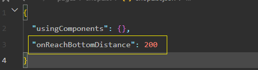
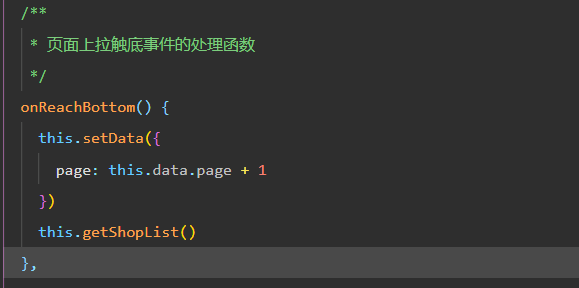
## 上拉触底 节流处理
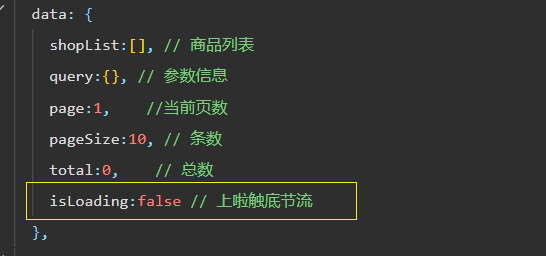
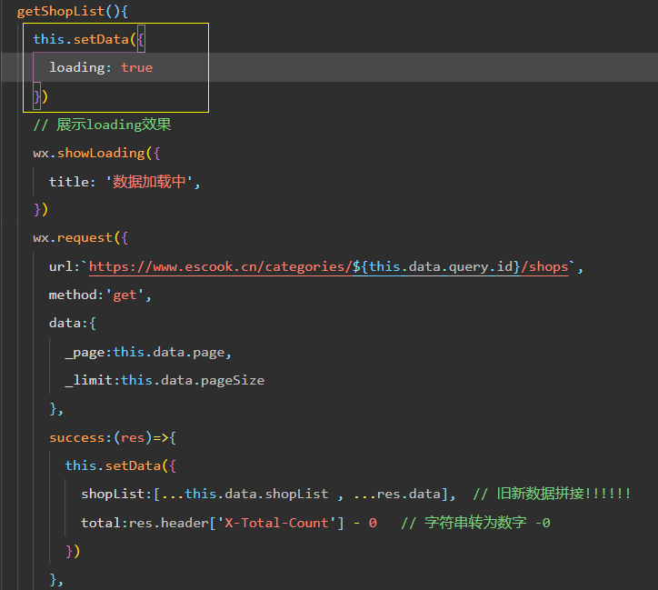
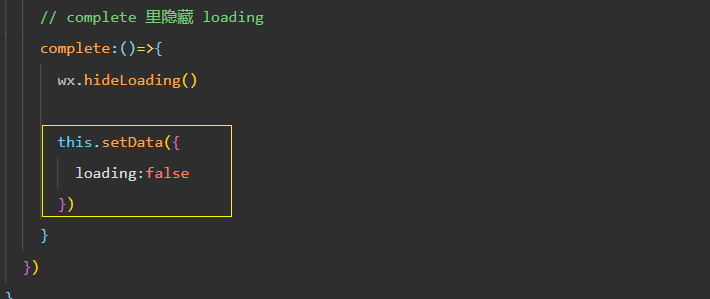
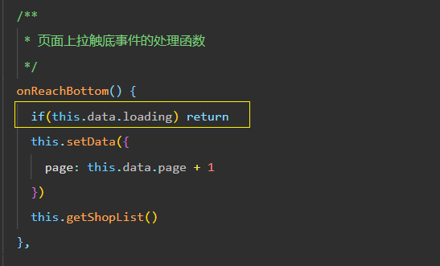
## 判断下一页是否还有数据 公式 
如果下面的公式成立，则证明没有下一页数据了：

页码值 * 每页显示多少条数据 >= 总数据条数
**page * pageSize >= total**

* 案例1：总共有 77 条数据，如果每页显示 10 条数据，则总共分为 8 页，其中第 8 页只有 7 条数据

page（7）* pageSize（10） >= total（77）
page（8）* pageSize（10） >= total（77）

* 案例2：总共有 80 条数据，如果每页显示 10 条数据，则总共分为 8 页，其中第 8 页面有 10 条数据

page（7）* pageSize（10） >= total（80）
page（8）* pageSize（10） >= total（80）

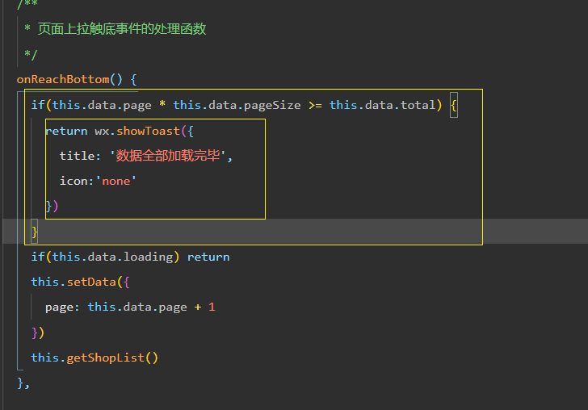
## 下拉刷新
###  开启下拉刷新
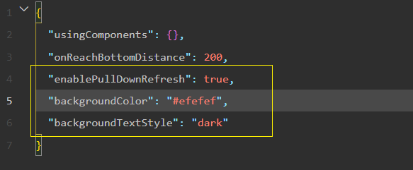
### 实现下拉刷新功能
1. 需要重置关键的数据 ( 页码值, shopList , total)
2. 重新发起请求

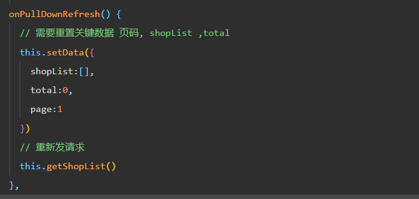
### 下拉刷新后自动关闭
按需调用 : 在 getShopList() 传入一个回调来控制是否关闭下拉刷新 

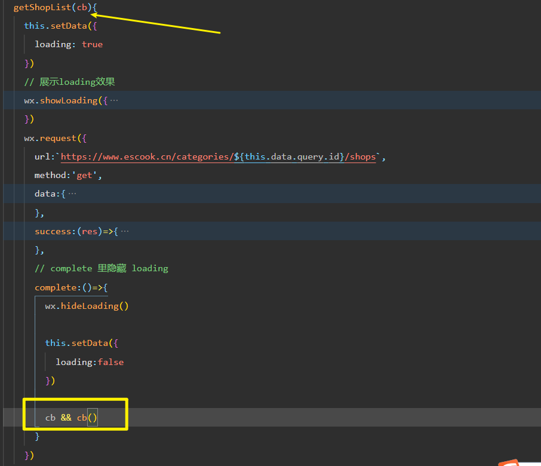
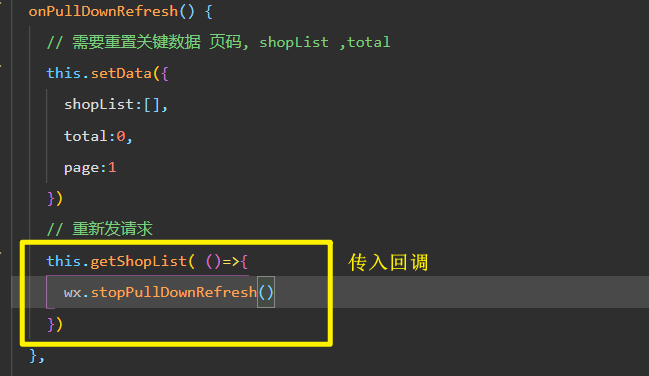

## 使用 wsx 处理手机号
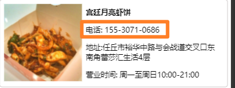

使用外联的 wxs 文件, 导入一个处理电话号码格式的函数
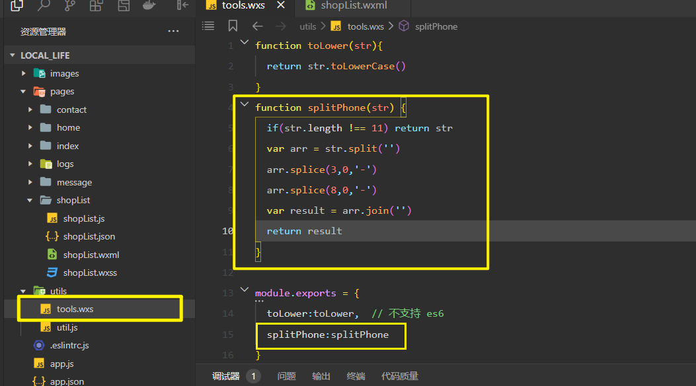
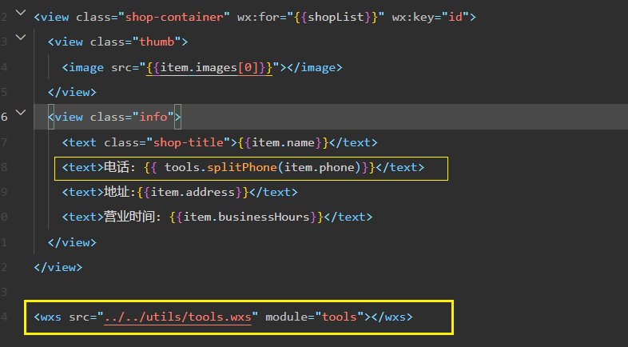

 
  

