# 页面导航
## 页面导航两种方法
1. 声明式导航
* 在页面上声明一个 `<navigator>` 导航组件
* 通过点击 `<navigator>` 组件实现页面跳转

2. 编程式导航
* 调用小程序的导航 API，实现页面的跳转
## 声明式导航
###  导航到 tabBar 页面
tabBar 页面指的是被配置为 tabBar 的页面

在使用 `<navigator>` 组件跳转到指定的 tabBar 页面时，需要指定 url 属性和 open-type 属性，其中：
* **url** 表示要跳转的页面的地址，必须以 **/**开头
* **open-type** 表示跳转的方式，**必须为 switchTab**

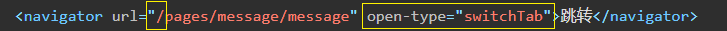

### 导航到 非 tanBar页面
**非 tabBar 页面**指的是没有被配置为 tabBar 的页面。

在使用 `<navigator>` 组件跳转到普通的非 tabBar 页面时，则需要指定 **url 属性和 open-type 属性**，其中：

* url 表示要跳转的页面的地址，必须以 `/`开头
* open-type 表示跳转的方式，**必须为 navigate**

示例代码如下：

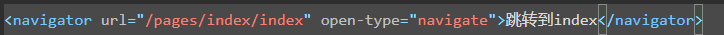

注意：为了简便，在导航到非 tabBar 页面时，open-type="navigate" 属性可以省略
### 后退导航
如果要后退到上一页面或多级页面，则需要指定 open-type 属性 navigateBack和 **delta 属性**，其中：
* open-type 的值必须是 **navigateBack**，表示要进行后退导航
* delta 的值必须是数字，表示要后退的层级

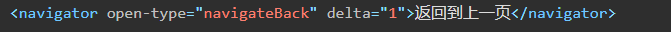

注意：为了简便，如果只是后退到上一页面，**则可以省略 delta 属性，因为其默认值就是 1**

## 编程式导航
### 导航到 tabBar 页面
调用 **wx.switchTab(Object object) 方法**，可以跳转到 tabBar 页面。其中 Object 参数对象的属性列表如下

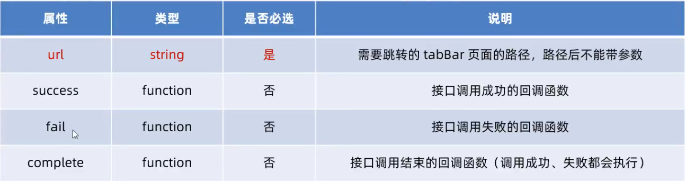

实际代码如下: 

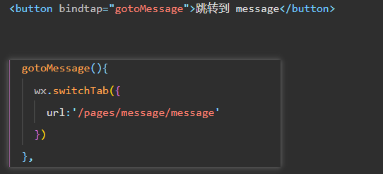

### 导航到 非 tabBar 页面
调用 **wx.navigateTo(Object object) 方法**，可以跳转到非 tabBar 的页面。其中 Object 参数对象的属性列表
如下：
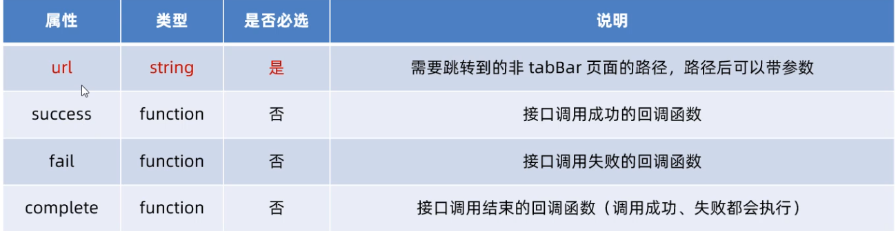

示例代码: 

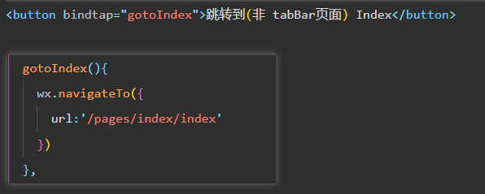
### 后退导航 
调用 **wx.navigateBack(Object object) 方法**，可以返回上一页面或多级页面。其中 Object 参数对象可选的
属性列表如下：
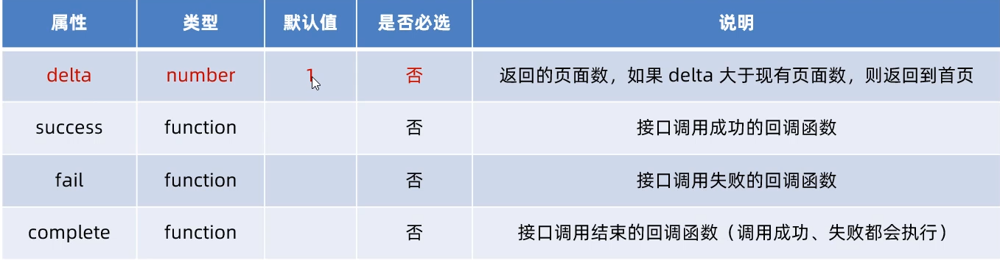

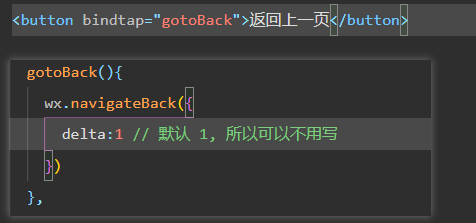
## 导航传参
### 声明式导航传参
navigator 组件的 url 属性用来指定将要跳转到的页面的路径。同时，路径的后面还可以携带参数：
* 参数与路径之间使用 `?` 分隔
* 参数键与参数值用 `=` 相连
* 不同参数用 `&` 分隔

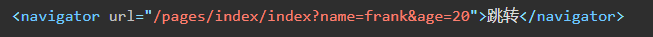

### 编程式导航传参
调用 **wx.navigateTo(Object object)** 方法跳转页面时，也可以携带参数，代码示例如下

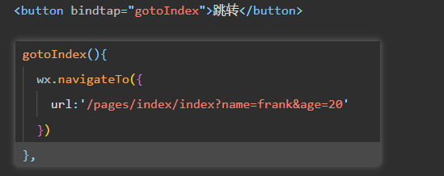
### 在 onLoad 中接收导航参数

通过**声明式导航传参**或**编程式导航传参**所携带的参数，可以直接在 onLoad 事件中直接获取到

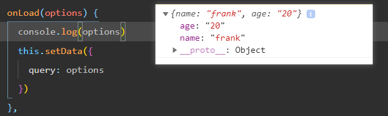

