# 页面事件
## 下拉刷新
下拉刷新 -> 重新加载页面数据
### 启用下拉刷新
1. 全局开启(不推荐)
*  在 app.json 的 window 节点中，将 enablePullDownRefresh 设置为 true

2. 局部开启(更推荐)
* 在页面的 .json 配置文件中，将 enablePullDownRefresh 设置为 true

在实际开发中，推荐使用第 2 种方式，**为需要的页面单独开启下拉刷新的效果**
### 配置下拉刷新窗口配置
在全局或页面的 .json 配置文件中，通过 backgroundColor 和 backgroundTextStyle 来配置下拉刷新窗口
的样式，其中：

* **backgroundColor** 用来配置下拉刷新**窗口的背景颜色**，仅支持16 进制的颜色值
* **backgroundTextStyle** 用来配置下拉刷新 **loading 的样式**，仅支持 dark 和 light

### 监听页面的呢下拉刷新事件
在页面的 .js 文件中，通过 **onPullDownRefresh()** 函数即可监听当前页面的下拉刷新事件

例如，在页面的 wxml 中有如下的 UI 结构，点击按钮可以让 count 值自增 +1

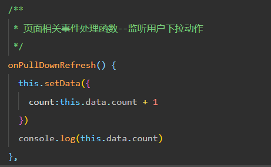
### 停止下拉刷新
当处理完下拉刷新后，下拉刷新的 loading 效果会一直显示，**不会主动消失**，所以需要手动隐藏下拉刷新的
loading 效果。此时，调用 **wx.stopPullDownRefresh()** 可以停止当前页面的下拉刷新

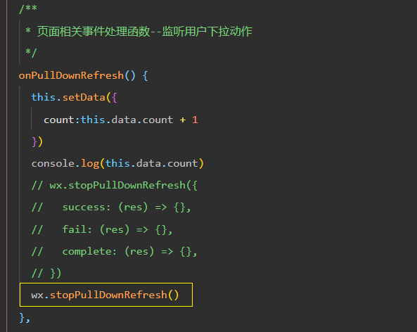

## 上拉触底 
沙拉触底 -> 加载更多数据(分页功能)
### 监听页面的上拉触底
在页面的 .js 文件中，通过 **onReachBottom() 函数**即可监听当前页面的上拉触底事件

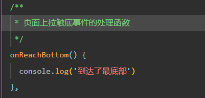

### 配置上拉触底举例
上拉触底距离指的是触发上拉触底事件时，滚动条距离页面底部的距离

可以在全局或页面的 .json 配置文件中，通过 **onReachBottomDistance 属性**来配置上拉触底的距离

小程序默认的触底距离是 **50px**，在实际开发中，可以根据自己的需求修改这个默认值
### 上拉触底案例
* 定义获取随机颜色的方法
* 在页面加载时获取初始数据
* 渲染 UI 结构并美化页面效果
* **在上拉触底时调用获取随机颜色的方法**
* **添加 loading 提示效果**
* **对上拉触底进行节流处理**
### (1) 定义获取随机颜色的方法
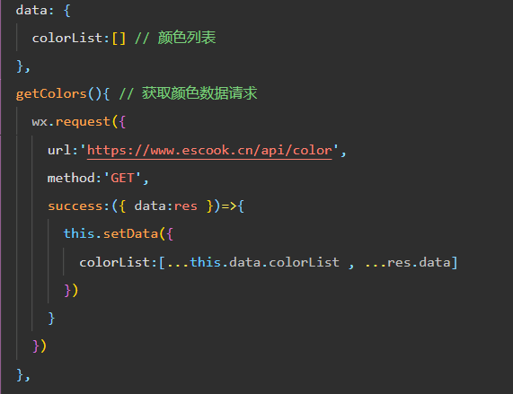
### (2) 页面加载时获取数据
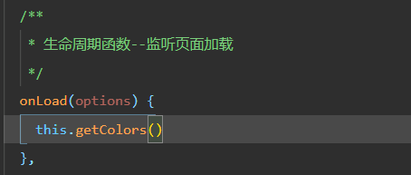
### (3)渲染到页面
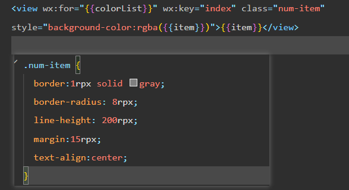
### (4)上啦触底获取随机颜色
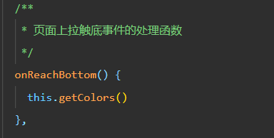
### (5) 添加 loading 提示效果
[官网][https://developers.weixin.qq.com/miniprogram/dev/api/ui/interaction/wx.showLoading.html]

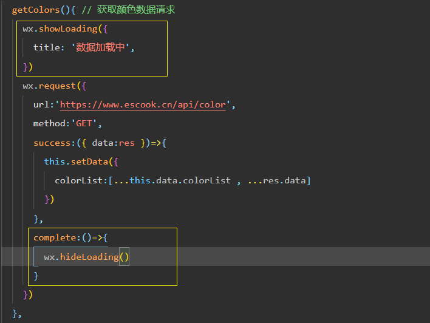
### (6) 节流处理
1. 在 data 中定义 isloading 节流阀
* false 表示当前没有进行任何数据请求
* true 表示当前正在进行数据请求

2. 在 getColors() 方法中修改 isloading 节流阀的值
* 在刚调用 getColors 时将节流阀设置 true
* 在网络请求的 complete 回调函数中，将节流阀重置为 false

3. 在 onReachBottom 中判断节流阀的值，从而对数据请求进行节流控制
* 如果节流阀的值为 true，则阻止当前请求
* 如果节流阀的值为 false，则发起数据请求

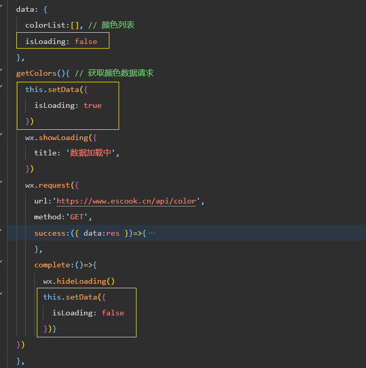
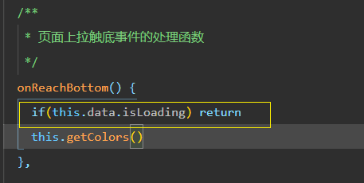

## 自定义编译模式
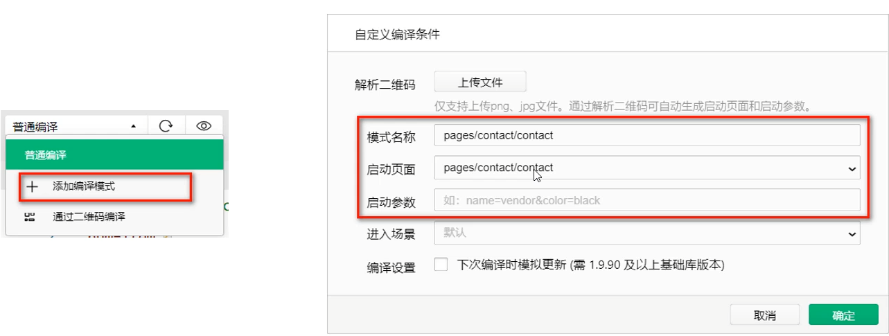

