# 自定义组件
## 创建组件
* 在项目的根目录中，鼠标右键，创建 **components -> test** 文件夹
* 在新建的 components -> test 文件夹上，鼠标右键，点击 **“新建 Component”**
* 键入组件的名称之后回车，会自动生成组件对应的 4 个文件，后缀名分别为 .js，.json， .wxml 和 .wxs
## 引用组件
### 局部引用组件
在**页面的 .json 配置文件**中引用组件的方式，叫做 **“局部引用”**
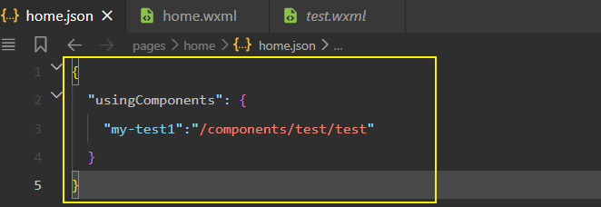

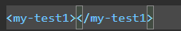

### 全局引用组件
在 **app.json 全局配置文件** 中引用组件的方式，叫做 **“全局引用”**

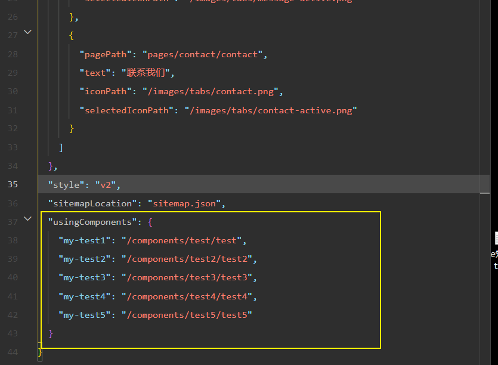
## 组件和页面的区别

从表面来看，组件和页面都是由 .js、.json、.wxml 和 .wxss 这四个文件组成的。但是，组件和页面的 .js 与
.json 文件有明显的不同：

* 组件的 .json 文件中需要声明 **"component": true 属性**
* 组件的 .js 文件中调用的是 **Component() 函数**
* 组件的事件处理函数需要定义到 **methods 节点** 中

## 样式
### 组件样式隔离
样式被隔离, 不会相互影响

### 组件样式注意点 
* app.wxss 中的全局样式对组件无效
* 只有 **class 选择器会有样式隔离效果**，id 选择器、属性选择器、标签选择器不受样式隔离的影响

**注意: !!!!!!!!!**
*在组件和引用组件的页面中建议使用 class 选择器，不要使用 id、属性、标签选择器！*
### 修改组件的样式隔离选项
默认情况下，自定义组件的样式隔离特性能够防止组件内外样式互相干扰的问题。但有时，我们希望在外界能
够控制组件内部的样式，此时，可以通过 **styleIsolation** 修改组件的样式隔离选项

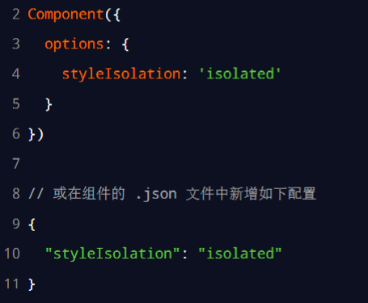
### styleIsolation 可选值
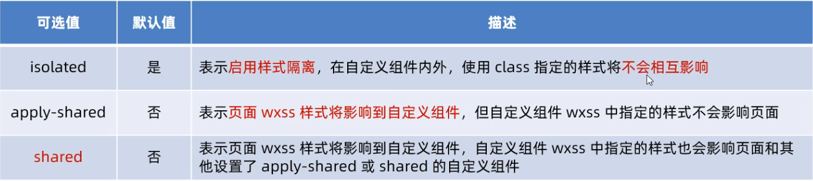

## 数据, 方法, 属性
### data 数据
用于组件模板渲染的私有数据，需要定义到 data 节点
### methods 方法 
在小程序组件中，**事件处理函数**和**自定义方法**需要定义到 methods 节点中，

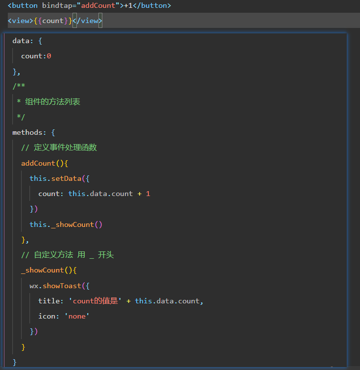
### properties 属性 
小程序组件中，properties 是组件的对外属性，**用来接收外界传递到组件中的数据**
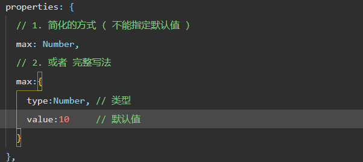
#### 小案例
实现 count 不能比 max 值 大 , 做一下简单的判断
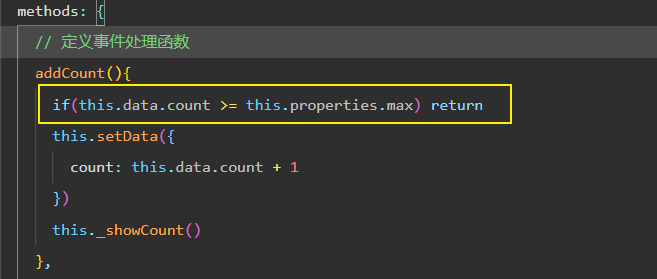

### data 和 properties 的区别
在小程序的组件中，properties 属性和 data 数据的用法相同，它们**都是可读可写的**，(跟 Vue 不一样)只不过：
* data 更倾向于存储组件的私有数据
* properties 更倾向于存储外界传递到组件中的数据

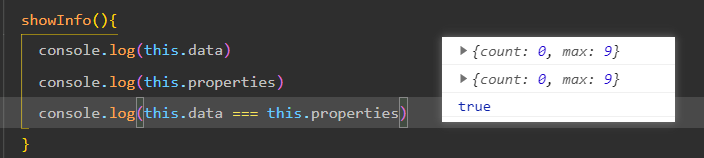

证明 data和 properties **本质上是一样**的 , 都是**可读可写**

### 使用 setData 修改 properties
由于**data 数据** 和 **properties 属性** 在本质上没有任何区别，因此 properties 属性的值也可以用于**页面渲染**，
或使用 setData 为 properties 中的属性重新赋值

## 数据监听器
数据监听器用于监听和响应任何属性和数据字段的变化，从而执行特定的操作。它的作用类似于 vue 中的
watch 侦听器
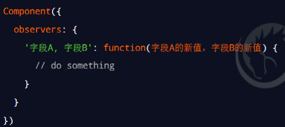

### 数据监听器基本用法

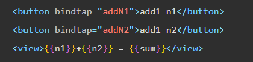
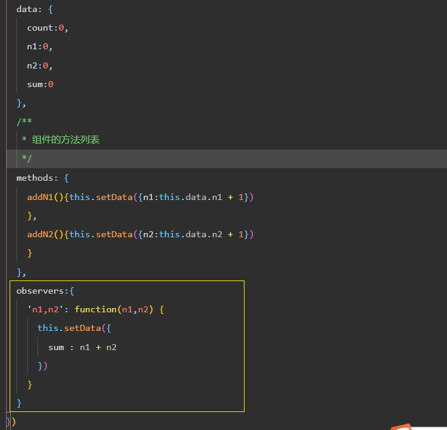
### 监听对象属性变化 
数据监听器支持监听*对象*中**单个**或**多个属性**的变化，
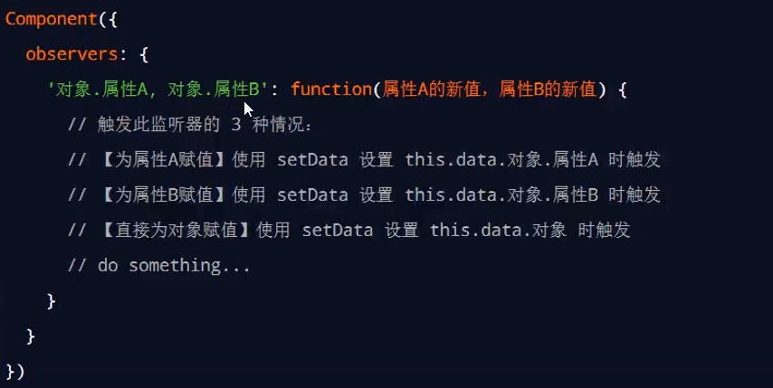

如果某个对象中需要被监听的属性太多，为了方便，可以使用**通配符** `**` 来监听对象中所有属性的变化
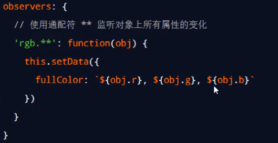
## 纯数据字段
概念：纯数据字段指的是那些**不用于界面渲染的 data 字段**

应用场景：例如有些情况下，某些 data 中的字段**既不会展示在界面上，也不会传递给其他组件**，仅仅在当前
组件内部使用。带有这种特性的 data 字段适合被设置为纯数据字段

好处：纯数据字段**有助于提升页面更新的性能**

###  使用规则
在 Component 构造器的 **options 节点**中，**指定 pureDataPattern 为一个正则表达**式，字段名符合这个正则
表达式的字段将成为纯数据字段

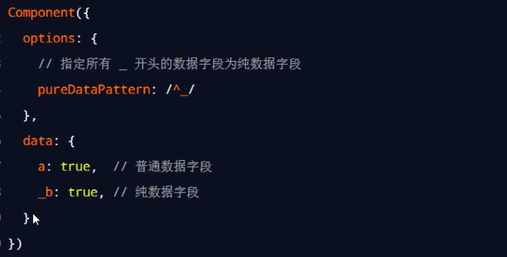

3. 使用纯数据字段改造数据监听器
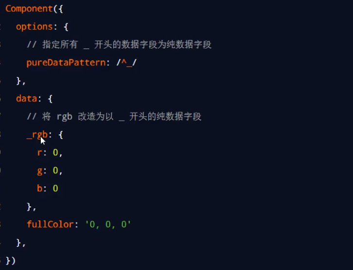

