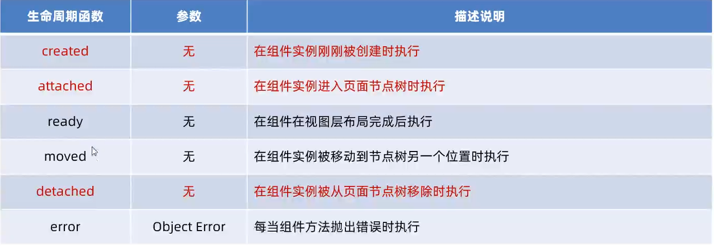
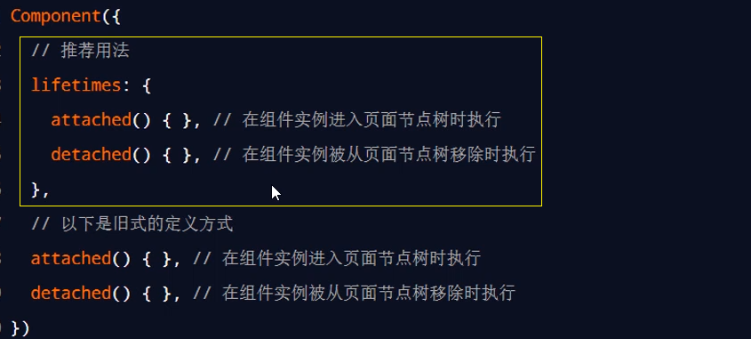
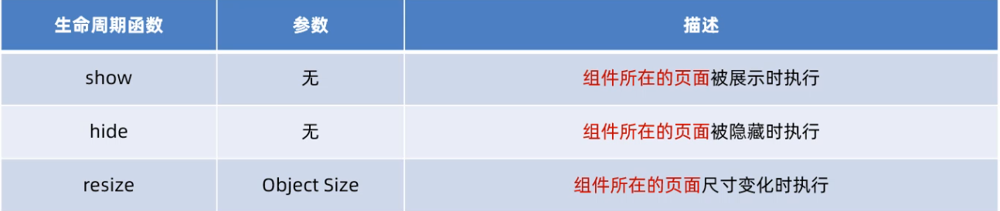
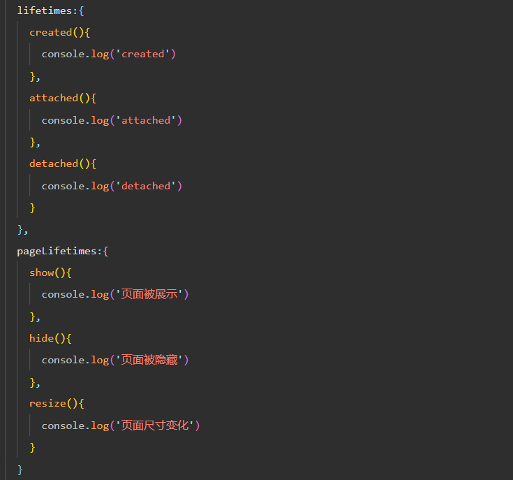
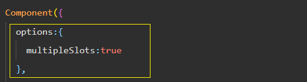

# 组件生命周期和插槽 
## 组件生命周期
### 组件全部生命周期
小程序组件可用的全部生命周期


### 组件主要的生命周期函数
在小程序组件中，最重要的生命周期函数有 3 个，分别是 **created、attached、detached**

1. 组件实例**刚被创建**好的时候，created 生命周期函数会被触发
* 此时还不能调用 setData
* 通常在这个生命周期函数中，只应该用于给组件的 this 添加一些自定义的属性字段

2. 在组件**完全初始化完毕、进入页面节点树**后， attached 生命周期函数会被触发
* 此时， this.data 已被初始化完毕
* 这个生命周期很有用，绝大多数初始化的工作可以在这个时机进行（例如发请求获取初始数据）

3. 在组件**离开页面节点树**后， detached 生命周期函数会被触发
* 退出一个页面时，会触发页面内每个自定义组件的 detached 生命周期函数
* 此时适合做一些清理性质的工作

### lifetimes 节点
在小程序组件中，生命周期函数可以直接定义在 Component 构造器的第一级参数中，可以在 **lifetimes 字段**
内进行声明 **（这是推荐的方式，其优先级最高）**


## 组件所在页面的生命周期
有时，**自定义组件的行为依赖于页面状态的变化**，此时就需要用到**组件所在页面的生命周期**


### pageLifetimes 节点 
组件所在页面的生命周期函数，需要定义在 **pageLifetimes 节点中**

## 插槽
在自定义组件的 wxml 结构中，可以提供一个 `<slot>`节点（插槽），用于承载组件使用者提供的 wxml 结构

### 单个插槽
单个插槽用法跟 Vue 相同
### 多个插槽
options 开启 multipleSlots 属性



组件内部 : 
```
<slot name="slotName"></slot>
```
使用时: 
```
<view slot="slotName">这是插入到slot name="slotName"的插槽</view>
```


