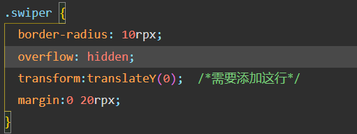

# 技巧
## 封装 wx.request() 网络请求
网络请求会在很多页面上用到, 但每次用原生的 `wx.request()`的话会非常的繁琐, 配置选项也比较多

所以事先封装一下网络请求, 着了要用 **类 class** 来封装, 因为用 class 封装有更高的聚合度, 而且里面还可以定义很多方法

怎么用?  可以这么用, 如下: 

但我们要想某一些页面它们返送网络请求的次数是非常多的, 而且每次发送网络请求的时候都要管理很多个 url路径, params 参数 等,
整个代码的结构依然看起来是很乱的, 所以怎么做呢? 中间再加一层 **分层架构** , 把确定的东西直接给我写死, 甚至连 `hyRequest.get` 都不用写

然后该怎么用 ?

发请求就变这么简单了, 封装的魅力...

## 关于 swiper 组件和图片的适配方案
**需求:** 不管是哪一种机型,  **让 swiper 组件的高度 等于 图片的高度**

**思路**: 
1. 图片加载完后, 获取图片的高度
2. 获取到的图片高度 赋值给 swiper 组件的高度 

**实现:** 

怎么获取到图片加载完后的时机? image 组件有 **bindload** 事件, 

可以监听这个事件

那下一步怎么获取到**图片的高度**呢?  [wx.createSelectorQuery()](https://developers.weixin.qq.com/miniprogram/dev/api/wxml/wx.createSelectorQuery.html)

data 里的 swiperHeight 动态设置到 swiper 的高度上

但这次发现上面的(获取高度)代码有点难记, 所以封装一下, 在里面用promise 直接 resolve(res)

**最终**: 

## 轮播图 圆角(border-radius) bug修复
`<swiper>` 组件上添加 class="swiper"

