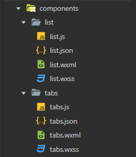
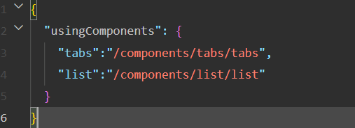
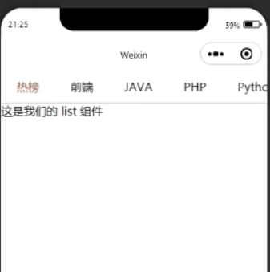

# 小程序进阶概念
## 组件
::: tip
1. 组件应该被放入到哪个文件夹中？
2. 如何在页面中使用【自定义组件】？
:::

1. 创建组件
   1. 创建 `components` 文件夹
   2. 创建 `tabs` 和 `list` 文件夹
   3. 右键 **新建 `Component`**
   
2. 使用组件
   1. 找到页面的 `.json` 文件
   2. 在 `usingComponents` 选项下 **注册组件**
      1. `key` 为当前组件在该页面中的标签名
      2. `value` 为组件的代码路径
      
   3. 在页面的 `wxml` 文件中，以 **注册的 `key`** 为标签名，使用组件

总结: 
1. 组件应该被放入到哪个文件夹中？
   1. `components`
2. 如何在页面中使用【自定义组件】？
   1. 在**页面**的 `.json` 文件中，通过 `usingComponents` 进行注册
   2. 在 `wxml` 文件中，以注册的 `key`  为 **标签名** 进行使用

## 组件的生命周期
::: tip
1. 组件的 生命周期 和 方法 分别应该被放入到哪个节点下？
2. `created` 函数中可以调用 `setData` 吗？
3. 获取数据的操作应该在哪个函数中进行？
:::

组件的生命周期必须要放入到 **`lifetimes`** 中, 而方法必须要放入到 `methods` 中

组件的生命周期一共有三个：

1. `created` ： 组件实例刚刚被创建好。**此时还不能调用 `setData`**
2. `attached`：组件完全初始化完毕、进入页面节点树后。**绝大多数初始化工作可以在这个时机进行**
3. `detached`：在组件离开页面节点树后

```js
// components/tabs/tabs.js
Component({
  properties: {

  },
  data: {
    listData:[], // tabs 数据
    active: -1 // 选中项
  },
  // 组件的生命周期
  lifetimes:{
    attached(){
      this.loadTabsData()
    }
  },
  /**
   * 组件的方法列表
   */
  methods: {
    loadTabsData(){
      wx.request({
        url:'https://api.imooc-blog.lgdsunday.club/api/hot/tabs',
        method:'GET',
        success(res){
          this.setData({
            listData: res.data.data.list,
            active: 0
          })
        }
      })
    }
  }
})
```

```html
<scroll-view class="tabs-box" scroll-x>
  <view wx:for="{{listData}}"
    wx:key="index"
    class="tab {{active === index ? 'active' : ''}}"
    >
    {{item.label}}
  </view>
</scroll-view>
```
```css
.tabs-box {
    /* 指定宽度 + 不换行 */
    width: 750rpx;
    white-space: nowrap;
    border-bottom: 1px solid #cccccc;
}

.tab {
    /* 指定 display */
    display: inline-block;
    padding: 12px 22px;
}

.active {
    color: #f94d2a;
}
```
 

**总结** : 
1. 组件的 生命周期 和 方法 分别应该被放入到哪个节点下？
   1. 生命周期应该被定义在 `lifetimes` 中
   2. 方法必须要放入到 `methods` 中
2. `created` 函数中可以调用 `setData` 吗？
   1. 不可以
3. 获取数据的操作应该在哪个生命周期函数中进行？
   1. `attached`

## 数据监听器
::: tip
1. 小程序中通过哪个选项来声明数据监听器
2. 数据监听器的使用场景是什么？
:::

通过 **接口文档** 可以看出，如果想要获取 `list` 那么需要传递一个 `type` 的参数，而这个 `type` 就是用户选中的 `tab 项` 的 `id`

所以接下来就需要来做一件事情：**监听用户选中的 `tab`，根据用户选中的 `tab` 来切换底部 `list` 的数据**

[数据监听器官方文档](https://developers.weixin.qq.com/miniprogram/dev/framework/custom-component/observer.html)


目标：**监听用户选中的 `tab`，根据用户选中的 `tab` 来切换底部 `list` 的数据**

步骤拆解如下：

> 1. 监听用户选中项的变化
> 2. 获取用户选中的数据的 `id`
> 3. 把 `id` 传递给 `list` 组件
> 4. `list` 组件根据接收到的 `id` 获取对应的数据

```html{5,6}
<scroll-view class="tabs-box" scroll-x>
  <view wx:for="{{listData}}"
    wx:key="index"
    class="tab {{active === index ? 'active' : ''}}"
    bind:tap="onItemClick"
    data-index="{{index}}"
    >
    {{item.label}}
  </view>
</scroll-view>
```

```js
methods: {
    ...
    onItemClick(e) {
      // 通过 dataset 获取传递的参数
      const { index } = e.target.dataset
      // 点击 tab 时, 切换当前激活项
      this.setData({
        active: index
      })
    }
  },
  observers:{ // 监听器
    'active': function (active) {
      // 监听 active 数据的变化, 先获取那一个 item 项
      const {id} = this.data.listData[active]
    }
  }
```

目前，已经实现了需求的前两步

后面两步需要了解 **组件之间的关系和通讯**


**总结:**
1. 小程序中通过哪个选项来声明数据监听器
   1. `observers`
2. 数据监听器的使用场景是什么？
   1. 需要监听数据的变化
   2. 在数据变化之后，进行一些额外的操作
## 组件之间的关系与通讯
::: tip
1. 组件之间数据传递的关系可以分为哪几种？
2. 兄弟组件之间传递数据的方式是什么？
:::

组件之间的关系常用的可以分为**父子组件**和**兄弟组件**


**不同关系组件之间传递数据的方式**
父子关系

1. 父向子传参：

   ```js
   // 子组件：通过 properties 声明要从父组件中接收的数据
       /**
        * 组件的属性列表
        */
       properties: {
           tabId: String
       },
   
   // 父组件：通过自定义属性的形式传递数据，以子组件中定义的 key 为属性名，以要传递的数据为属性值
      <list tabId="{{tabSelectId}}">
   ```

2. 子向父传参：

   ```js
   // 子组件：通过 triggerEvent 方法发送一个通知，通知父组件接收数据。
   // 方法的第一个参数为：通知名
   // 方法的第二个参数为：要传递的数据
   this.triggerEvent('change', {
       id
   })
   
   // 父组件：通过 bind 监听子组件中发送的通知
   // bind 后的内容为 子组件发送的通知名，表达式为接收到该通知时所触发的方法
   <tabs bind:change="onTabChange"></tabs>
   // 方法被触发后可以通过 e.detail 的形式获取子组件传递过来的数据对象
   onTabChange (e) {
       const {id} = e.detail;
       this.setData({
           tabSelectId: id
       })
   }
   ```

   
兄弟关系

1. 兄弟组件之间传参：**兄弟关系 === 没有关系**。 兄弟组件只是为了方便称呼的一个叫法而已

   所以想要完成兄弟组件之间的传参，就需要：**为它们建立关系**

   而建立关系说白了就是为了找到一个：**和这两个组件都认识的 ”中间人“ 。** 

   这个中间人一般为：**统一的父组件。**

   而最后：兄弟组件之间想要传递数据，就需要利用 ”中间人进行传递“，也就是：

   > 1. 【兄弟 A 组件】传递数据给 父组件（中间人）
   > 2. 父组件（中间人）再把数据传递给 【兄弟 B 组件】

   
**总结**
1. 组件之间数据传递的关系可以分为哪几种？
   1. 父向子传递数据
   2. 子向父传递数据
   3. 兄弟组件之间传递数据
2. 兄弟组件之间传递数据的方式是什么？

## 组件的插槽
::: tip
小程序中如何定义多个插槽？
:::

小程序默认只能定义一个插槽，如果要定义多个插槽那么需要：**在组件中指定 `options` 选项的 `multipleSlots` 选项为 `true`**
```js
Component({
  options:{
    multipleSlots:true
  }
})
```

**使用：**

**2.1：使用单一插槽：**

在组件使用时，以 `innerHTML ` 的形式插入内容：

```html
<component>
    <view>单一插槽插入的 DOM</view>
</component>
```

**2.2：使用多个插槽：**

在组件使用时，以 `innerHTML ` 的形式插入内容，以 `slot` 属性标记当前 `DOM` 插入到哪个插槽中：

```html
<component>
    <view slot="header">该元素将被插入到 name=header 的插槽中</view>
    <view slot="footer">该元素将被插入到 name=footer 的插槽中</view>
</component>
```

**总结:**
小程序中如何定义多个插槽？

1. 指定 `options` 的 `multipleSlots` 为 `true`
2. 使用具名插槽传递

