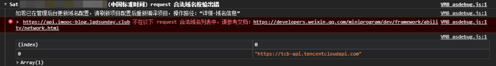
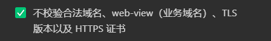

# 小程序核心语法
## 绑定数据
`index.js`
```js
// index.js
// 获取应用实例
const app = getApp()
Page({
  data:{
    product:{
      price:50,
      num:5
    }
  }
})
```

1. 什么是**数据驱动**？
   1. 当数据发生变化时，视图理应发生变化
2. 在小程序中如何完成数据绑定？
   1. 在 `data` 中定义数据 (对象)
   2. 在 `wxml` 中通过 `{{}}` 使用数据
## 常用事件与属性列表
::: tip
1. 如何为按钮添加点击事件 ? 
2. 如何修改 `data` 中的数据的值 ? 
:::

#### 处理点击事件
那么现在处理一下**点击事件**

> 1. 创建一个按钮
> 2. 当用户点击按钮时
> 3. 让 `product` 的 `num + 1`

先创建按钮
```html
<button type="primary">+1</button>
```

在【小程序】中，那么如果想要给 `button` 添加点击事件则不可以使用 `click` 而是 **`bind:tap / bindtap`**

其中 `bind: / bind` 表示【绑定事件】，`tap` 为绑定的具体事件。小程序具体事件列表，可以点击 [这里](https://developers.weixin.qq.com/miniprogram/dev/framework/view/wxml/event.html#%E4%BA%8B%E4%BB%B6%E7%9A%84%E4%BD%BF%E7%94%A8%E6%96%B9%E5%BC%8F) 查看

`index.wxml`
```html
<button type="primary" bind:tap="addNum1">+1</button>
```
`index.js`
```js
const app = getApp()
Page({
  data:{
    product:{
      price:50,
      num:5
    }
  },
  addNum(){
    console.log('点击了按钮')
  }
})
```
#### 修改 data 的数据
想要修改 `data` 中的数据，那么我们需要借助一个函数 `setData`。

`setData` 接收一个 对象作为参数，这个对象就是最新的 `data` 数据。

其中 `key` 为要修改的数据， `value` 为最新的值
#### 访问 data 的数据
因为想要让 `num + 1` ，所以我们还需要拿到 `num` 的当前值，想要访问 `num` 的值，可以通过 `this.data.product.num` 的形式访问

所以最终的修改 `num` 的代码为：

`index.js`
```js
  addNum(){
    this.setData({
      'product.num': this.data.product.num + 1
    })
  }
```
**答案:**
1. 如何为按钮添加点击事件？
   1. `bindtap` ||  `bind:tap`
2. 如何修改 `data` 中数据的值？
   1. 通过 `this.setData({})` 定义新的值
   2. 通过 `this.data` 访问具体的值
## 事件传参
::: tip
如果想要在 **点击事件中** 传递参数，那么需要怎么做？
:::

现在 `addNum` 方法可以接受一个参数, 每次点击按钮增加的 `num` 数量为传入的参数 

-----
在小程序中，如果想要给 **点击事件传递参数的话，**那么需要借助 **event 对象** 和 **data- 属性** ！

#### 形参
首先先来看 **形参**，对于 **点击事件的回调方法** 而言，默认会接收一个参数 **event （事件对象）**。这个 `event` 对象为：**回调方法的唯一参数**

#### 实参
对于 **小程序** 中，我们不能直接为 **回调方法传递实参**。

而是需要通过：**属性绑定的形式，把需要传递的参数绑定到 当前 `DOM` 元素中**，绑定数据的属性需要以 `data-` 开头。该属性可以通过 `e.target.dataset` 进行访问

```html
<button type="primary" data-step="5" bind:tap="addNum">+1</button>
```

```js
const app = getApp()
Page({
  data:{
    product:{
      price:50,
      num:5
    }
  },
  addNum(e){
    // e.target.dataset.step 获取值
    const step = parseInt(e.target.dataset.step)
    this.setData({
      'product.num': this.data.product.num + step
    })
  }
})
```
**总结:**

如果想要在【点击事件中】传递参数，那么需要怎么做？

1. 通过属性绑定`（data-xxx）`的形式，把需要传递的参数绑定到 当前 `DOM` 元素中
2. 在对应的回调函数中，通过 `e.target.dataset` 进行访问

## 实现【双向数据绑定】
::: tip
1. 什么叫做**双向数据绑定**？
2. 小程序中如何实现双向数据绑定？
:::


接下来希望实现一个新的功能：

> 创建一个数字输入框，输入框 与【商品数量】完成 【双向数据绑定】。
>
> 即：
>
> 1. 输入框内容发生变化时，商品数量同步跟随变化
> 2. 商品数量发生变化时，输入框内容同步跟随变化

----
> 1. 创建一个【数字输入框】
> 2. 设置 【商品数量】 为输入框的初始值
> 3. 监听用户的输入行为
> 4. 获取用户输入的值
> 5. 赋值给【商品数量】
```html
<input type="number" value="{{product.num}}" bind:input="onInput"/>
```
```js
  onInput(e){
    const val = parseInt(e.detail.value)
    this.setData({
      'product.num': val
    }) 
  }
```
**总结:**
1. 什么叫做双向数据绑定？
   1. 当视图发生变化时，数据跟随发生变化
   2. 当数据发生变化时，视图跟随发生变化
2. 小程序中如何实现双向数据绑定？
   1. 通过 `value` 为 `input` 视图绑定数据
   2. 通过监听 `bindinput` 获取视图的变化，在回调方法中修改数据

## 条件渲染
::: tip
`wx:if` 和 `hidden` 的区别是什么？
:::

> 1. 如果【总价格 <= 100 】：hello 帅哥
> 2. 如果【总价格 > 100 && 总价格 < 1000】：哇哦 有钱人哦
> 3. 如果【总价格 >= 1000】：土豪你好

小程序中提供了两个 API 都可以实现【条件渲染】的功能：

1. `wx:if ... wx:elif ... wx:else`
2. `hidden`

分别实现一下
```html
<!-- wx:if ... wx:elif ... wx:else：判断结果为 true 则进行渲染，否则不进行渲染 -->
  <view>
    售货员小姐姐惊呼：
    <text wx:if="{{ product.price * product.num <= 100 }}">hello 帅哥</text>
    <text wx:elif="{{ product.price * product.num > 100 && product.price * product.num < 1000 }}">哇哦 有钱人哦</text>
    <text wx:else>土豪你好</text>
  </view>
  <!-- hidden：结果为 true 则隐藏，否则不隐藏 -->
  <view>
    售货员小姐姐惊呼：
    <text hidden="{{ !(product.price * product.num <= 100) }}">hello 帅哥</text>
    <text hidden="{{ !(product.price * product.num > 100 && product.price * product.num < 1000) }}">哇哦 有钱人哦</text>
    <text hidden="{{product.price * product.num < 1000}}">土豪你好</text>
  </view>
```

答案：

> 1. v-if 和 hidden 的区别是什么？
>    1. `v-if` 用来控制 【组件是否会被渲染】
>    2. `hidden` 用来控制【组件是否会被隐藏】
>    3. 一般来说，`wx:if` 有更高的切换消耗而 `hidden` 有更高的初始渲染消耗。因此，如果需要频繁切换的情景下，用 `hidden` 更好，如果在运行时条件不大可能改变则 `wx:if` 较好。


## 列表渲染
::: tip
1. 使用 `wx:for` 时，当前项的【下标变量名】和【当前项变量名】默认分别是什么？
2. `block` 组件是否会被渲染？
:::

小程序中提供了 `wx:for` 指令

同时也为提供了一个：**包裹性质的容器 `block` 组件**，当我们去循环多个元素时，可以使用 `block` 进行包裹，`block` 组件只起到包裹的其他组件的作用，本身并不会进行渲染。
```html
<view class="box">
  <block wx:for="{{products}}" wx:key="index">
    <view>
      <text>商品名: {{item.name}}</text>
      <text>商品价格 : {{item.price}}</text>
    </view>
  </block>
</view>
```

```js
data: {
   products: [
     {
       name: '苹果',
       price: 3.2
     },
     {
       name: '面包',
       price: 5.0
     },
     {
       name: '可乐',
       price: 2.5
     }
   ]
 }
```

**总结:**
1. 使用 `wx:for` 时，当前项的【下标变量名】和【当前项变量名】默认分别是什么？
   1. 默认数组的当前项的下标变量名默认为 **`index`**
   2. 数组当前项的变量名默认为 **`item`**
2. `block` 组件是否会被渲染？
   1. `block` 只是一个包裹性质的容器，不会被渲染

## 配置文件解读
1. `app.json` 配置文件：https://developers.weixin.qq.com/miniprogram/dev/reference/configuration/app.html
   1. `pages` 数组：https://developers.weixin.qq.com/miniprogram/dev/reference/configuration/app.html#pages
      1. 创建 `list` 页面
   2. `window` 对象：https://developers.weixin.qq.com/miniprogram/dev/reference/configuration/app.html#window
   3. `tabbar` 对象：https://developers.weixin.qq.com/miniprogram/dev/reference/configuration/app.html#tabBar
      1. `index` 页面
      2. `list` 页面
2. `页面.json` 配置文件：https://developers.weixin.qq.com/miniprogram/dev/reference/configuration/page.html'
## 数据请求
::: tip
1. 小程序中的数据请求有什么限制？以及如何解决这种限制
2. 小程序的数据请求会存在跨域问题吗？为什么？
3. 小程序的数据请求可以叫做 `ajax` 请求吗？为什么？
:::

[wx.request](https://developers.weixin.qq.com/miniprogram/dev/api/network/request/wx.request.html) 发起网络请求，请求的方式主要分为两种：

1. `get` 请求
2. `post` 请求

这里准备了两个数据请求接口，可以用来测试 [wx.request](https://developers.weixin.qq.com/miniprogram/dev/api/network/request/wx.request.html) 的数据请求（详见接口文档）：

1. `/api/test/getList`
2. `/api/test/postData`

```js
// html
<view>
  <button type="primary" bindtap="onGetClick">发起 get 请求</button>
</view>
// js
// index.js
// 获取应用实例
onGetClick () {
    wx.request({
        url: 'https://api.imooc-blog.lgdsunday.club/api/test/getList',
        method: 'GET',
        success: (res) => {
            console.log(res);
        }
    })
}
```
这样的代码看起来没有任何问题，但是却得到了一个错误（可测试的 `APPID：wxf01e2ce0eb588aac`）：


而要解决这个问题，我们就需要明确一个问题：**小程序中的数据请求有什么限制？**

1. 只能请求 `HTTPS` 类型的接口
2. 必须将接口的域名添加到信任列表中

**解决方案：**

1. 生产环境：将想要请求的域名协议【更改为 HTTPS】并【添加到域名信任列表】
2. 开发环境：通过勾选


--- 
当 `get` 请求完成，接下来来测试一下 `post` 请求：

```js
// html 
  <button type="primary" bindtap="onPostClick">发起 post 请求</button>
  // js
   onPostClick () {
    wx.request({
      url: 'https://api.imooc-blog.lgdsunday.club/api/test/postData',
      method: 'POST',
      data: {
        msg: '愿大家心想事成，万事如意'
      },
      success: (res) => {
        console.log(res);
      }
    })
  }
```

**题外话**
1. **跨域问题：** 跨域问题主要针对 **浏览器** 而言，而小程序宿主环境为【**微信小程序客户端**】，所以小程序中不存在【跨域问题】
2. **`ajax` 请求：** `ajax` 依赖于 `XMLHttpRequest` 对象，而小程序宿主环境为【微信小程序客户端】，所以小程序中的【网络请求】**不是** `ajax` 请求


总结: 
1. 小程序中的数据请求有什么限制？以及如何解决这种限制
    1. 限制：
       1. 只能请求 `HTTPS` 类型的接口
       2. 必须将接口的域名添加到信任列表中
    2. 解决方案：
       1. 生产环境：将想要请求的域名协议【更改为 HTTPS】并【添加到域名信任列表】
       2. 开发环境：通过勾选
 2. 小程序的数据请求会存在跨域问题吗？为什么？
    1. 不会
 3. 【跨域问题】只存在于基于浏览器的 `Web` 开发中
 4. 由于小程序的宿主环境不是浏览器，而是微信客户端
 5. 所以小程序中不存在跨域问题
 6. 小程序的数据请求可以叫做 `ajax` 请求吗？为什么？
    1. 不可以
    2. `ajax` 的核心是依赖于 【浏览器端】 的 `XMLHttpRequest` 对象
    3. 由于小程序的宿主环境不是浏览器，而是微信客户端
    4. 所以小程序的数据请求不可以叫做 `ajax` 请求

## 小程序中使用 promise 解决异步编程
::: tip
如何使 `wx.request` 配合 `async` 和 `await` 使用？
:::

目前有一个需求，需要你按照以下的逻辑去进行接口请求：

1. 先去请求接口 A
2. 在接口 A 获取到数据之后，再去请求接口 B
3. 在接口 B 获取到数据之后，再去请求接口 C
4. 在接口 C 获取到数据之后，再去请求接口 D


因为 `wx.request` 不支持 `promise` 化，所以我们需要：**使用 `promise` 封装 `wx.request` 请求**
```js
  pA () {
    return new Promise((resolve, reject) => {
      console.log('执行 A 接口的逻辑');
      wx.request({
        url: 'https://xxx',
        success: (res) => {
          resolve(res)
        },
        fail: (err) => {
          reject(err)
        }
      })
    })
  }
```

使用 `async` 和 `await` 简化 `promise` 的操作（PS：注意不要勾选 ES6 转 ES5）

```js
async onPromiseGetClick () {
    const resA = await this.pA()
    console.log(resA.data.data.msg);
    const resB = await this.pB()
    console.log(resB.data.data.msg);
    const resC = await this.pC()
    console.log(resC.data.data.msg);
    const resD = await this.pD()
    console.log(resD.data.data.msg);
  }
```

**总结:**
* 如何使 `wx.request` 配合 `async` 和 `await` 使用？
1. 使用 `promise` 封装 `wx.request` 请求
2. 使用 `async` 和 `await` 简化 `promise` 的操作

## 生命周期
::: tip
1. 什么是生命周期？什么是生命周期函数？
2. `onReady`  的调用时机是什么？
:::

**什么是生命周期：**

所谓 **生命周期** 就是：一件事物由 **创建** 到 **销毁** 的全过程。

在这个过程中会有很多 **” 关键的时刻 “**，这些关键的时刻就是 **生命周期函数**

------

在 【小程序】中，生命周期主要分为两部分：

1. **页面的生命周期** (现在总结)
2. **组件的生命周期**（后面再总结一下）

创建新的页面 `list`，在新创建的页面中，可以发现在 `js` 文件中已经默认生成了很多的代码：
```js
// pages/list/list.js
Page({
	...
    /**
     * 生命周期函数--监听页面加载
     */
    onLoad: function (options) {
        console.log('onLoad');
    },

    /**
     * 生命周期函数--监听页面初次渲染完成
     */
    onReady: function () {
        console.log('onReady');
    },

    /**
     * 生命周期函数--监听页面显示
     */
    onShow: function () {
        console.log('onShow');
    },

    /**
     * 生命周期函数--监听页面隐藏
     */
    onHide: function () {
        console.log('onHide');
    },

    /**
     * 生命周期函数--监听页面卸载
     */
    onUnload: function () {
        console.log('onUnload');
    },
	...
})
```

**这些生命周期函数不需要全部掌握**，先需要着重掌握其中两个就可以：

1. `onLoad`：最先被调用，可以用来【接收别的页面传递过来的数据】。在后面的【页面跳转】中会再去进行具体总结
2. `onReady`：页面初次渲染完成后调用。可以 **在这里从服务端获取数据** 

```js
// html
<scroll-view class="list-box" scroll-y>
    <block wx:for="{{ listData }}" wx:key="index">
        <view class="list-item">{{ index }} -- {{ item.title }}</view>
    </block>
</scroll-view>

// js
    /**
     * 生命周期函数--监听页面初次渲染完成
     */
    onReady: async function () {
        console.log('onReady');
        const data = await this.getList()
        this.setData({
            listData: data.list
        })
    },
    getList() {
        return new Promise((resolve, reject) => {
            wx.request({
                url: 'https://api.imooc-blog.lgdsunday.club/api/test/getList',
                method: 'GET',
                success: (res) => {
                    resolve(res.data.data)
                }
            })
        })
    }
// css
.list-item {
    padding: 26px;
    font-size: 20px;
    font-weight: bold;
    border-bottom: 1px solid #cccccc;
}
```
**总结**
1. 什么是生命周期？什么是生命周期函数？
   1. 所谓 **生命周期** 就是：一件事物由 **创建** 到 **销毁** 的全过程。
   2. 在这个过程中会有很多 **” 关键的时刻 “**，这些关键的时刻就是 **生命周期函数**
2. `onReady`  的调用时机是什么？
   1. 页面初次渲染完成后调用。可以 **在这里从服务端获取数据** 


## pullToRefresh - 下拉刷新与上拉加载
::: tip
1. 如何开启下拉刷新
2. 在 `onPullDownRefresh` 中，一般进行什么操作
3. 在 `onReachBottom` 中，一般进行什么操作
:::

### 上拉加载 onReachBottom
在 【小程序】中，默认已经实现了【上拉加载】的功能，可以直接通过监听 `onReachBottom` 函数，来监听：**页面上拉触底事件**。当页面滑动到底部时，会触发 `onReachBottom` 函数

先定义一下数据: 
```js
  /**
     * 页面的初始数据
     */
    data: {
        // 当前页数
        page: 1,
        // 每页的数据量
        size: 10,
        // 数据总数
        total: -1
    },

```
然后【当页面进入时】，获取第一页的数据
```js
    // 获取数据方法
    getList() {
        return new Promise((resolve, reject) => {
            wx.request({
                url: 'https://xxxxxx',
                method: 'GET',
                // 请求当前页的数据
                data: {
                    page: this.data.page,
                    size: this.data.size
                },
                success: (res) => {
                    resolve(res.data.data)
                }
            })
        })
    },
    onReady: async function (){ // 页面第一次加载
      const data = await this.getList()
      this.setData({
        listData: data.list,
        total: data.total
      })
    }
```

然后在【**上拉操作**】时，持续进行后续的数据请求：

```js
 /**
     * 页面上拉触底事件的处理函数
     */
    onReachBottom: async function () {
        console.log('到达了底部');
        // 修改 page
        this.setData({
            page: this.data.page + 1
        })
        // 获取最新数据
        const data = await this.getList()
        // 将最新的数据补充到现有数据的后面
        this.setData({
            listData: [...this.data.listData, ...data.list],
            total: data.total
        })
    },
```
同时希望 **数据加载完成后，给用户一个提示，同时不在发起数据请求**

```js
onReachBottom: async function () {
    console.log('onReachBottom');
    // 如果当前数据量已经 === 总数据量，则表示数据已经加载完成了
    if (this.data.listData.length === this.data.total) {
        return;
    }
    ...
}
```

### 下拉刷新 onPullDownRefresh
想要在【小程序】中实现【下拉刷新】不同于上拉加载，需要**首先开启**下拉刷新

```json
// 页面.json
{
  "backgroundColor": "#cccccc",
  "enablePullDownRefresh": true
}
```
当开启了【下拉刷新】之后，我们就可以去监听 `onPullDownRefresh` 函数，这个函数会在：**用户下拉刷新时进行回调**
```js
    /**
     * 页面相关事件处理函数--监听用户下拉动作
     */
    onPullDownRefresh: function () {
        console.log('onPullDownRefresh');
    },
```
在此回调中，需要进行的操作就非常简单了，只需要：**重置页数，重置数据源，关闭下拉动画** 就可以了：
```js
/**
     * 页面相关事件处理函数--监听用户下拉动作
     */
    onPullDownRefresh: async function () {
        console.log('onPullDownRefresh');
        // 重置页数
        this.setData({
            page: 1
        })
         // 获取最新数据
         const data = await this.getList()
         // 将最新的数据补充到现有数据的后面
         this.setData({
             listData: data.list
         })
        //  关闭下拉刷新的动作（在真机中，下拉刷新动作不会自动关闭）
        wx.stopPullDownRefresh()
    },
```

**总结:**
1. 如何开启下拉刷新
   1. 对 **页面对应的 `json` 文件** 中通过 `"enablePullDownRefresh": true` 开启
2. 在 `onPullDownRefresh` 中，一般进行什么操作
   1. 重置页数
   2. 重置数据源
   3. 关闭下拉动画 `wx.stopPullDownRefresh()`
3. 在 `onReachBottom` 中，一般进行什么操作
   1. 判断数据是否已经加载完成 
   2. 自增页数
   3. 累加数据

## 页面跳转 
::: tip
1. 页面跳转的方式有哪几种？
2. 跳转到 `【tabbar】`页面和`【非 tabbar】`页面的方式分别是什么？
3. 如何进行导航传参
:::

小程序的页面跳转分为两种方式：

1. 声明式导航
   1. 跳转到 `tabbar` 页面
   2. 跳转到 `非tabbar` 页面
   3. 后退页面
2. 编程式导航
   1. 跳转到 `tabbar` 页面
   2. 跳转到 `非tabbar` 页面
   3. 后退页面

### 声明式导航

【小程序】中提供了一个：**跳转页面的组件 `navigator`** ，使用这个组件可以完成【声明式导航】
```html
<!-- 跳转到 非 tabbar 页面 -->
<block wx:for="{{ listData }}" wx:key="index">
    <view class="list-item">
        <!-- 注意：url 的表达式必须为 / 开头的页面路径 -->
        <navigator url="/pages/detail/detail">{{ index }} -- {{ item.title }}</navigator>
    </view>
</block>

----

<!-- 跳转到 tabbar 页面 -->
<!-- 注意：跳转到 tabbar 页面，必须要指定 open-type="switchTab"-->
<navigator open-type="switchTab" url="/pages/index/index">跳转到首页</navigator>

-----

<!-- 后退页面 -->
<!-- 注意：后退页面必须指定 open-type="navigateBack" -->
<navigator open-type="navigateBack">后退</navigator>
```

### 编程式导航
【小程序】中提供了三个 `API` ，用来帮助我们进行 **编程式导航**：

1. [wx.switchTab](https://developers.weixin.qq.com/miniprogram/dev/api/route/wx.switchTab.html)：跳转到 tabBar 页面，并关闭其他所有非 tabBar 页面

   ```js
   <!-- 编程式导航跳转到首页 -->
   <button type="primary" bind:tap="onSwitchToHome">利用 switchTab 跳转到首页</button>
   
   onSwitchToHome () {
       wx.switchTab({
           url: '/pages/index/index',
       })
   }
   ```

   

2. [wx.navigateTo](https://developers.weixin.qq.com/miniprogram/dev/api/route/wx.navigateTo.html)：保留当前页面，跳转到应用内的某个页面。但是不能跳到 tabbar 页面

```js
<!-- 编程式导航跳转到详情页面 -->
<button type="primary" bindtap="onNavigateToDetail">利用 navigateTo 进入详情页</button>

onNavigateToDetail () {
    wx.navigateTo({
        url: '/pages/detail/detail',
    })
}
```

   

3. [wx.navigateBack](https://developers.weixin.qq.com/miniprogram/dev/api/route/wx.navigateBack.html)：关闭当前页面，返回上一页面或多级页面。

```js
<!-- 编程式导航后退页面 -->
<button type="primary" bindtap="onNavigateBack">利用 navigateBack 后退页面</button>

onNavigateBack () {
    wx.navigateBack({
        delta: 1,
    })
}
```

### 导航传参
【小程序】的导航传参遵循：**`get` 请求的标准** 。

> 1. 以 `?` 分割 `url` 和参数
> 2. 以 `=` 连接参数的 `key` 和 `value`
> 3. 以 `&` 来拼接参数

**点击跳转时，传递当前 `item` 的索引和标题，并且在 `detail` 页面中展示**：

```js
// 声明式导航传递参数
<navigator url="/pages/detail/detail?index={{index}}&title={{item.title}}">{{ index }} -- {{ item.title }}</navigator>
// 编程式导航传递参数
<button type="primary" bindtap="onNavigateToDetail" data-index="{{index}}" data-title="{{item.title}}">
  利用 navigateTo 进入详情页
</button>

onNavigateToDetail (e) {
    const { index, title } = e.target.dataset
    wx.navigateTo({
        url: `/pages/detail/detail?index=${index}&title=${title}`,
    })
}

// 在 detail 中接收数据，并展示
<view class="msg">index：{{index}} -- title：{{title}}</view>
onLoad: function (options) {
    const {index, title} = options;
    this.setData({
        index,
        title
    })
}
```

总结: 
1. 页面跳转的方式有哪几种？
   1. 声明式导航
   2. 编程式导航
2. 跳转到 【tabbar】页面和【非 tabbar】页面的方式分别是什么？
   1. 声明式导航
      1. `<navigator open-type="switchTab" url="xx" />`
      2. `<navigator open-type="navigate"(默认可不指定) url="xx" />`
   2. 编程式导航
      1. `wx.switchTab({ url: 'xx'})`
      2. `wx.navigateTo({ url: 'xx'})`
3. 如何进行导航传参
   1. 【小程序】的导航传参遵循：**`get` 请求的标准** 。
      1. 以 `?` 分割 `url` 和参数
      2. 以 `=` 连接参数的 `key` 和 `value`
      3. 以 `&` 来拼接参数
