# 搭建
## 创建 pages
创建了 2 个页面分别是 **home-music, home-video**, 并在 app.json 配置文件配置了路径, 如下: 
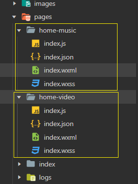
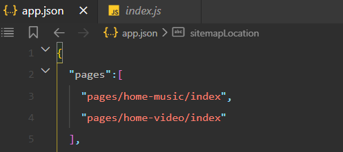
## 创建 tabBar 
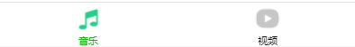

app.json 配置文件中配置 "tabBar" 属性, 如下: 

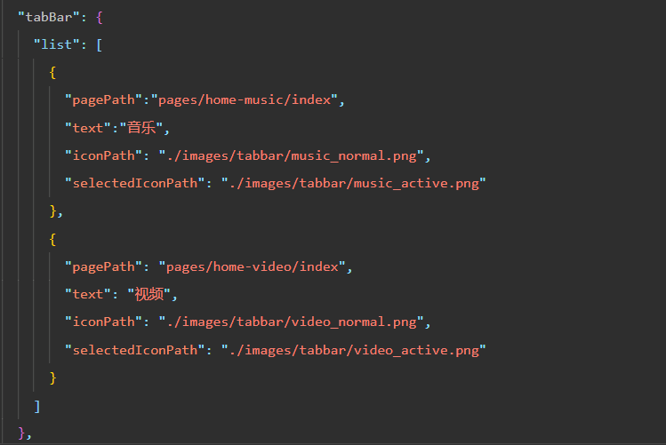
## 视频列表页
### 封装 wx.request() 网络请求
网络请求会在很多页面上用到, 但每次用原生的 `wx.request()`的话会非常的繁琐, 配置选项也比较多

所以事先封装一下网络请求, 着了要用 **类 class** 来封装, 因为用 class 封装有更高的聚合度, 而且里面还可以定义很多方法

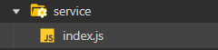
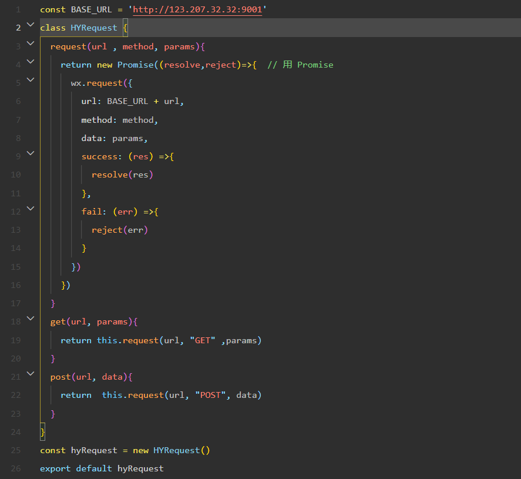

怎么用?  可以这么用, 如下: 
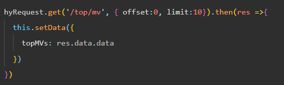

但我们要想某一些页面它们返送网络请求的次数是非常多的, 而且每次发送网络请求的时候都要管理很多个 url路径, params 参数 等,
整个代码的结构依然看起来是很乱的, 所以怎么做呢? 中间再加一层 **分层架构** , 把确定的东西直接给我写死, 甚至连 `hyRequest.get` 都不用写

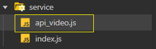
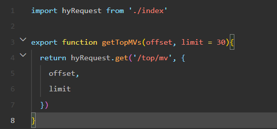

然后该怎么用 ?

**pages/home-video/indeex.js**

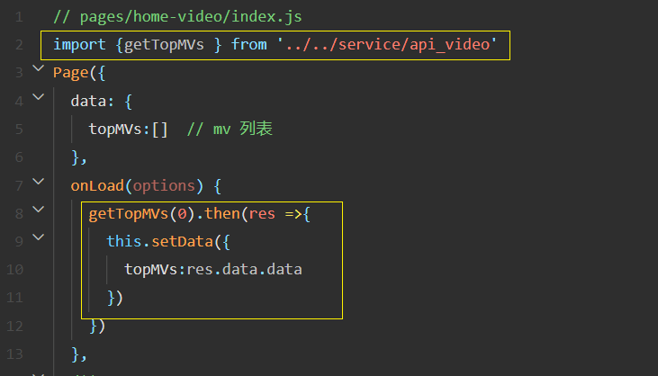

发请求就变这么简单了, 封装的魅力...
### 做一些优化
请求中直接resolve了 res.data
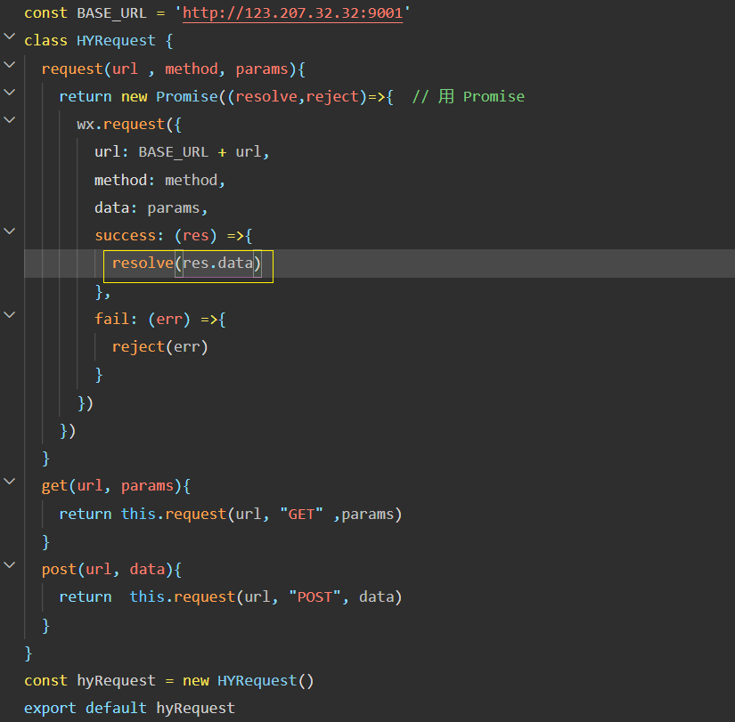

不用 then , 而是用了 async await 

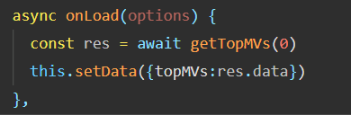
### 视频页面的UI结构
快速地搭建
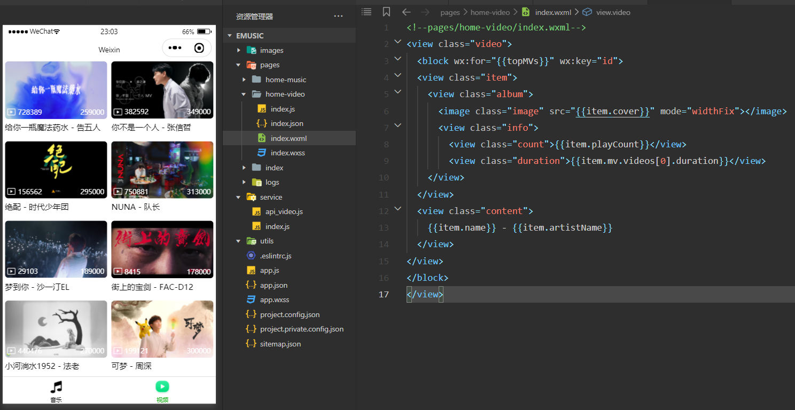
### 页面数据格式处理(MV播放量, 时长)
wxml 文件中想要进行**数据的转化处理**, 使用另外一个语法 wxs

*注意: wxs文件里面**不能**使用 ES6 语法*

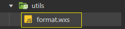
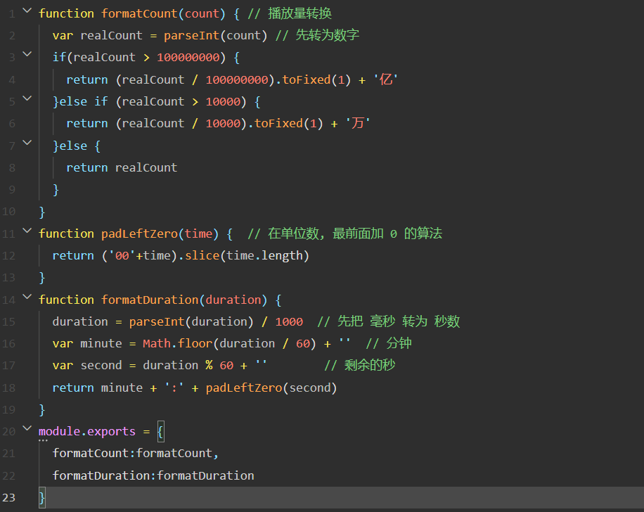

并将模块导入  `<wxs src="../../utils/format.wxs" module="format"></wxs>` 
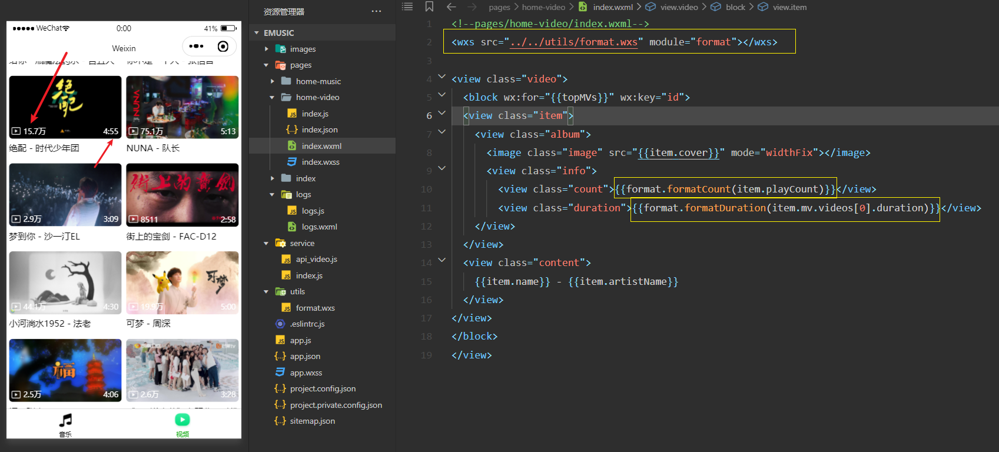

### mv视频封面 自定义组件 video-item-v1 
有可能被很多页面中使用这个 mv 封面

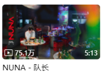

所以要封装成一个公共组件 

在项目创建 components 文件夹, 要在里面生成公共的组件

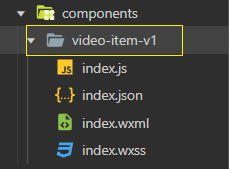
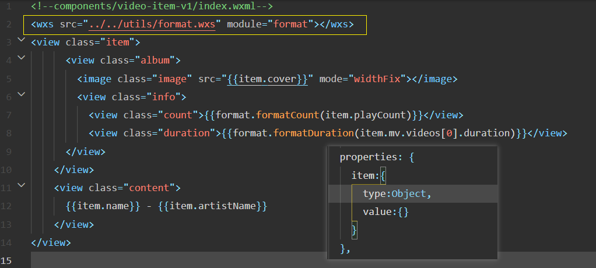

然后在 pages 下的 home-video 页面使用该组件, 先配置一下 home-video 的 index.json 文件 
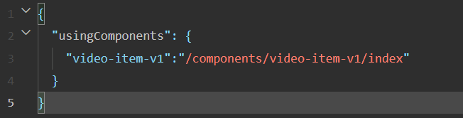
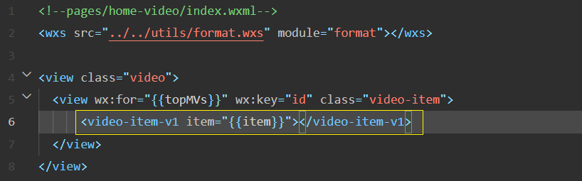

### 上拉触底加载更多
先简单实现, 不考虑细节

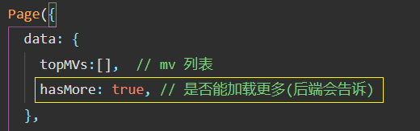
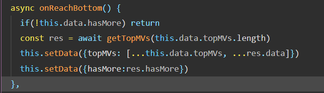

### 下拉刷新
下你简单实现, 不考虑细节 

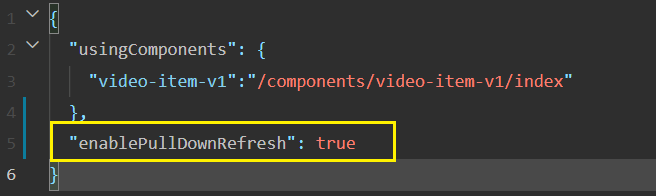
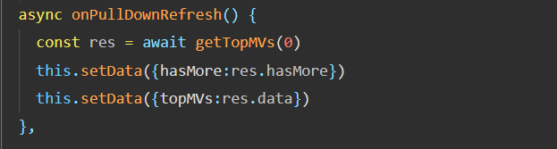

整体一看重复逻辑比较多, 所以下面做下封装
### 再次封装网络请求
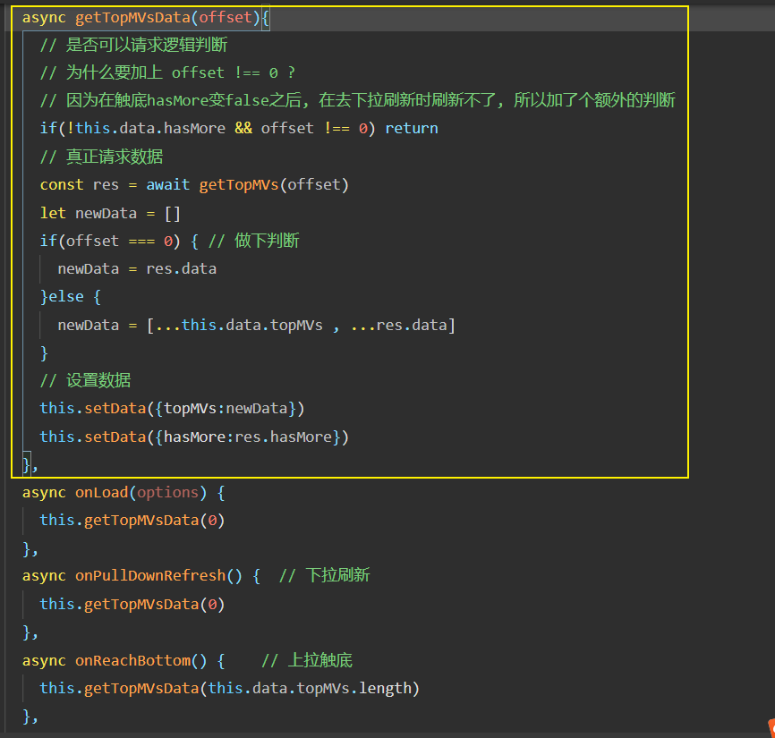

### 下拉刷新加载动画
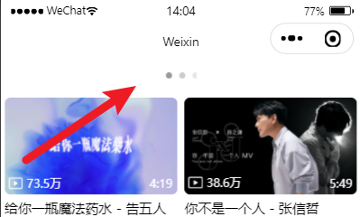

先要在页面 JSON 文件, 设置 "backgroundTextStyle": "dark"
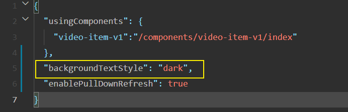

下拉刷新默认不会自动关闭, 调用 wx.stopPullDownRefresh() 关掉
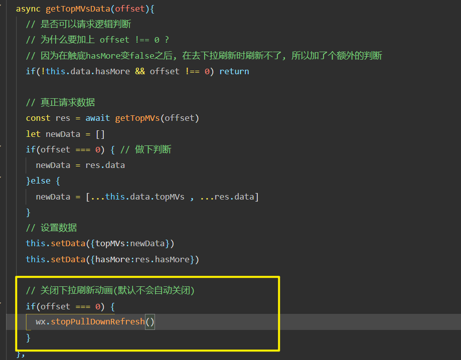
## 视频详情页
### 点击后跳转到详情页(传递id参数)
需求: 点击某一个视频封面后, 跳转到此视频的详情页面

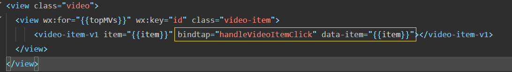
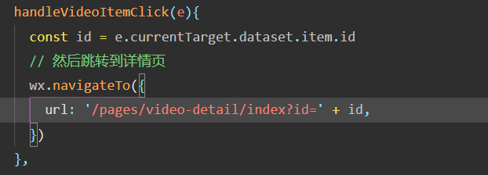

但事先要创建一个 video-detail 页面 详情页 pages/video-detail/index

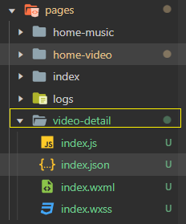

index.js: 

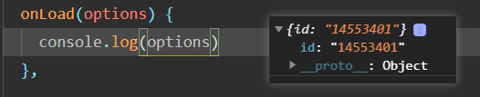

并且为了方便开发, 把变异模式调到当前详情页面
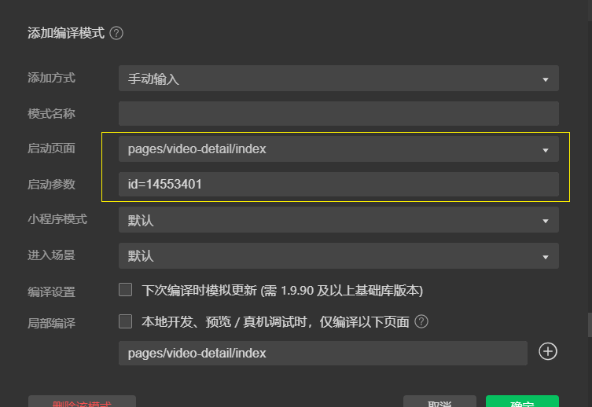
### 封装请求接口
详情页面需要拿到关于 mv地址, mv详情数据, 相关视频 的数据

在 service/api_video.js 封装请求接口 
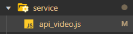

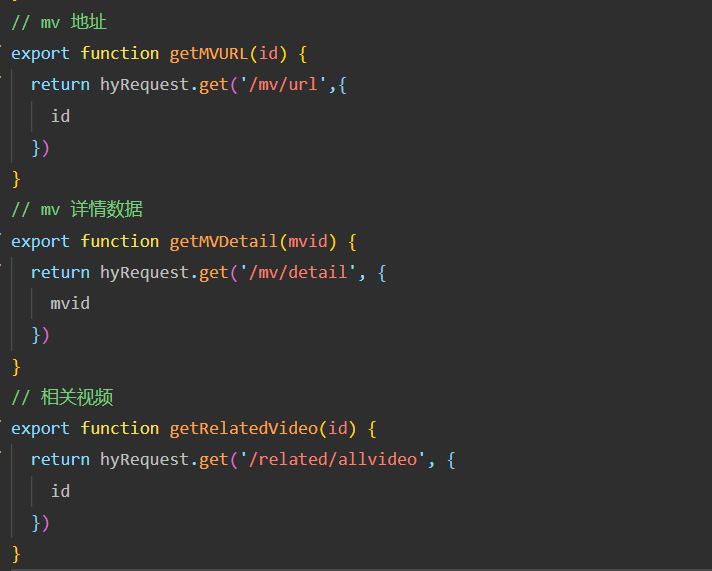
### 获取详情数据 
pages/video-detail/index.js
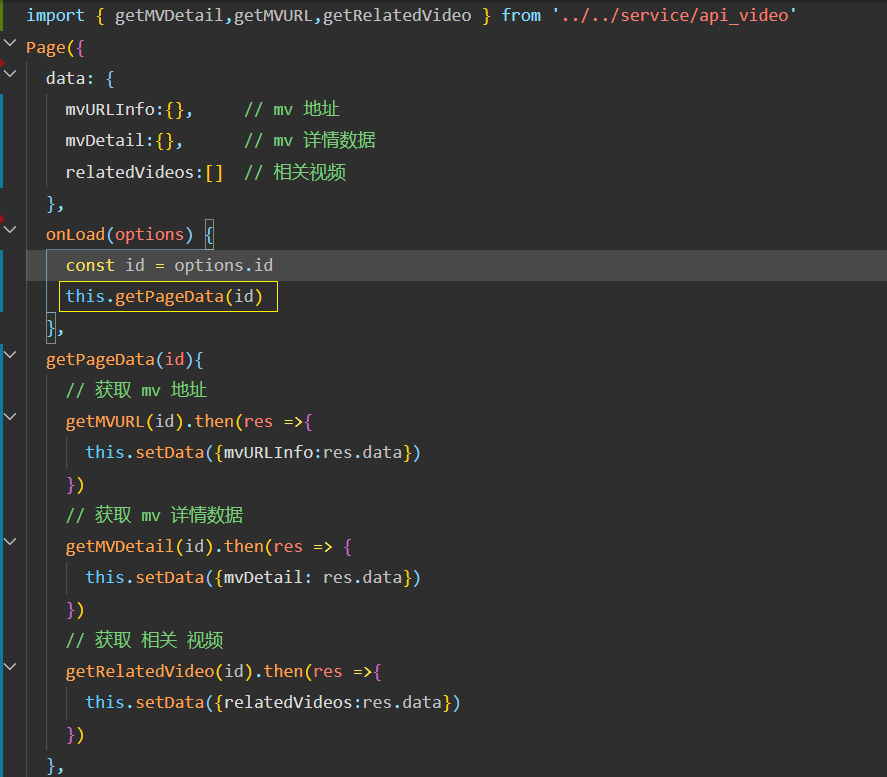
### 视频播放器展示 - video 媒体组件
用的是小程序原生组件
[video 媒体组件](https://developers.weixin.qq.com/miniprogram/dev/component/video.html)

并且要给个**固定定位**, 然后给 page 给个 padding

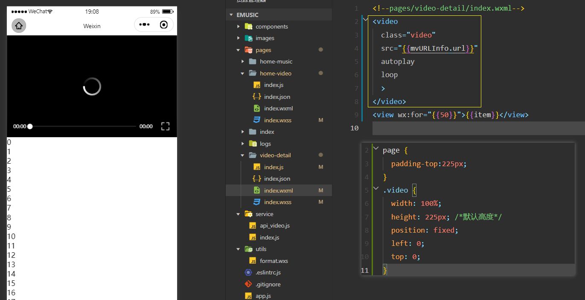

