# 首页 - 音乐页面
## 使用 npm - 引入 Vant 组件库
```
npm init -y
```
```
npm i @vant/weapp@1.3.3 -S --production
```
点击 构建 npm

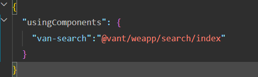
## 搜索框
事先给所有页面的都加上偏灰一点的背景色 #fafafa , 给上面导航栏也加上

app.wxss:

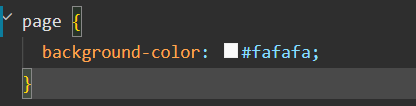

app.json: 

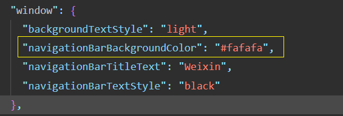

wxml 结构 : 

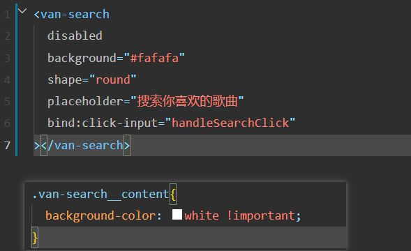

页面的搜索框**不能**在当前页面上输入东西, 这样的话特别丑, 所以该**跳转到一个新的搜索页面**进行歌曲的搜索

创建搜索页面: 

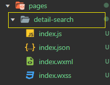

点击搜索框时, 跳转到搜索页面 
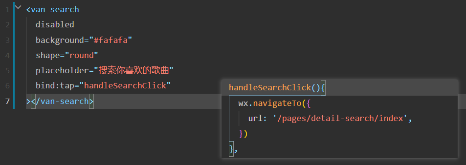
## 轮播图
### 封装请求接口 
创建文件 service/api_music, 封装关于音乐页面的接口
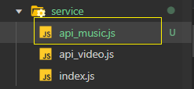

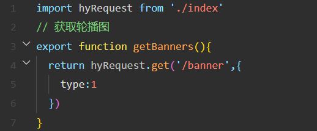

### 获取数据并UI渲染
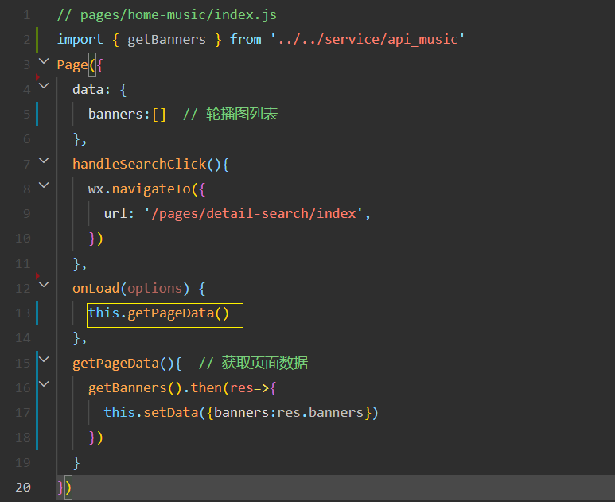
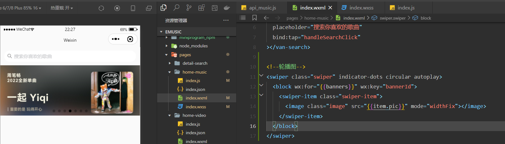

### 关于 swiper 组件和图片适配方案
**需求:** 不管是哪一种机型,  **让 swiper 组件的高度 等于 图片的高度**

**思路**: 
1. 图片加载完后, 获取图片的高度
2. 获取到的图片高度 赋值给 swiper 组件的高度 

**实现:** 

怎么获取到图片加载完后的时机? image 组件有 **bindload** 事件, 
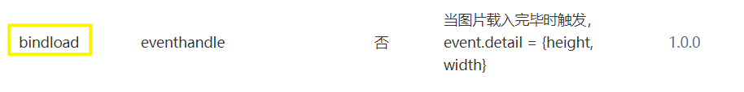
可以监听这个事件

那下一步怎么获取到**图片的高度**呢?  [wx.createSelectorQuery()](https://developers.weixin.qq.com/miniprogram/dev/api/wxml/wx.createSelectorQuery.html)

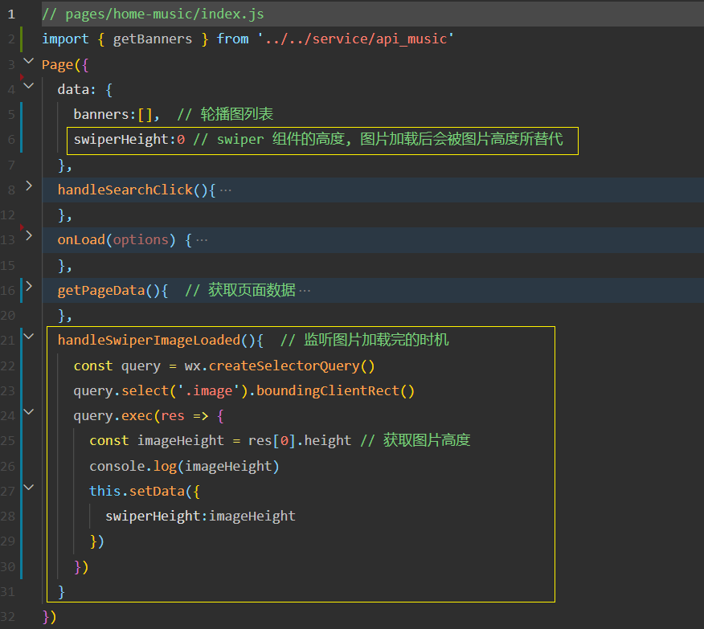

data 里的 swiperHeight 动态设置到 swiper 的高度上
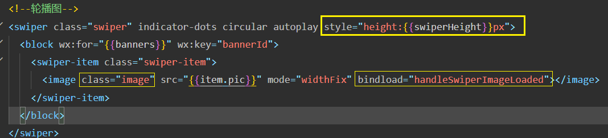

但这次发现上面的(获取高度)逻辑代码有点难记, 所以封装一下, 在里面用promise 直接 resolve(res)
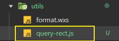
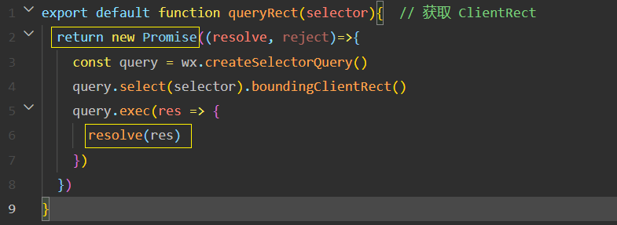

**最终**: 
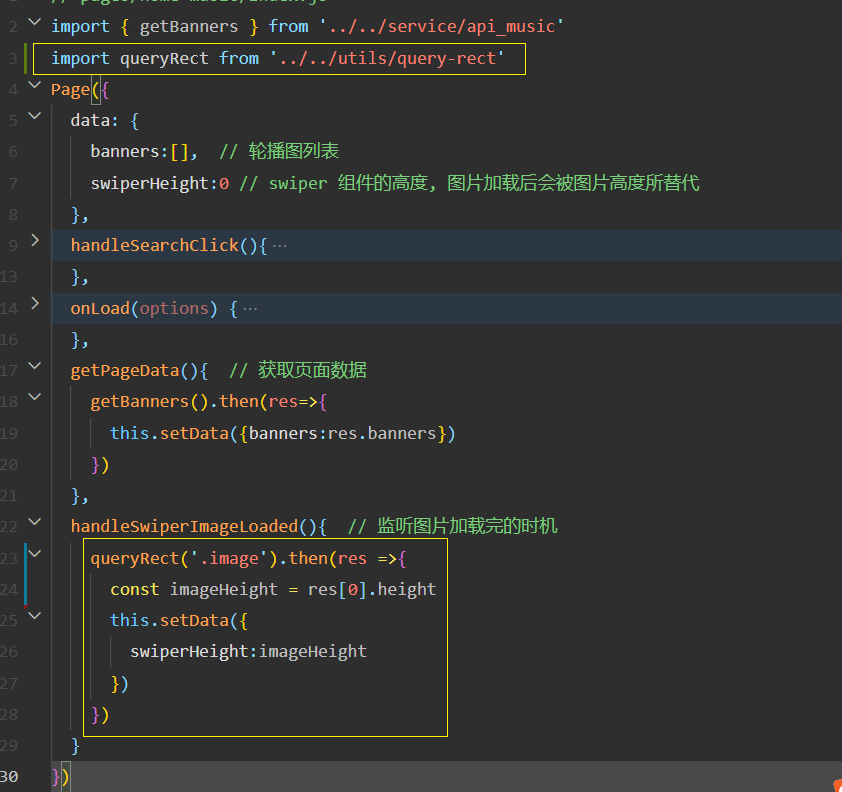
## 标题组件 area-header 


封装成一个组件, components 下创先 area-header 目录 

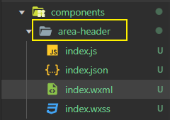

父组件中可以通过 properties 指定对应的文字, 并且可以通过 showRight 控制是否显示/隐藏 右边"更多"功能
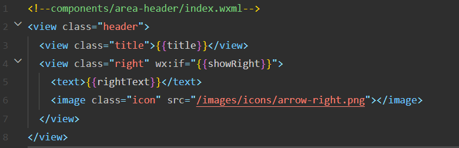
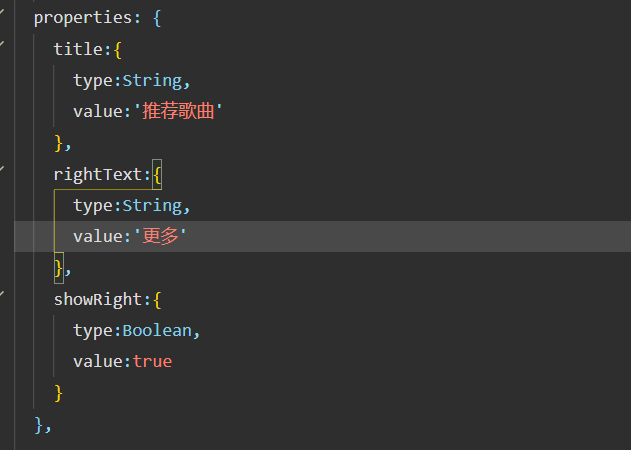

最后在 home-music 页面引用 area-header 并使用

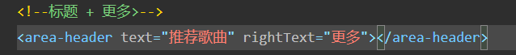

## 全局状态管理 
用一个库 [hy-event-store](https://github.com/coderwhy/hy-event-store)

这个是一个基于事件的全局状态管理工具，可以在Vue、React、**小程序**等任何地方使用

**安装**: 
```
npm install hy-event-store
```
**数据共享 示例**: 
```js
const { HYEventStore } = require("hy-event-store")
const axios = require('axios')

const eventStore = new HYEventStore({
  state: {
    name: "why",
    friends: ["abc", "cba", "nba"],
    banners: [],
    recommends: []
  },
  actions: {
    getHomeMultidata(ctx) {
      console.log(ctx)
      axios.get("http://123.207.32.32:8000/home/multidata").then(res => {
        const banner = res.data.data.banner
        const recommend = res.data.data.recommend
        // 赋值
        ctx.banners = banner
        ctx.recommends = recommend
      })
    }
  }
})

// 数据监听
eventStore.onState("name", (value) => {
  console.log("监听name:", value)
})

eventStore.onState("friends", (value) => {
  console.log("监听friends:", value)
})

eventStore.onState("banners", (value) => {
  console.log("监听banners:", value)
})

eventStore.onState("recommends", (value) => {
  console.log("监听recommends", value)
})

// 数据变化
setTimeout(() => {
  eventStore.setState("name", "lilei")
  eventStore.setState("friends", ["kobe", "james"])
}, 1000);

eventStore.dispatch("getHomeMultidata")
```


