# 起步
## 初始化项目
使用 vue-cli 创建项目
```
vue create zheye
```
### CSS 样式解决方案 - Bootstrap
[Bootstrap 官网](https://getbootstrap.com/)

安装
```
npm i bootstrap@5.2.1
```
### 开发流程
* 将 UI 划分出组件的层级 

* 创建应用的静态版本 
### columnList 组件编码
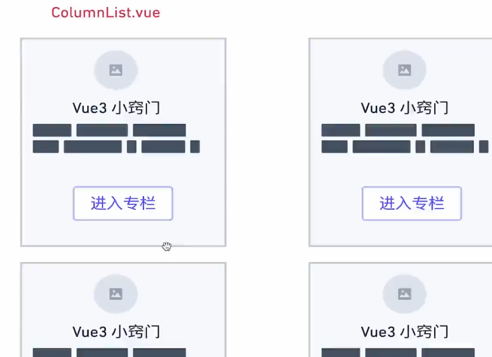
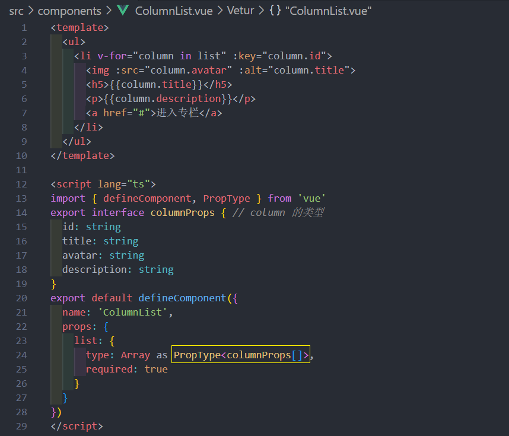
columnList 需要接受的是有 `columnProps`类型对象 组成的数组

想把构造函数断言类型需要使用 `PropType`, PropType 接受泛型

PropType 作用 : 
* 写代码有补全功能, 有提示

在 App.vue 注册使用测试一下 columnList.vue 组件 


测试数据: 
```js
   const testData: columnProps[] = [
      {
        id: 1,
        title: 'test1的专栏',
        description:
          '这是的test1专栏，有一段非常有意思的简介，可以更新一下欧, 这是的test1专栏，有一段非常有意思的简介，可以更新一下欧',
        avatar:
          'http://vue-maker.oss-cn-hangzhou.aliyuncs.com/vue-marker/5ee22dd58b3c4520912b9470.jpg?x-oss-process=image/resize,m_pad,h_150,w_150',
      },
      {
        id: 2,
        title: 'test2的专栏',
        description: '这是的test2专栏，有一段非常有意思的简介，可以更新一下欧',
        avatar:
          'http://vue-maker.oss-cn-hangzhou.aliyuncs.com/vue-marker/5ee22dd58b3c4520912b9470.jpg?x-oss-process=image/resize,m_pad,h_100,w_100',
      },
      {
        id: 3,
        title: 'test3的专栏',
        description:
          '这是的test1专栏，有一段非常有意思的简介，可以更新一下欧 这是的test1专栏，有一段非常有意思的简介，可以更新一下欧',
        avatar: 'http://vue-maker.oss-cn-hangzhou.aliyuncs.com/vue-marker/5ee22dd58b3c4520912b9470.jpg?x-oss-process=image/resize,m_pad,h_100,w_100'
      },
      {
        id: 4,
        title: 'test4的专栏',
        description: '这是的test2专栏，有一段非常有意思的简介，可以更新一下欧',
        avatar:
          'http://vue-maker.oss-cn-hangzhou.aliyuncs.com/vue-marker/5ee22dd58b3c4520912b9470.jpg?x-oss-process=image/resize,m_pad,h_100,w_100',
      }
    ]
```

### columnList 组件使用 bootstrap 美化
使用 bootstrap 的 grid , card 
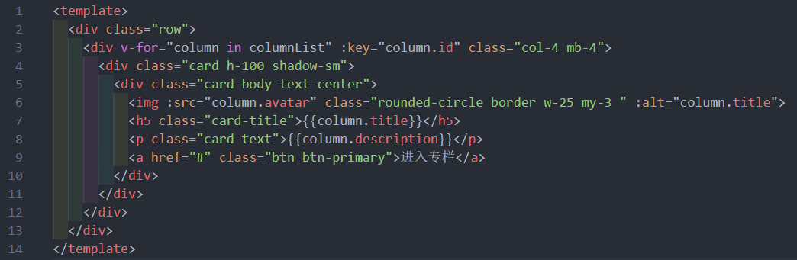
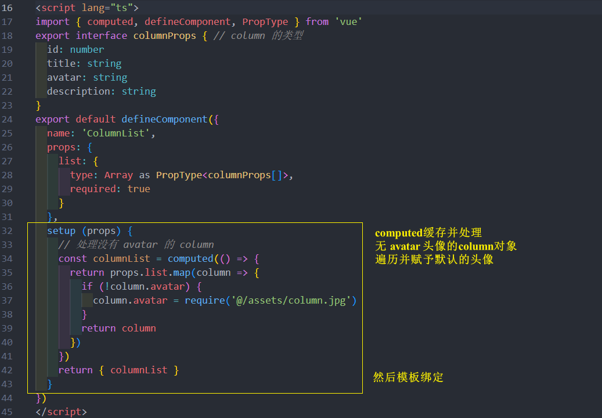

效果: 
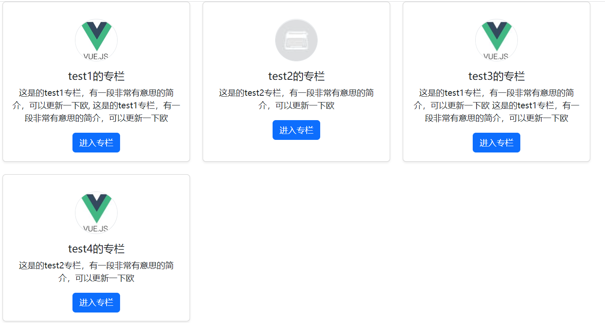

### GlobalHeader 组件编写
设计图: 
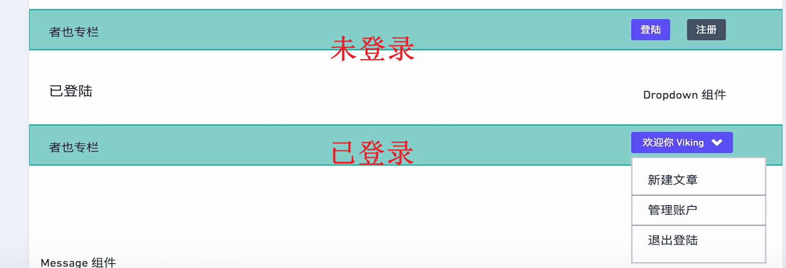

分析: 

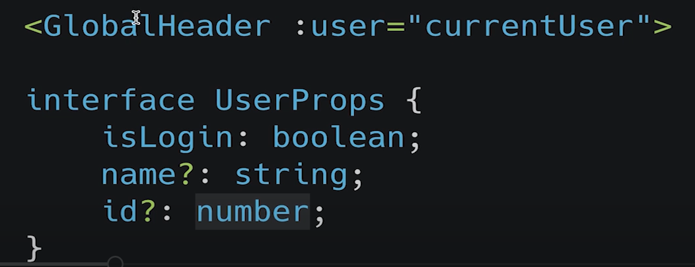
 
**components/GlobalHeader.vue**

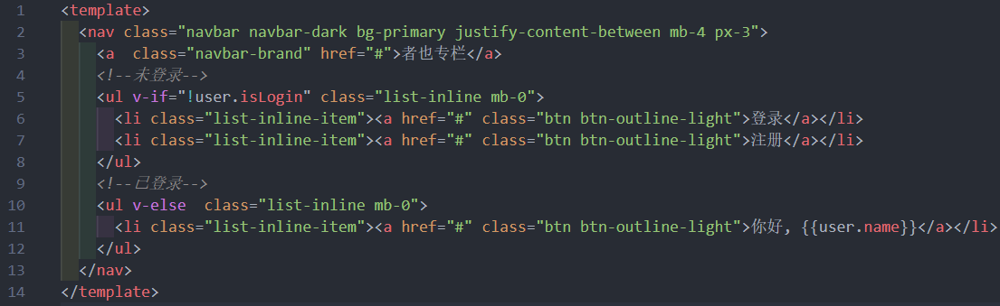
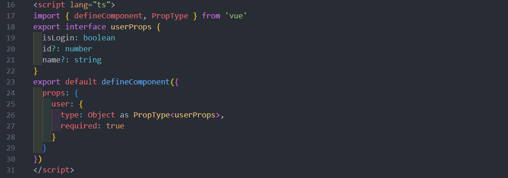

然后在 App.vue 注册使用测试一下 columnList.vue 组件 
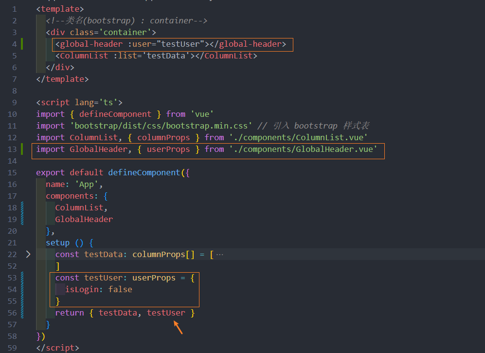

最终效果: 
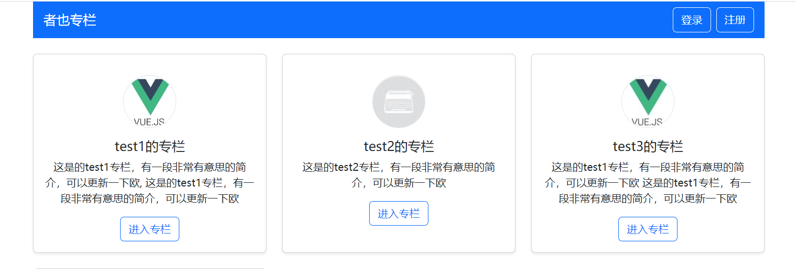

### Dropdown 组件基本功能编码
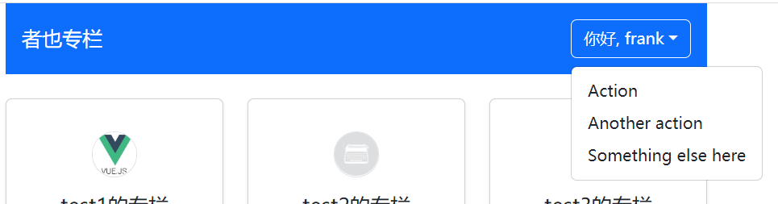

**components/Dropdown.vue**
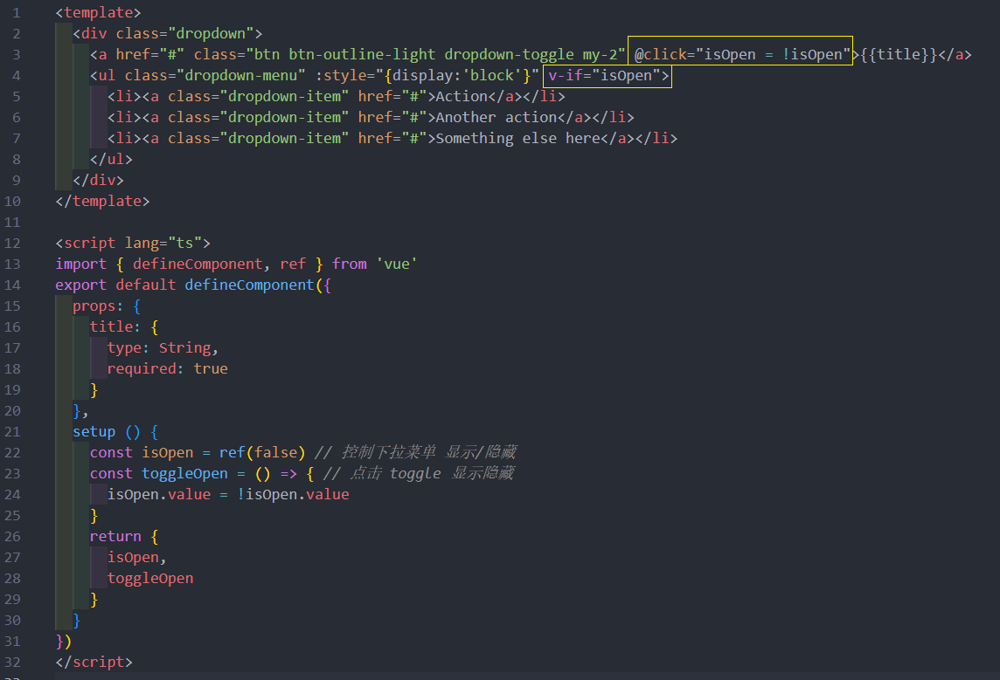


